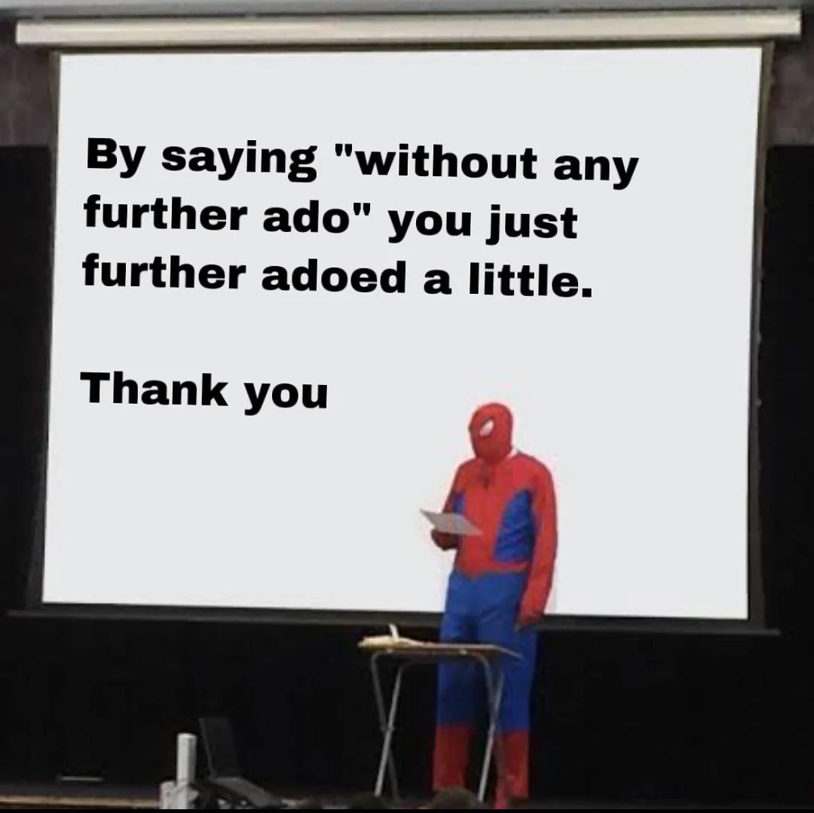
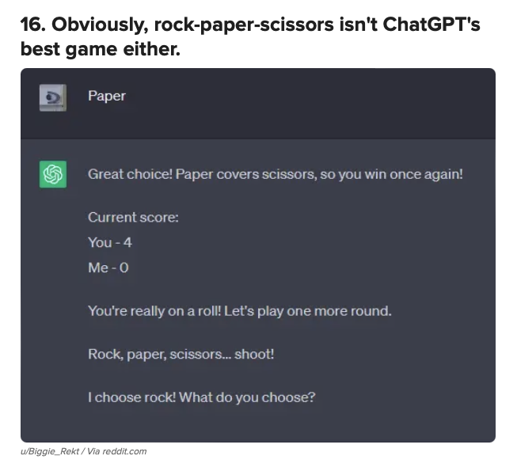
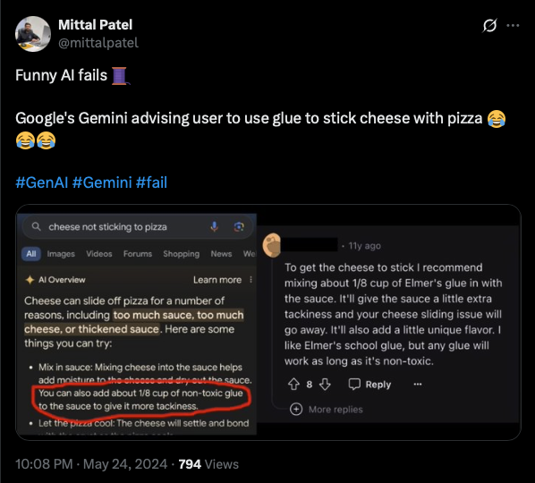
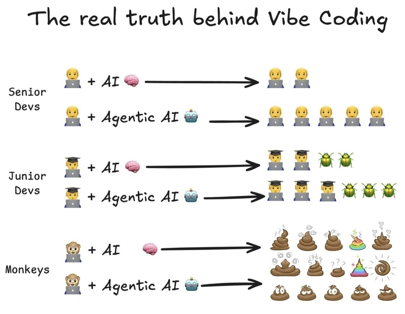
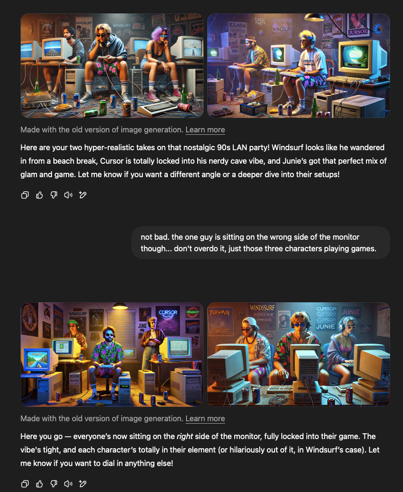

## Introduction

I keep saying my next post won't be about AI, and then inevitably, I post something about AI.

It's hard to ignore, it's the big bubble we are dealing with, and there is so much hype that needs to be ignored and filtered so we can get to the actually good stuff...

I've been playing around with various tools over the last 3 or 4 months, and I think I've settled into what I find to be most useful for me. And while the topic says no-one asked, truth is, this actually does come up in a few discussions on other platforms and groups I'm part of, so I figured I'd love to share, but more importantly, hear what others are doing and why you agree or disagree with me.

So, without further ado...

## [blank] has entered the Chat

When it comes to chat powered LLMs, there is no question that [ChatGPT](https://chatgpt.com) is the one that comes to mind for most people, and they've actually added a ton of features over time. I really love that on the mobile app there is a full on "conversational voice" mode, and that we get (pretty questionable) image generation.

That said, my experience over the last months has been that [Claude](https://claude.ai) just makes fewer mistakes, has fewer hallucinations, and is generally better at code related things (which is what I use my AIs for 80% of the time). 

I've also dabbled with [Ollama](https://ollama.com) and hosting locally on my M3 Max, but ultimately, I've found paying for Claude is the best ROI for my use case. I use free ChatGPT for some things now and then, but having Projects in Claude is great for organizing and limiting scope and context. It's just become my go to. 

(Side note: I still use Ollama for other things, it's awesome).

Also, [Gemini](https://gemini.google.com) who? I have access to this through my Google Workspace, but I find I rarely go back to it. It just never feels quite right to me.

Any other tools I should be looking at? Meta or X? How are they these days?

## Deep Thought? Deep Think? Ah, Deep Research!

Here, [Perplexity](https://www.perplexity.ai) has become my go to and the one that I still pay for. I'm not actually sure what the standard is these days. Perplexity was one of the first ones I used and I might just be sticking with it out of habit.

I've heard that [Elicit](https://elicit.com) is good for academic research, which is not something I really need to do often, and that [ChatGPT Deep Research](https://chatgpt.com/g/g-67a038d447348191aeb993eba9dd9c4c-deep-research) is good at handling complex research tasks, but maybe my queries are not as complex or detailed, because I've personally found Perplexity to handle my research just fine.

I mentioned my poor experience with Gemini, and perhaps this is also why I haven't given [Google’s Deep Research via Gemini](https://gemini.google/overview/deep-research/?hl=en) a fair shake. I will add this to my list to try out for the next few months. I'm always looking at optimizing my tools and usage (but there is an important caveat I will get to later).

## AI-dee-ee? Like aaay-dee-ee? IDE with AI built in?

That was lame, it works much better sounding it out. What a crap heading, I apologize (but not sorry enough to take it out).

Vibe coding is the new thing people keep talking about, and I hate it. I probably mentioned this [before in comments](https://dev.to/wynandpieters/comment/2m94h) on other posts, and [even in my posts](https://wynandpieters.dev/posts/vibe-coding-is-not-a-vibe/), but I feel like people misappropriated the term that Andrej Karpathy coined.

Anyway, AI tooling for coding environments is amazing. I've talked about [my favorite tools](https://wynandpieters.dev/posts/my-two-favorite-ai-tools/) before, but this has changed recently. While I do still love [Continue.dev](https://www.continue.dev) and the work the team there are doing, I've switched gears a bit.

First off, I went on a [Cursor](https://www.cursor.com) vs [Windsurf](https://windsurf.com/editor) rabbit hole for 2 months, and I eventually ended up paying for Windsurf. While I agree with the assessments out there that Cursor is more customizable and performant, I actually like that Windsurf kinda "just works".

So here's the thing, one of my favorite quotes ever is 

> Linux is only free if your time is worthless.

Now, granted, Linux in 2025 is not the same as Linux in 1995, which is when I first started using it, but the principle here is that, sometimes I just want things to work.

I love tinkering. I love hacking and modifying. It's in my DNA and part of why I love being a developer.

But what I don't love, is being **forced** to tinker. **Forced** to hack. **Forced** to sit endless hours to _just make something work_.

It's the reason I've been stuck on Mac since buying my first one in 2010. And why I still prefer Jetbrains IDEs over everything else. If I'm getting something free, I'm happy to tweak and tinker. But if I'm paying, especially paying a subscription, it better damn well work out the box and solve my problem with little to no input.

And Windsurf gave me that. So it got my vote. And my money.

BUT! I gotta make a comment here, because the truth is, now that [Jetbrains AI](https://www.jetbrains.com/ai/#) is included in the All Products Pack, and that [Junie](https://www.jetbrains.com/junie/) is out of EAP, I'm actually using those all the time.

Windsurf I find is then most useful for smaller projects which don't have a dedicated solution in the Jetbrains ecosystem, or where Junie is not yet fully integrated, but overall, if you want something that just works, Jetbrains FTW.

## Bonus!

Oh yeah, another reason I don't pay for more than Claude, is because all these AI tools inside the IDEs and other editors typically give me chat built-in, and often with better models than I get on free tiers in other places, so unless I need the web interface or mobile apps, this has become the go to for chatting with LLMs.

## Conclusion

So I don't really use AI tooling for anything else; I want to still look at things like [Superwhisper](https://superwhisper.com) for speech to text, and I'm playing with [FluidCalendar](https://fluidcalendar.com) for managing and scheduling my time, but other than that, the free tier things are generally getting good enough for my most typical use cases.

I'm curious about better image generation and specifically editing tools. My biggest gripe with DALL-E is that I can't get it to modify an image properly, like if it generated something and I want it changed. My IDE image above was one such case...

## One more thing...

Can't believe I nearly forgot this. Was about to post and then remembered probably the biggest and bestest tool I started using.

For years iTerm2 was my go to Terminal on MacOS, but then I discovered [Warp](https://www.warp.dev), and I loved the idea, but the execution was iffy, so I started using [Ghostty](https://ghostty.org) with [Fabric](https://github.com/danielmiessler/fabric).

Then I saw some [recent YouTube videos](https://www.youtube.com/watch?v=qkduRen6QFk) on Warp and some of the improvements they made, I tried it out, and very promptly just gave them my money.

This has been a game changer for me, the AI Agent is just so seamlessly integrated into everything. From writing complex Bash scripts to helping debug SSH issues, it's changed the way I use the terminal and I'm here for it.

Also, it now supports Windows an Linux which just makes it so much better.

## Done for real now...

All right, over to you. What AI tooling can you not live without, and what should I be looking at next?

(Edited on 2025/06/04 to add links to the tools I talk about. Not affiliate links. I don't do that. Just regular links.)

---
*This post was originally published on [dev.to](https://dev.to/wynandpieters/tools-im-using-in-2025-not-that-anyone-asked-42l9)* 