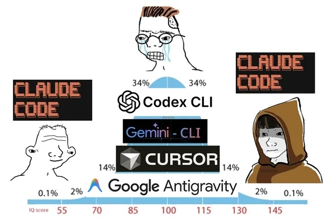
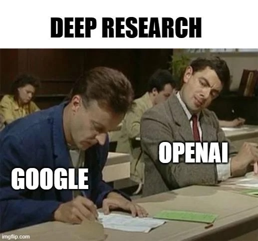
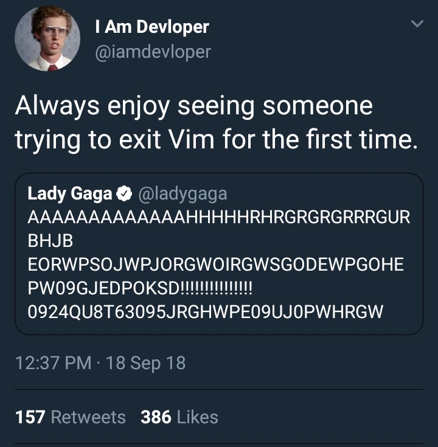
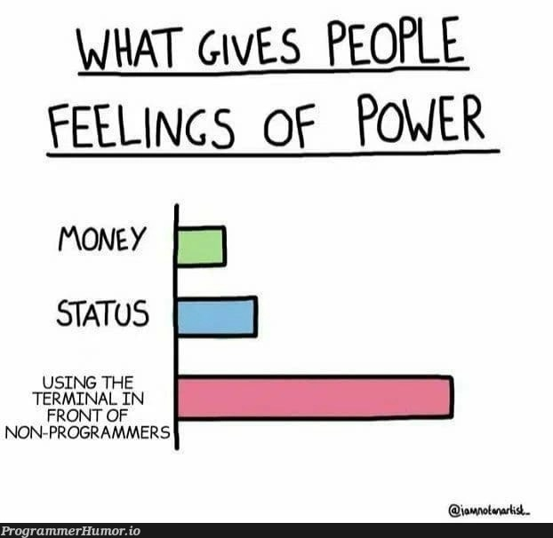
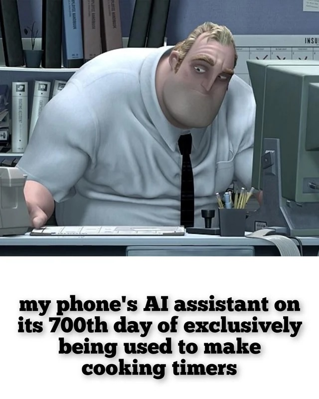

## Introduction

In some ways, a lot has changed since my [last post](/posts/ai-tech-stack-2025/), and in other ways, not much has changed. There has been a big shift in the last 12 months, especially toward "agentic engineering" and how we run multi-agent AFK setups vs HITL as we have been. I touched on this in my [introduction to the tool I'm working on](/posts/cast-intro/) as well, which, spoiler, is part of my toolchain. Kinda. It's a WIP...

## Coding Tools

So for starters, I very rarely if ever use ChatGPT anymore. But, I do play around with [Codex](https://developers.openai.com/codex/cli), which is the OpenAI agentic coding tool using their models. I still don't pay for it, but based on what I've been seeing online, and with the [pricing changes Anthropic have been making for Claude](https://www.reddit.com/r/ClaudeAI/comments/1tj2exk/claude_p_is_moving_to_metered_pricing_on_june_15/), I am considering a switch.

[Claude Code](https://claude.com/product/claude-code) is still my main tool for coding. It's still the one I pay for, along with [Junie](https://www.jetbrains.com/junie/) which is included in my JetBrains All Product Pack. I'm not a power user going through millions of tokens a week, so I generally still find the Pro subscription is enough, but there have been times I've considered Max... I think one thing that helps is that one of my clients gives me aaccess to their Claude Clode Team, so I'm not paying out of pocket for most of it.

Some really useful things for Claude Code I just want to shout out:
- [Claude Code Cheatsheet](https://awesomeclaude.ai/code-cheatsheet)
- [Skills For Real Engineers](https://github.com/mattpocock/skills)
- [CLI proxy that reduces LLM token consumption by 60-90% on common dev commands](https://github.com/rtk-ai/rtk)
- [7 layers of defense against prompt injection in Claude Code](https://github.com/slavaspitsyn/claude-code-security-hooks)

Two interesting ones I've been playing with, [JetBrains Air](https://air.dev) and [Google Antigravity](https://antigravity.google). Google recently used [Antigravity 2.0 to build a custom OS](https://antigravity.google/blog/google-antigravity-built-an-os) and run Doom during their [I/O 2026 keynote](https://www.youtube.com/watch?v=T_fnhr5lVBw), so I'm really interested to see where this goes. Will report back after a few months.

I've been experimenting with various agent orchestration frameworks, but as I mentioned before about CAST, the main issue I'm finding is that the tools don't really cater for the use cases of the more complex systems I work on, and many of them are very limited in the tools you can use and the agents you can run. The problem I'm trying to solve is a lot more broad and open, which also means progress is slow, but I dogfood my own ideas for building the things I want to build. The closest I've found to CAST is [Factory.ai](https://factory.ai) and [Aparent](https://aperant.com), which I'm keeping a close eye on and also playing around with. Both worth looking at.

## Research Tools

Last year I was heavily into [Perplexity](https://www.perplexity.ai) but for most of 2026 I've actually been using [NotebookLM](https://notebooklm.google.com) a lot more. Perplexity is still useful for just daily news, but when I want to research, when I want to summarise, when I want to learn... NotebookLM all the way.

[Claude Research Mode](https://support.claude.com/en/articles/11088861-using-research-on-claude) is also still very useful for gathering information, and I suspect that I sometimes get better results using Claude to do the initial research and highlighting the key resources for me, and then feeding those into NotebookLM to limit the scope. This might be because of the theirs I'm using, I suspect I get the dumb models on the Google side.

## IDE and Editors

So the main change here from 2025 is that I've completely stopped using [Continue.dev](https://www.continue.dev), [Cursor](https://www.cursor.com) and [Windsurf](https://windsurf.com/editor). Ultimately, with the improvements that JetBrains have been making to their IDEs, and with the addition of Junie and fantastic plugins for Claude Code and Gemini etc, it just doesn't make sense to use anything else... 

So yeah, [Jetbrains All Products Pack](https://www.jetbrains.com/all/). Still my go to.

I believe AI Pro is now included in the subscription, but there is a case to be made for [AI Ultimate](https://www.jetbrains.com/ai-ides/buy/?section=personal&billing=yearly) too.

That said, sometimes you do just want an editor, not a full blown IDE, and for that for the last few months I've been experimenting with [Zed](https://zed.dev). It's okay. I've had some weird issues with their terminal emulator; I don't know what they are doing but my ZSH config doesn't load right so it sometimes gets stuck in what looks like an infinite loop, and then my PATH is all messed up... IDK, I expect my editors to kinda just work, but overall, I like the look and feel and for when I just need to edit a file, it's fine.

I spend most of my time in the Terminal these days anyway, the IDE is really just for proper debugging, not coding anymore, and the text editor is just for when my Neovim is acting up. And I still haven't found a decent agent or TUI for stepping through code using a debugger, so Jetbrains IDEs FTW.

## Terminal and CLI Tools

[Warp](https://www.warp.dev) is still my terminal of choice. It's awesome. Their [Oz Agent Platform](https://www.warp.dev/oz) is amazing. I've tried [cmux](https://cmux.com), it sucks, just use Warp, seriously. Anyone who raves about cmux just hasn't tried Warp yet. I went through a phase where I didn't pay for Warp anymore, but this is coming to an end, they just give you so much, and if you want to use BYOK (Bring Your Own Key), you gotta pay for at least the lowest tier.

I don't use [Fabric](https://github.com/danielmiessler/fabric) as much anymore. I still have it, but I generally just find using Claude Desktop is good enough.

Oh, also, I frikken love [Toad](https://github.com/batrachianai/toad). It's a "unified interface for AI in your terminal". Built on Textualize and utilising [Agent Client Protocol](https://agentclientprotocol.com/overview/introduction) it provides a UI over multiple coding agents, which is great, since I don't just use the one. You do lose some features in something like Claude Code, because they don't expose everything over ACP, so it does depend on the specific use case, but I highly recommend checking it out.

I've also been playing around with [Pi](https://pi.dev), but I'm not quite sold on it yet.

Oh, super random side-note, but I've actually been running Claude Code on a VM on my Proxmox server, and then using [Remote Control](https://code.claude.com/docs/en/remote-control) to work on projects from my phone and tablet. It's super janky, and frustrates me more often than not, but man, what a future we live in. This will be really cool in future.

## Personal AI Assistant

No, I'm still not using OpenClaw, stop asking. Not touching that shit with a ten foot pole. [No thank you](/posts/openclaw-wtf/).

I am keen on trying [Hermes](https://hermes-agent.nousresearch.com) though, maybe, it looks promising and much more secure. For now though, [Claude Cowork](https://claude.com/product/cowork) is doing most of what I want, and my custom self-hosted [n8n](https://n8n.io/) setup locally is doing the rest.

## Conclusion

It's been an interesting year in the dev space since I last wrote about my AI tech stack. There is an interesting shift in the industry, but I'm still not sold. One of my posts coming soon is actually about how, the longer we get into this cycle, the more I see AI coding as the "next evolution of low code and no code", rather than a replacement or evolution of software engineering.

Super curious to know what tools other people are using, and if there is anything you think I should be checking out. Let me know in the comments section over on [dev.to](https://dev.to/wynandpieters/tools-im-using-in-2026-and-what-ive-stopped-using-from-2025-4fi8).

---
*This post was originally published on [dev.to](https://dev.to/wynandpieters/tools-im-using-in-2026-and-what-ive-stopped-using-from-2025-4fi8)* 