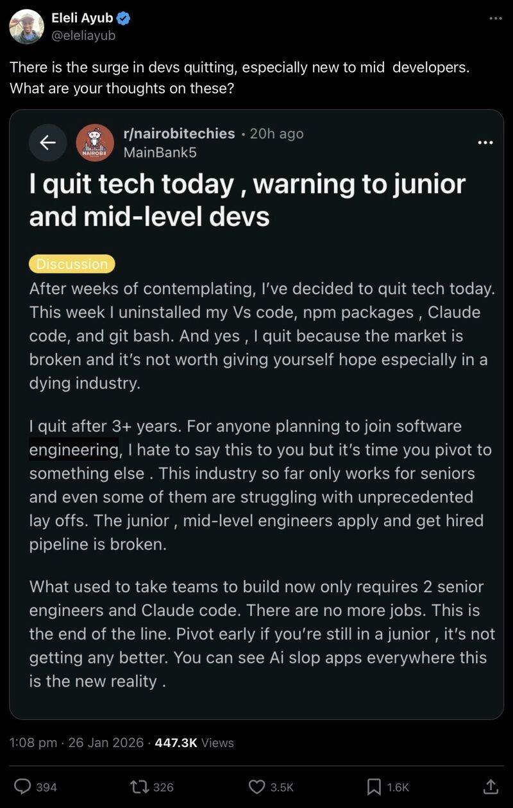

This came up in my feeds today.

I’ve said it before and I’ll keep saying it until I can’t anymore: never before has there been a time where we needed to be more intentional about training and mentoring juniors than now.

As much as I love and use it, my biggest worry with current AI tooling has always been that it takes the thinking and understanding away from you. This is different from previous coding tools. Many just obfuscated or abstracted concepts, others assisted with tedious tasks, but this time the tool does it all. And it’s making us lazy, and it’s making us less capable. Studies are starting to show this.

These models need to be trained on good data to remain good. Garbage in, garbage out. What happens when the generation of engineers who actually understand how the sausage is made retire or move on? What are we left with? LLMs trained on AI-generated slop? Juniors who don’t understand compilers or kernels or first principles?

I wonder if we’ve reached a point in tech where we need to adopt a different model. Apprenticeships work well for plumbers, electricians, and mechanics. Is this what we need to do to save the profession we love so much?

The market is tough right now. But giving up and telling people to pivot isn’t the answer. Investing in the next generation is.

---
*This post was originally published on [LinkedIn](https://www.linkedin.com/posts/wynand-pieters_ive-said-it-before-and-ill-keep-saying-activity-7421773752805285888-LyOr)*