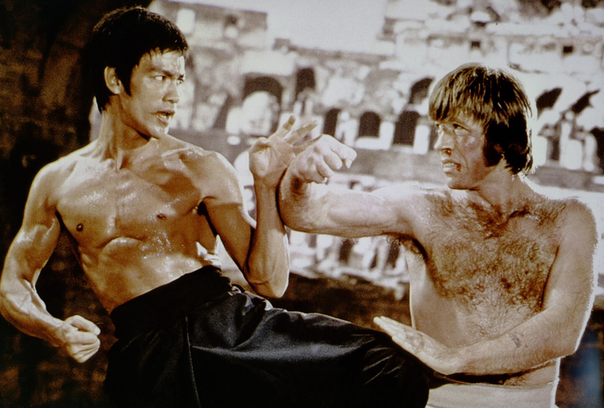
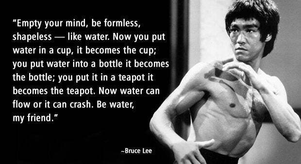
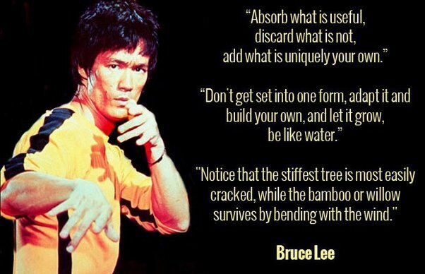
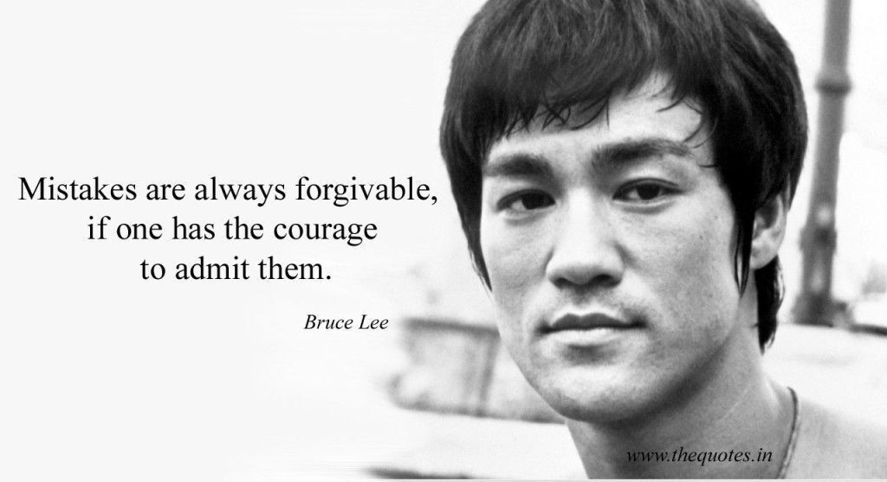
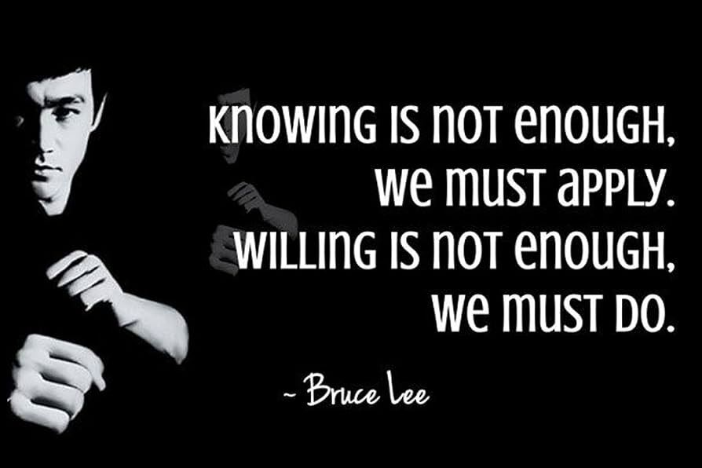
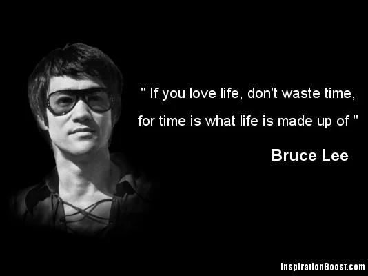
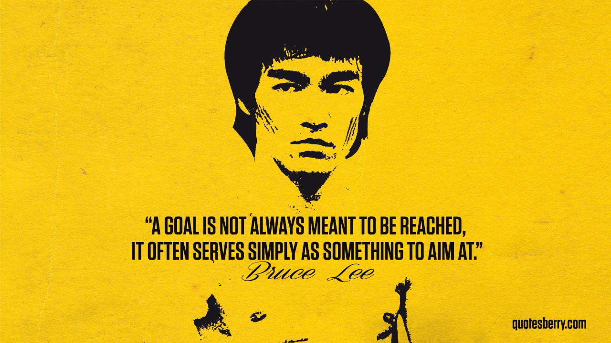
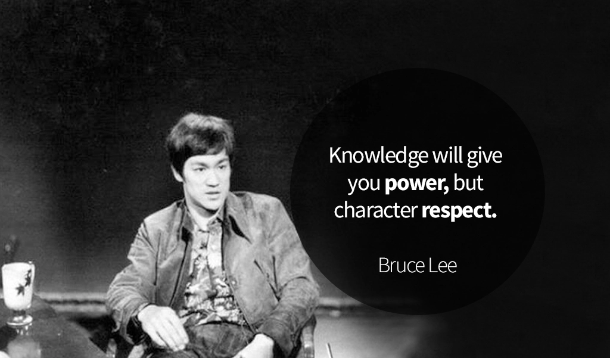

## Intro

I don't know why this has been on my mind the last few weeks, but guess that means I need to write something down...

I love Bruce Lee. I don't generally think of myself of someone who has "heroes", but if there is one person outside my father who has greatly inspired me and changed how I think about life, it would be Bruce Lee.

At first, as a little kid with silly hopes and crazy dreams, it was just all the cool fighting scenes in his movies that made want to be like him.

But as I grew older and I watched [Dragon: The Bruce Lee story](https://moviesanywhere.com/movie/dragon-the-bruce-lee-story?show=retailers), seeing how he lived life and his approach to martial arts and film, and then later buying and obsessing over [The Tao of Jeet Kun Do](https://www.amazon.com/Tao-Jeet-Kune-Do-Expanded/dp/0897502027), I started thinking about how to apply these elements and lessons to my own life.

(I also really loved [this interview from the Pierre Berton show](https://www.youtube.com/watch?v=uk1lzkH-e4U), and some of the things I reference will come from that.)

And of course, since this is a tech blog, I'll focus on how these apply to my career and my approach to building software and companies. And I trust there will be some wisdom or insight for everyone that reads it.

I'm also quite confident I'm not the first and won't be the last person to equate lessons from Lee into software, so I suggest scouring the interwebs for more insights.

Let's get into it.

## "Be water, my friend."

This famous quote encapsulates Lee's philosophy of adaptability and fluidity. In software development, this can translate to being flexible in problem-solving, adapting to new technologies, and continuously evolving your skills.

For me, this is the essence of what Agile really tries to achieve. When you cut out the methodologies, and look at the intent and principles. It means that if you have an idea that doesn't work, you try something else. It means that if you are going in the wrong direction, you change rather than stubbornly pushing forward.

Wrt our own adaptability around things like tools and languages and frameworks, the hill that I will probably die on is the "it depends" meme. While I surely have things I prefer, sometimes it's not sensible to blindly hold on to those when the entire industry is moving in a different direction. We must adapt and evolve and grow.

I feel this also nicely ties into the next one.

## "Absorb what is useful, discard what is not, add what is uniquely your own."

Lee's approach to martial arts involved taking the best elements from various styles and creating his own. In software development, this means learning from different programming paradigms and tools, discarding outdated practices, and innovating to develop your unique coding style and solutions.

There is no "right way" or "one solution", and there is no "best" editor or "one language or paradigm to rule them all". As much as people want to fan the flames of online wars, at the end of the day, there are pros and cons to everything.

So try new things, learn things, attempt hard things, and figure out what works best *for you* and the people around you.

And don't just copy-paste, whether someone else's code, or a persons behaviour and attitude and approach to life.

Yes, even now, as I talk about the lessons and inspiration of Bruce Lee, I don't try and "be" him or even "be like" him. I am looking at what he did well and absorbing the useful lessons to myself, discarding what is not applicable, and then adding what is uniquely my own.

## "Mistakes are always forgivable, if one has the courage to admit them."

And I get this wrong sometimes. And you will too. But we shouldn't fear failure and mistakes. Having failed at something *does not make you a failure.* It just means you have not found the path to success _yet_.

This quote from Lee encourages a growth mindset and accountability. In software development, acknowledging errors and learning from them is essential for personal and professional growth. Finding a space where there is psychological safety for us to do this is extremely important.

## "Knowing is not enough, we must apply. Willing is not enough, we must do."

This quote to me really emphasizes the importance of practical application and action. In your career, it's not just about learning new programming languages or methodologies; it's about applying that knowledge to create meaningful and functional software.

I've spoken about this in some of my previous posts, the idea of intentional learning and intentional practice. You don't become an expert by half-arsing it for 10 000 hours; you do it through deliberate practice, continuous feedback, and making adjustments.

It's not enough to watch 20 beginners tutorials and then think "yeah, I got this". Do something. Build something. Break something else, then figure out how to fix it. Be willing to try and fail until you try and succeed. Whether that's solving a hard problem, or building a new startup, or working for that promotion. 

## "If you love life, don't waste time, for time is what life is made up of."

Time management and valuing your time are crucial. In software development, prioritizing tasks effectively, avoiding procrastination, and making the most of your working hours can lead to greater productivity and satisfaction.

Knowing how to spend time outside of work is just as important. Time is a finite resource, and we are using it regardless of what we are doing. There is a time for work, and a time for play, and a time for rest. Important to note though, there is a difference between intentional rest and just ... existing in space.

I long struggled (and still do to some extent) with the idea that I always need to be productive. Something I've learned over years is, rest is not unproductive, but doing nothing is. Intentional rest is doing something, and it is productive.

I've also spoken before on how this TED Talk by Laura Vanderkam on [How to gain control of your free time](https://www.youtube.com/watch?v=n3kNlFMXslo) changed my perception of time spent by changing my thinking:

> "Instead of saying "I don't have time" try saying "it's not a priority," and see how that feels. Often, that's a perfectly adequate explanation. I have time to iron my sheets, I just don't want to. But other things are harder. Try it: "I'm not going to edit your résumé, sweetie, because it's not a priority." "I don't go to the doctor because my health is not a priority." If these phrases don't sit well, that's the point. Changing our language reminds us that time is a choice. If we don't like how we're spending an hour, we can choose differently."

But back to software... think about how you spend your time on projects and what people you spend time with in your org. Think about what is really priority, and be agile and pragmatic and focus on how you best spend your time to accomplish the goals set. And please, make time to rest intentionally.

Speaking of goals...

## "A goal is not always meant to be reached, it often serves simply as something to aim at."

I won't hammer on this one too much. People and companies often have lofty goals. Some startups set up to solve a hard problem, then fail. And this is where I feel the quote is important.

It reflects the importance of setting goals for direction rather than absolute achievements. In software development, setting ambitious goals can drive progress and innovation, even if they are not always fully attained.

Shoot for the stars, and even if you fall short, you might make it to the moon.

Okay, so let me leave you with one more.

## "Knowledge will give you power, but character respect."

Over time, a developer's reputation is built not just on their technical skills but also on their character. Respect from peers, clients, and the community can lead to more opportunities and long-term success. Effective leaders in software development are those who combine deep technical knowledge with strong character traits like empathy, fairness, and integrity. Such leaders inspire and earn the respect of their teams.

Gaining expertise in specific programming languages, tools, and methodologies can give a developer significant leverage in their career, enabling them to handle challenging tasks and lead projects effectively. Knowledge empowers us to solve complex problems, innovate, and build efficient, high-quality software.

But while technical knowledge is essential, humility and the willingness to listen to others' ideas and feedback are equally important. This balance helps in continuous improvement and gaining respect. Sharing knowledge with less experienced colleagues and helping them grow demonstrates character. It builds a culture of learning and respect within the team or organization.

It's not just you alone on this journey.

## Conclusion

I'm curious to hear who outside of the tech industry has had the greatest impact on you and how that has changed you approach to software? Let me know in the comments.

---
*This post was originally published on [dev.to](https://dev.to/wynandpieters/be-water-my-friend-my-tao-of-software-development-5jn)* 