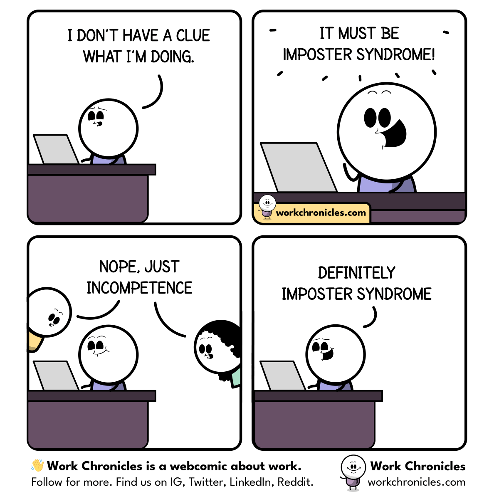

## Intro

I see a lot of videos and blogs these days about "how I would learn to code if I started over", and "do these X things to get hired by FAANGs".

I see free and paid courses and tutorials on various platforms ranging from horrendous to amazing.

I see people with zero experience spewing opinions with no real basis as facts, and people knowing less than them eating it up (or worse, arguing with people who actually know).

This post isn't any of that. It's not meant to discuss or address any of these things. At all. So why bring it up?

Because some of it might be relevant, so this is my disclaimer.

**What follows is my opinion, and I feel it has worked for me. I'm not saying it is the only or best way. I'm not saying it works for everyone.**

What I will say is that there are nuggets of usefulness for someone. And I'd love to hear what you do, and what's helped you that I can look at as well.

## Okay, so?

The other day I had a question from young developer at the company I'm consulting for. It was a fairly simple question, and yet it caused much reflection, and eventually prompted some new questions for me.

The question he asked was "How did you get to where you are now? Where do you even start growing?"

I've been doing this professionally for about 15 years, and as a hobby for much longer. I don't consider myself to be great, most days I don't even consider myself to be good. I have been told I'm both by different people, but I also know people a lot more skilled and impressive than me. Take that as you will. For me it meant I felt unqualified to answer this question.

Always makes me laugh. Of course, imposter syndrome could be good. It means you realise there are things you don't know. And knowing is half the battle. Thinking you know everything will be your downfall. And I for one still know next to nothing.

And all this made me think; How _did_ I get here?

## My Earliest Influence

The first and most influential bit on my path was probably [The Pragmatic Programmer, From Journeyman To Master](https://pragprog.com/titles/tpp20/the-pragmatic-programmer-20th-anniversary-edition/). 

This book set me on a path of self-improvement and striving to be better. Small things which I now practice daily, lessons which I could immediately apply to the very first projects I did as intern and my first full-time position, all the way up to present day.

For the past 15 years I've recommended this book to every programmer and developer I meet that hasn't already read it.

The next one that really had an impact was [Clean Code, A Handbook of Agile Craftsmanship](https://www.amazon.com/Clean-Code-Handbook-Software-Craftsmanship-ebook/dp/B001GSTOAM/). Really helped me step up my game.

But I needed more, and my next step was to...

## Find good people

I strongly believe one of the best things you can do to grow and improve is to get involved with like-minded people who you can learn from and who can push you.

It doesn't have to be a mentor, although finding those are great. Sometimes even a bad mentor can teach you something about yourself. But having people you can talk to, bounce ideas off of, debate tech and trends... it helps. I play poker every month with a bunch of really smart software engineers, and even just chatting about what we are working on gives insight and chances for growth.

Conferences and meet-ups give you a chance to learn from other peoples lessons. Two things I've learned growing up relevant to this post:

> We learn more from our failures than our successes.

But also:

> You must learn from the mistakes of others — you will never live long enough to make them all yourself

Conferences, podcasts, blogs and meet-ups are great ways to do this. And it also set me on the next path where I try to...

## Learn from everyone

Once you have those people in your life who help you grow, go looking for the people removed from you. I am a big fan of the "97 Things Every X Should Know" series of collective wisdom books.

In particular, these three have stood out in my own career:

- [97 Things Every Programmer Should Know](https://github.com/97-things/97-things-every-programmer-should-know)
- [97 Things Every Software Architect Should Know](https://www.amazon.com/Things-Every-Software-Architect-Should-ebook/dp/B0026OR30S/)
- [97 Things Every Cloud Engineer Should Know](https://www.amazon.com/Things-Every-Cloud-Engineer-Should-ebook/dp/B08PQ6DCJG/)

Not everything will apply to all that you do, but there are some gems hidden in each. With this in mind, and a hunger to learn and grow more, I realised that I had to...

## Learn from Specialists

Finding good online courses can be hard. Platforms like YouTube make it easy to find free materials, but "likes" don't equate to "quality"; some really stupid stuff have gone viral over the years and tend to hide some of the real diamonds.

The same goes for platforms like Udemy. The most popular and highest rated aren't always the best content. Sure, 4 times out of 5 it probably is, but that other 1 is probably the course that went on sale the most and got bought by the most people.

So while I don't agree that this is a general truth, it does often apply:

> Those who can, do; those who can't, teach.

Just something to think about.

Personally I prefer Coursera and Pluralsight, because the content is more curated, and Coursera is backed by University content, but the same issues apply. This is again where a good network helps; find someone else who benefitted from a course, and see if it aligns with your style op learning.

If you learn well from books, I can highly recommend [Pragmatic Bookshelf: By Developers, For Developers](https://pragprog.com/)

And that lead me to think I need to...

## Read more Books, Blogs, Newsletters & Websites

Tech moves at a stupidly fast pace. Two years into a project, it's "legacy" and there is something new shiny available. Keeping up is hard, in fact, near impossible. Having sources catered to where you specialise helps a lot.

Don't just send all newsletters to spam, but curate what is worthwhile. I spend a lot of time reading [Hacker News](https://news.ycombinator.com/) links and [InfoQ](https://www.infoq.com/) articles and watching talks there as well.

Some books that fundamentally changed how I think about business, which is something I never did as a junior, but had to as an architect and manager, were

- [The Phoenix Project: A Novel about IT, DevOps, and Helping Your Business Win](https://www.amazon.com/Phoenix-Project-DevOps-Helping-Business/dp/0988262592)
- [The Unicorn Project: A Novel about Developers, Digital Disruption, and Thriving in the Age of Data](https://www.amazon.com/Unicorn-Project-Developers-Disruption-Thriving-ebook/dp/B07QT9QR41/)

Of course, none of the above helps at all if you don't...

## Apply what you learn

Doing something, anything, is always better than doing nothing. And I hate to say it, but consuming content without focus and intent is doing nothing.

Watching a course means nothing if you don't apply it. You can't watch a Youtube video on how to make a blueberry pie, never bake one, and then proclaim to the world you are a master baker. In two years, when someone asks you to bake one, and that video is gone... I feel for the poor soul eating whatever slop you end up with.

I am often guilty of this myself, watching courses on something I think I will use, then never do, or even learning just for the sake of learning. These days, I try and be more intentional, focusing on something I will use in my current job, or a side project I am working on.

I don't like telling people they should take on side projects or contribute to open source, since very often you will then end up with no life. If that's what you want though, by all means, enjoy the burnout.

But I do encourage active learning. Watch a course on a new language, and rebuild something you did recently in that language. Rewrite something you did at work in one framework in a competing framework, and learn from it. Take smalls lessons in one place and apply them everywhere you see a gap to do so.

Which also brings me to my last point. A book that was recommended to me recently which greatly changed my view on work, which is that...

## Skills Trump Passion

Okay, whoa whoa whoa and whoa. 

That will be taken out of context. 

The book that I read was [So Good They Can't Ignore You: Why Skills Trump Passion in the Quest for Work You Love](https://www.amazon.com/Good-They-Cant-Ignore-You/dp/1455509124), and the author makes the argument that being passionate about something does not make you automatically successful, but passion backed by skills will greatly increase your odds.

Obviously there is a lot more to it than this, but for me the key takeaway was that you first need to build up your skills, your "career capital" he calls it, through "deliberate practice".

As you build and sharpen your skills, especially within your network, people will notice, and you will keep growing. And eventually others will notice too.

And how much better will this world be if we could all just be a little better today than we were yesterday.

---
*This post was originally published on [dev.to](https://dev.to/wynandpieters/biggest-impacts-on-my-career-9el)* 