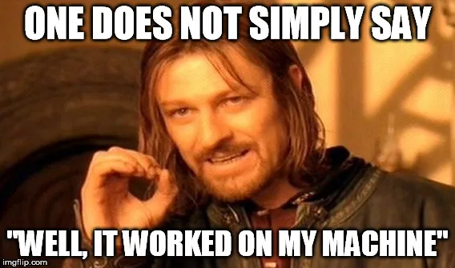

Previous posts for context: [The Future of AI Coding is Directing](/posts/cast-intro/) and [C.A.S.T Progress: First Blood](/posts/cast-first-blood/)

---

Last time I had one event flowing from a ticket board to a NATS topic. That was the plumbing. This time the plumbing has something running through it: a ticket goes in one end as a one-line wish, and a reviewed, merged, cleaned-up branch comes out the other. No human types a line of code in between.

It took four agents, one demo script, and, when I sat down to write this post on a laptop that had never run it before, eleven bugs.



## The Setup

Quick recap if you're joining late. C.A.S.T is a ticket-driven multi-agent framework. The ticket is the shared memory. State changes on the ticket fire NATS events. Agents subscribe to the topic for their role, wake up, do one job, write the result back to the ticket, and go back to sleep. Nobody talks to anybody directly.

The stack hasn't changed since [First Blood](/posts/cast-first-blood/): [kata](https://github.com/wesm/kata) for issues, NATS with JetStream for wake-ups, a thin Python bridge between the two, and a headless agent CLI as the runtime. Antigravity (`agy -p`) by default, though as you'll see, not for this run. Two processes plus a Docker container.

What has changed is that there are now four agent runners instead of zero:

| Role | Wakes on | Does | Writes back |
|---|---|---|---|
| PM | `tickets.backlog` | Grills the ticket until the acceptance criteria are testable | AC as a comment, label `ready` |
| Dev | `tickets.ready` | Claims the ticket, git worktree, runs the agent CLI, runs the tests | Commit on `cast/ticket-<ref>`, label `review` |
| Reviewer | `tickets.review` | Diffs the branch against base, judges it against the AC | Verdict as a comment, label `approved` or back to `ready` |
| Cleanup | `tickets.closed` | Removes worktrees, deletes the merged branch | Nothing. It's cleanup. |

Each one is a hundred-odd lines of Python. Subscribe, read the ticket with `kata show`, build a prompt, call the agent CLI in print mode, parse the first line of the output, move the label. That's the whole pattern, four times over.

The human is still in the loop in exactly two places: writing the ticket, and merging. That's deliberate. An autonomous team still gets one gate before code lands on main.

## What I Actually Tested

`demo.py` runs the whole lifecycle unattended. It starts the bridge and all four runners, creates a ticket, labels it `backlog`, and then just watches the labels change. When the reviewer approves, the script plays human: merges the feature branch and closes the ticket with `kata close --done`. Then it waits for the cleanup agent to delete the branch.

The merge target is an ephemeral branch created for the run, so the demo never touches a real `main`. And the ticket is deliberately vague, because I wanted to see the PM agent earn its keep:

> **Add a string reverse helper**
> We need a utility that reverses strings. Add it to the project.

That's it. No file names, no function signatures, no edge cases. If a dev agent picked that up cold it would guess at all three.

The PM agent is supposed to refuse that. It grills the ticket until every criterion is something a test can check, and if it can't get there it posts questions and waits for a human. Which is a problem for an unattended demo, so the demo plays the stakeholder as well: when a `## Clarifying Questions` comment shows up, it posts a canned answer and lets the PM go again. Six rounds and the PM forces `ready` regardless.

One more thing I changed for this post. Every earlier run had the agents working on the C.A.S.T repo itself, which is a bit like testing a fire extinguisher by setting fire to the fire station. So this run points the agents at a throwaway project: a fresh git repo with a README and nothing else.

```
$ python demo.py --repo ~/Source/cast-demo-target
=== C.A.S.T Full-Lifecycle Demo ===

Target repo:   ~/Source/cast-demo-target
Worktree root: ~/Source/cast-demo-target/worktrees

Created ephemeral base branch: cast/demo-base-bac648

Launching bridge...
Launching pm...
Launching dev...
Launching review...
Launching cleanup...
13:51:36 INFO cast-bridge   stream 'TICKETS' created (retention=interest, max_age=7d)
13:51:36 INFO cast-bridge   spawn: kata events --tail --last-event-id 48
13:51:36 INFO cast-agent    Subscribed to tickets.ready in queue group 'cast-agents'
13:51:36 INFO cast-reviewer Subscribed to tickets.review
13:51:36 INFO cast-cleanup  Subscribed to tickets.closed
13:51:36 INFO cast-pm       Subscribed to tickets.backlog and tickets.comment

Creating raw issue: 'Add a string reverse helper bac648'
Created issue kqtt

Labeling kqtt as 'backlog' — PM agent should refine it...
13:51:39 INFO cast-bridge   → tickets.backlog  issue=kqtt  seq=27
13:51:39 INFO cast-pm       PM woke on backlog: ticket kqtt
  [  0s] labels: ['backlog']  (+backlog)
```

The full, unedited log of this run is [here](demo-run.log) if you want to follow along line by line. What follows is the interesting bits.

## What the Agents Did

**The PM refused the ticket.** Five seconds after waking up, it posted this to the issue and left the label on `backlog`:

```
13:51:44 INFO cast-pm PM agent output for kqtt:
STATUS: NEEDS_INPUT
1. What language/module should this live in, and what's the exact function
   signature (name, input type, return type)?
2. How should it handle Unicode — reverse by byte, UTF-16 code unit, or
   grapheme cluster (so emoji/combining characters/multi-byte scripts stay intact)?
3. What is the expected behavior for empty string input, and for null/undefined input?
4. Should the original string be mutated, or must a new string be returned?
5. Is this a pure function only, or does it also need a CLI/API entry point?
```

Those are good questions. Question two in particular is the one a dev agent would have silently answered wrong. The demo's canned stakeholder answer went on as a comment, the bridge turned that into a `tickets.comment` event, the PM woke again, and four seconds later:

```
13:51:50 INFO cast-pm PM agent output for kqtt:
STATUS: READY
1. `reverse(s: str) -> str` in `string_utils.py` returns a new string with
   characters in reverse order by Unicode code point (grapheme clusters not
   handled specially), leaving the input string unchanged.
2. `reverse("")` returns `""`.
3. Calling `reverse` with a non-`str` argument, including `None`, raises `TypeError`.
4. `test_string_utils.py` contains pytest tests covering: a standard ASCII string,
   an empty string, a multi-codepoint Unicode string (verifying code-point-level
   reversal), and a non-str/`None` input raising `TypeError`; all pass via a
   plain `pytest` invocation.
13:51:50 INFO cast-bridge → tickets.ready  issue=kqtt  seq=31
```

Every one of those is something a test can check. That's the bar, and it took one round trip.

**The dev agent claimed it within the same second.** Worktree on a fresh branch, `claude -p` with the whole ticket thread as the prompt, and sixteen seconds later:

```
13:51:50 INFO cast-agent Claimed ticket kqtt
13:51:50 INFO cast-agent Setting up git worktree for branch cast/ticket-kqtt
Preparing worktree (new branch 'cast/ticket-kqtt')
13:51:51 INFO cast-agent Running agent on task in worktree...
13:52:06 INFO cast-agent Agent Output:
All 4 tests pass.
`reverse(s: str) -> str` in `string_utils.py` uses `s[::-1]` (Python's slicing
already reverses by code point). → skipped: custom loop/algorithm, add if
grapheme-cluster correctness is ever needed.
13:52:06 INFO cast-agent Running tests to verify agent solution inside the worktree...
collected 4 items
test_string_utils.py ....                                                [100%]
============================== 4 passed in 0.00s ===============================
13:52:07 INFO cast-agent All tests passed successfully!
[cast/ticket-kqtt b9dea69] feat: solve ticket kqtt - Add a string reverse helper bac648
 2 files changed, 26 insertions(+)
 create mode 100644 string_utils.py
 create mode 100644 test_string_utils.py
13:52:07 INFO cast-bridge → tickets.review  issue=kqtt  seq=33
```

The runner doesn't trust the agent's "all tests pass". It runs `pytest` itself in the worktree, and only commits and moves the label if that comes back green. Tests as backpressure, straight out of the Ralph playbook.

(That "→ skipped: ..., add if ..." phrasing is my own "ponytail" lazy-developer skill leaking through. The agent picked it up from my global Claude config. I'll take it.)

**The reviewer diffed the branch and checked each criterion.** Ten seconds:

```
13:52:07 INFO cast-reviewer Reviewer woke on tickets.review: ticket kqtt
13:52:17 INFO cast-reviewer Reviewer agent output for kqtt:
STATUS: APPROVED
All four acceptance criteria are met: (1) `reverse(s: str) -> str` in
`string_utils.py` uses `s[::-1]`, which reverses by Unicode code point and
returns a new string without mutating the input (strings are immutable in
Python); (2) `reverse("")` returns `""` via the same slice; (3) the `isinstance`
check raises `TypeError` for any non-`str` input, explicitly covering `None`;
(4) `test_string_utils.py` contains plain pytest test functions covering an
ASCII string, an empty string, a multi-codepoint Unicode string (correctly
reversed by code point, including the astral-plane emoji), and non-str/`None`
inputs raising `TypeError`, runnable via a plain `pytest` invocation.
13:52:17 INFO cast-reviewer Ticket kqtt approved at b9dea6900d68d4b09594e8a674414d2760633df1
13:52:17 INFO cast-bridge → tickets.approved  issue=kqtt  seq=35
```

Note what it's doing: criterion by criterion, against the diff, with the commit SHA it reviewed recorded on the ticket. Not "looks good to me". Not opinions about naming. The prompt tells it to judge only against the acceptance criteria and it does.

**The human merged, and cleanup did its one job.**

```
[human-sim] Merging cast/ticket-kqtt → cast/demo-base-bac648...
[human-sim] Merged at 201a5ef9c7ef25929a9dd62e38a1b8b4505729db
[human-sim] Closing issue kqtt...
13:52:18 INFO cast-bridge → tickets.closed  issue=kqtt  seq=36
13:52:18 INFO cast-cleanup Cleanup woke on tickets.closed: ticket kqtt reason=done
13:52:19 INFO cast-cleanup Deleted merged branch cast/ticket-kqtt
  [  0s] ✓ Branch cast/ticket-kqtt deleted by cleanup agent

✓ C.A.S.T Full-Lifecycle Demo PASSED
  Five roles, one ticket, zero human coding, full spec path exercised.
```

Ticket created at 13:51:39. Branch deleted at 13:52:19. Forty seconds, five processes, one ticket, and the only thing a human typed was the one-line wish at the top.


## A Necessary Reversal

In the [intro post](/posts/cast-intro/) I made a big deal of communication discipline. Requirements on the ticket, implementation on the PR, decisions in ADRs. "Not as a preference, as a protocol."

The reviewer agent now posts its findings on the ticket. Not the PR.

Here's why: C.A.S.T intentionally doesn't know what git host you use. There's no `gh`, no `glab`, no Bitbucket client, and honestly I don't want there to be. The dev agent commits to a local branch. The only artifact every agent can read and write, regardless of whether a remote even exists, is the kata issue. A rule that says "post to the PR" when there is no PR isn't a protocol. It's a silent failure waiting to happen.

So review is now diff-based and host-agnostic. The reviewer runs `git diff base...cast/ticket-<ref>`, judges that diff against the acceptance criteria already on the ticket, and writes the verdict as a comment. ADR-0010 records the decision and explicitly supersedes the reviewer half of ADR-0005.

The principle survives, though. The failure signal just moved. The violation to watch for now isn't "review feedback on the ticket". It's "reviewer commenting on implementation taste instead of AC conformance". Same idea: if the wrong kind of conversation shows up in a place, something upstream went wrong.

## What Broke

This is the part everyone probably wants to hear about. Every one of these bugs was invisible on the machine I built it on. They only showed up because I ran the demo on a laptop that had none of the state the first machine had accumulated.


**Bug one: the agents assumed the target repo was the current directory.** Every runner ran `git worktree add`, `git diff`, `git branch -d` in whatever directory it was started from, which had always been the C.A.S.T repo. The cleanup agent was worse: it resolved the repo root from its own file location, so it could never have cleaned up a branch anywhere else. The fix is one environment variable, `CAST_REPO`, resolved in one shared place, and every git call gets a `cwd`. Boring. Should have been there from day one.

**Bug two: a ghost from the Plane era.** The first demo run died instantly with every runner throwing `filtered consumer not unique on workqueue stream`. The NATS Docker volume on this laptop still held a `TICKETS` stream created back in April by a `nats-init.sh` script from when Plane was the ticket board. That stream had *workqueue* retention and five durable consumers. The bridge wanted *interest* retention. The bridge's stream setup did `try: add_stream except: log "already exists"`, which is exactly the kind of code that turns a config mismatch into a mystery.

Retention can't be changed on an existing stream, so the fix is to fail loudly: check the existing stream's retention and exit with the command to delete it. Ten lines. Turns a twenty-minute head-scratch into a one-line error message.

**Bug three: I committed the bridge cursor.** The bridge persists the last kata event id it published so it never replays. That file was in git. On the new laptop kata's event log had three events in it and the bridge started tailing from event 1292. It would have sat there silently for the next 1,289 events.

The `.gitignore` had the directory in it all along. It also had a helpful comment on the same line:

```
.cast/bridge/          # bridge cursor and runtime state
```

Git doesn't do trailing comments. That whole line, spaces and hash and all, is the pattern. It matches nothing. The `.kata.local.toml` line had the same problem, which is why `kata init` politely appended a second, working copy of it when I set the laptop up. I have written `.gitignore` files for fifteen years.

**Bug four: a startup race nobody had ever hit.** With a genuinely fresh NATS, the bridge creates the `TICKETS` stream on startup. The four runners start at the same time and call `js.subscribe` on subjects in that stream. Whoever loses the race gets `NotFoundError` and dies. This never happened before because the stream had existed on my machine since April. The fix is a tiny retry helper in the shared library: subscribe, and if the stream isn't there yet, wait a second and try again.

**Bug five: the same null guard, three times.** Back in June I fixed a crash where kata returns `"comments": null` on a fresh ticket instead of an empty list. I fixed it in the function that builds the conversation thread. I did not fix it in the two sibling functions that count PM and reviewer comments for the round cap. The PM agent crashed on the very first ticket. Lesson I already knew and apparently needed to relearn: when a bug report names a symptom, grep every caller before you patch the one path the report names.

**Bug six: the demo leaked processes.** When a runner crashed on startup the demo script called `sys.exit(1)` before its cleanup block, leaving the bridge from that run alive. After two failed runs I had three bridges tailing kata, two of them writing the same cursor temp file. That produced a rename error I initially thought was a real concurrency bug in the bridge, plus a PM agent that woke twice for one ticket. It wasn't a bridge bug. It was two bridges. The demo now terminates its children and deletes its ephemeral branch on a startup failure, and the cursor temp file carries the process id so two bridges can at least not corrupt each other.

**Bug seven: an unauthenticated agent looks exactly like a cautious one.** With everything else fixed, the PM agent woke up, ran for sixty seconds, and posted this to the ticket:

```
## Clarifying Questions

1. Please clarify the requirements.
```

Which is a perfectly plausible thing for a PM agent to say about "we need a utility that reverses strings". Except it wasn't the agent. `agy` had never been logged in on this laptop. It printed an OAuth URL to stderr, waited sixty seconds for a human who wasn't there, and exited with nothing on stdout. The runner threw away stderr, saw empty output, and substituted a hard-coded fallback question. The reviewer had the same fallback, a canned "manual review required".

A fallback that fabricates a plausible answer is worse than a crash. Every agent call now goes through one shared function that logs stderr and raises on a non-zero exit or empty output. The PM leaves the ticket on backlog with an error in the log. The dev agent writes a `BLOCKED.md` saying the runtime failed. The reviewer leaves it on review. Nobody guesses.

And since I was in there anyway: the command was hard-coded as `agy -p` in three separate files. ADR-0009 made Antigravity the *default* runtime, not the only one, and a default you can't change isn't a default. It's now one environment variable:

```bash
CAST_AGENT_CMD="claude -p --dangerously-skip-permissions"
```

Flags first, prompt appended last, which works for `agy`, `claude`, and `codex exec` alike. Which is how the run in this post ended up on `claude -p` after all. Remember the [last post](/posts/cast-first-blood/#one-more-thing), where I was upset about Anthropic changing how `claude -p` is billed? That change got delayed. It still works, it's still on my subscription, and on a laptop where `agy` wasn't logged in it was one env var away. The whole point of a replaceable runtime is that the day it matters, you don't have to care.

**Bug eight: the bridge couldn't be told to stop.** The bridge blocks on reading `kata events --tail`. It handles SIGTERM by setting a flag that gets checked when the next line arrives. If no event arrives, it never checks. The demo waits two seconds and sends SIGKILL, which leaves the kata child process orphaned. A five-line watcher task now terminates the child the moment the flag is set, and the bridge exits in under a second.

**Bugs nine, ten and eleven: the ones the successful run found.** Once the lifecycle actually completed, the log had three more things in it. The PM agent, when it ignores a comment on a ticket that's already left backlog, acknowledged the NATS message twice and threw `MsgAlreadyAckdError` into the log. Harmless, ugly, one line. The PM also asked whether the helper should live in `cast_lib.py`, which is a file in C.A.S.T, not in the target project: the PM and reviewer ran `claude -p` from wherever the runner was started, and Claude had a look around. They now run inside the target repo. And the cleanup agent's `git branch -d`, which I chose over `-D` in ADR-0011 precisely so an unmerged branch could never be deleted, refused to delete a merged one. `-d` checks whether the branch is merged into *the branch you have checked out*. It knows nothing about `CAST_BASE_BRANCH`. Cleanup now asks git the actual question, `merge-base --is-ancestor`, against the configured base, and only then force-deletes. Same safety, correct target.

Eleven bugs, none of them in the agents' logic. All of them in the seams: between the runners and the filesystem, between the bridge and a stale NATS volume, between a CLI's stderr and a runner that never read it, between what one machine had accumulated and what a fresh one didn't.

## What Worked

Once the seams were sewn up, the lifecycle ran unattended, on a fresh laptop, against a repo that had never seen an agent. The PM agent turned "we need a utility that reverses strings" into concrete, testable criteria after exactly one round of questions. The dev agent produced the module and the tests and committed to its branch. The reviewer diffed it, checked it against the PM's criteria, approved it with a rationale. The demo merged, closed the ticket, and the cleanup agent deleted the branch.

Forty seconds end to end. Most of that was three `claude -p` calls. The plumbing itself, bridge to NATS to runner, adds up to about a second across the whole run.


The round caps earned their place too. The PM stops grilling after six rounds and forces `ready`. The reviewer gives up after three review cycles and labels the ticket `blocked` for a human. Neither triggered in this run, but knowing they're there is the difference between an autonomous loop and an infinite one.

## What I'm Taking Away

- **Fresh machines are the best integration test.** Every bug in this post was a state bug: a Docker volume, a committed cache file, a working directory assumption. Unit tests were green the whole time. If you build a system that coordinates processes, run it somewhere that has never run it before you call it done.

- **Fail loudly at the seams.** The stream mismatch, the stale cursor, the missing stream, the empty agent output: every one had a `try/except` or a default that turned a wrong configuration into silence, or worse, into a plausible-looking answer. Every one of the fixes is "detect the mismatch and say so". Silence is not robustness. Neither is a fallback that makes something up.

- **Reversing a public design decision is fine if you write it down.** The reviewer-on-the-ticket change contradicts something I said with a lot of confidence six months ago. The ADR says why, what it supersedes, and what the new failure signal is. That's the whole point of keeping them.

## What's Next

The lifecycle works for one repo and one dev agent. The spec promises more than that.

Still not built: the feature folder, where the dev agent synthesises a top-level `CLAUDE.md` from every in-scope repo's own context before it starts. The multi-repo PoC, the Go facade plus Python gRPC service that started this whole thing. And I still haven't run two dev agents at once to watch JetStream's queue group hand each ticket to exactly one of them. The subscription is written that way. Nobody has seen it happen.

Also missing is anything for the human at `blocked` and `approved`. Right now those topics have no subscriber. A notification is a small thing to build and a large thing to be without.

That's the next post.

And after that? Probably making it public. The goal would be to have adapters for whatever your ticketing system and Git pipeline is. Read your master ticket, do the NATS things locally, eventually push the changes back to your repo and master ticket. Each dev should be able to run their own team of agents locally without breaking the standard way of work for your team and company. But that's for another post.

---

*C.A.S.T is still not public. It's getting closer. [RSS](https://wynandpieters.dev/posts/index.xml) is the way.*
