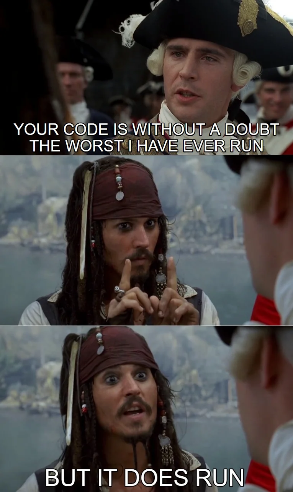
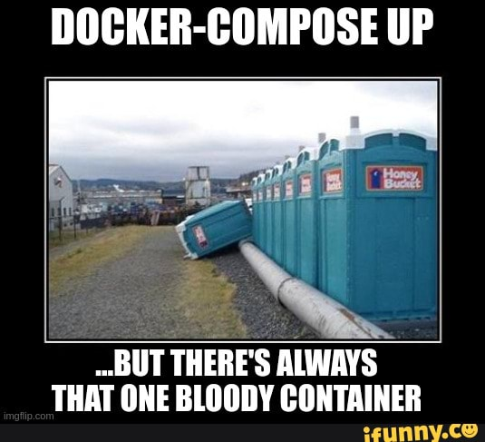
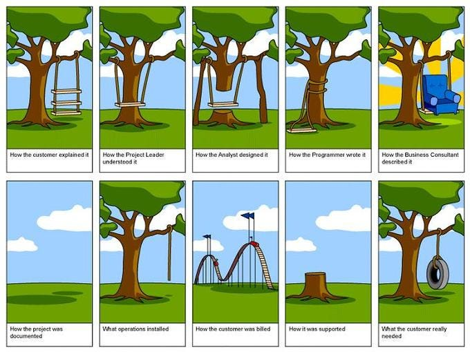

Previous post for context: [The Future of AI Coding is Directing. Let Me Introduce You to Your C.A.S.T.](/posts/cast-intro/)

Also, this banner was generated by ChatGPT and whatever model they are using at the moment, and I'm kinda impress, NGL.

---

When I wrote about C.A.S.T last month, the design was solid but unproven. I had a SPEC, ADRs, hire/fire scripts, and a lot of conviction. What I didn't have was a single event flowing from a ticket board to a NATS topic to a waiting agent.

Today I do. And getting there was exactly as messy as you'd expect.



## The Setup

If you're joining late: C.A.S.T is a ticket-driven multi-agent framework. Tickets move through states. State changes fire events. Agents wake up and do work. The coordination primitive is the ticket itself — not agent-to-agent communication.

Since the last post, a significant piece changed. Plane is gone. I wrote about it being the ticket board, self-hosted, webhooks, the works. In practice, Plane's 13-service Docker stack was too unreliable for local development. Webhooks would silently stop firing. Services would crash and not restart. I was spending more time debugging my coordination layer's infrastructure than building the coordination layer.



So I replaced it with [kata](https://github.com/wesm/kata) — a local-first issue tracker written in Go. Single binary. SQLite backend. No Docker dependency. A stable CLI and a JSON event stream you can tail. It has a TUI for when you want to browse issues like a human, and a `--json` flag for everything else. The decision is recorded in ADR-0008, which you can view yourself once I open the repo to the public.

NATS stays. Its JetStream queue groups give me competing-consumer semantics — exactly one dev agent claims each ticket, no application-level locking — and that's worth keeping a single Docker container running for.

The local stack is now `docker compose up` for NATS and `kata daemon start` for issue tracking. Two processes. That's it.

Now keep in mind, I'm focusing on the plumbing and proving the concept. Ideally, over time, I will be able to hook into whatever KANBAN based ticketing system you want. But for now, the extra complexity from Plane just wasn't worth the hassle.

## What I Actually Tested

The bridge is the critical path. It's the thing that connects the ticket board to the message bus. A lightweight Python process that tails `kata events --tail`, watches for label changes, and publishes to the corresponding NATS topic.

The test was simple: create an issue, label it `ready`, and verify that a NATS subscriber on `tickets.ready` receives the event with the correct issue metadata. Not the full workflow — no agents claiming tickets or running Ralph loops yet — but the foundational plumbing that everything else depends on.

If this doesn't work, nothing works.


## What Broke

Two things broke. Both were the kind of bugs that make you feel stupid in hindsight but are genuinely non-obvious when you're staring at them.

**Bug one: nats-py and timedelta arithmetic.** The bridge creates a JetStream stream on startup with a 7-day retention policy. I defined `STREAM_MAX_AGE` as `datetime.timedelta(days=7)` because that's how you express duration in Python. Reasonable, right?

Except `nats-py` internally converts durations to nanoseconds by multiplying by `10^9`. When you multiply a `timedelta` object by `10^9`, Python doesn't give you nanoseconds. It gives you a `timedelta` of 7 billion days. Which then overflows when the library tries to convert it to a C int.

The error message — `OverflowError: Python int too large to convert to C int` — doesn't exactly scream "you used a timedelta instead of a float." The fix is one line: express the value as seconds.

```python
# Before (broken):
STREAM_MAX_AGE = datetime.timedelta(days=7)

# After (works):
STREAM_MAX_AGE = 7 * 24 * 3600.0  # 7 days in seconds
```

This is the kind of bug that would have taken me an hour to find six months ago. It took about thirty seconds with an AI agent reading the nats-py source alongside the traceback. I'll take that trade every day.

**Bug two: kata's JSON response schema.** The `kata create --json` command nests the issue data inside an `issue` key. My code — and the `lib.sh` helper that wraps kata's CLI — was trying to read `short_id` from the top level. `KeyError`.

This one is just the cost of building against an early-preview tool. kata is pre-1.0 and its contract is still settling. The fix is trivial but it's a good reminder that I need integration tests that catch schema drift, not just unit tests against mocked payloads.

## What Worked

Once the two bugs were fixed, the whole pipeline lit up on the first try.


Create an issue. Label it `ready`. The bridge picks up the `issue.labeled` event from kata's event stream, maps it to `tickets.ready`, and publishes a JSON payload to NATS JetStream. A subscriber on the other end receives it within a second.

```json
{
  "issue_uid": "01KSPSRYF6MHP59FW5NE78TA92",
  "issue_short_id": "ta92",
  "project_name": "cast",
  "event_id": 5,
  "actor": "wynand",
  "label": "ready"
}
```

That's a wake-up call. The agent that receives this doesn't need to know anything else from the message — it calls `kata show ta92 --json` and gets the full issue with title, body, acceptance criteria, labels, comments, everything. The NATS message is small, fast, and carries just enough to route the work.

The unit tests for the bridge's `route()` function — 30 of them — were already passing before any of this. They test the pure event-classification logic without needing NATS or kata running. That's by design. The bridge is deliberately thin: classify, publish, persist cursor. Everything else lives elsewhere.

## What I'm Taking Away

Three things:

- **The Plane-to-kata migration was the right call.** I should have done it sooner. Every minute I spent debugging Plane's Docker stack was wasted time. kata gives me everything I need for agent coordination — issues, labels, comments, events, a CLI that agents can call directly — without the operational overhead. The tradeoff is no browser UI, but `kata tui` in a terminal is fine. I'm not building a product for a team of humans. I'm building plumbing for agents. The HITL things come later. Baby steps.

- **Integration tests beat unit tests for this kind of system.** The unit tests were green. The system was broken. The bugs were in the seams — between nats-py's expectations and Python's type system, between kata's actual output format and what my code assumed. Seam bugs only show up when you plug the real things together.

- **The bridge is boring, and that's the point.** It's about 150 lines of meaningful code. It tails a stream, classifies events, publishes messages. No state machines. No retry queues. No complex error recovery. If kata's event stream disconnects, it reconnects with backoff. If NATS is down, it restarts the loop. The cursor file means it never replays events it's already published. That's it.

I spent weeks earlier this year looking at LangGraph and other orchestration frameworks for this layer. I'm glad I didn't use them. The simplest thing that works is a subprocess reading NDJSON and a NATS publish call. Sometimes the boring answer is the right answer. Don't overcomplicate.



## What's Next

The bridge works. The plumbing is proven. Now I need to build the thing that actually does work.

Next up is the agent runner — the piece that subscribes to `tickets.ready` via a JetStream queue group, claims a ticket, sets up a feature folder with git worktrees for the relevant repos, synthesises the top-level CLAUDE.md, and kicks off a Ralph loop.

That's the real test. Not "can events flow?" but "can an agent wake up cold, read a ticket, and produce a working PR across two repositories without a human holding its hand?"

I'll write about that when I get there. Including what breaks.

## One more thing...

Oh yeah, just as a side note; I've been using Claude Code since basically launch. It's been my preferred tool for so long, and I'm very upset that they changed how pricing works for `claude -p`. This is fundemental to the Ralph Loop part of what C.A.S.T. plans on implementing, so I will definitely need to pivot.

As part of the experiment in deciding what comes next, I actually tried out Codex and Antigravity, and had them implement this phase of the project.

And I never thought I'd say this, after the train wreck that was Bard and hit-and-miss Gemini, but Antigravity 2.0 with Gemini 3.5 Flash really is impressive. It nailed this implementation and execution in 30 minutes compared to hours of back and forth with Claude and Codex...

Next post will probably have something on that too. Very tempting to replace `claude -p` with `agy -p` ...


Of course, long term, I'd want people to use whatever works best for them. But for now, focusing on the plumbing, I need a sane default.

---

*This project is not getting as much attention as I would like to give it, but do I still think it solves a gap other tools aren't. Keep following my posts if you are interested. [RSS](https://wynandpieters.dev/posts/index.xml) is the way.*