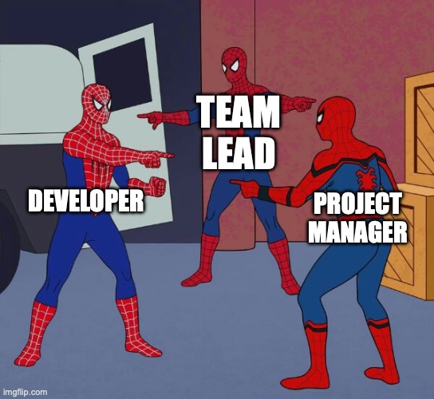
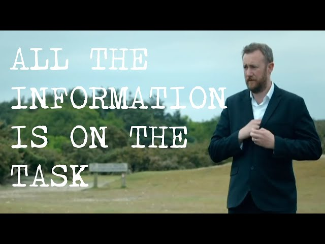
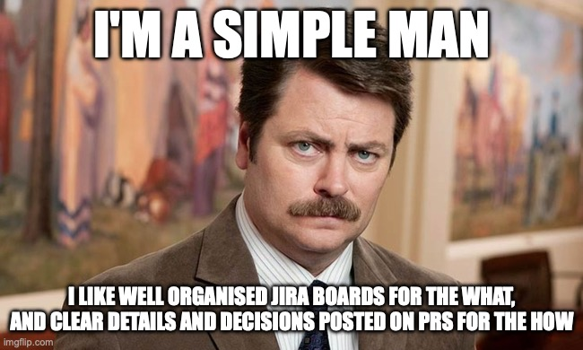
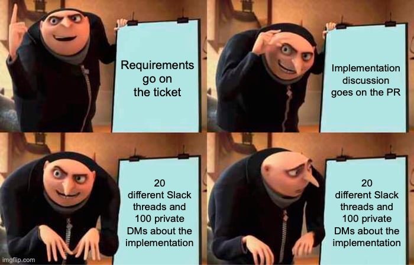

Previous post for context: [Two AI Agents Walk Into a Codebase](https://wynandpieters.dev/posts/two-ai-agents-walk-into-a-codebase)

---

If you look at social media, everyone will tell you that most people are still using AI like a very fast keyboard. You write what you want, it writes the code, you review it, you move on. Faster, sure. But you're still in the driver's seat for every line, every file, every decision.

They will also tell you that the future is not that. The future is swarms of AI agents doing the work of 100s of people. And I mostly agree. The shift that's actually happening — and I say this as someone who's spent the last month living inside it — is from *writing* code to *directing* agents.

Because the wall between what a developer, team lead and project manager do is starting to blur.

You write the spec. You write the acceptance criteria. You write the constraints. Then you point agents at those artifacts and let them work while you focus on the things that actually require judgment: architecture, scope decisions, the PR review that catches what the agent missed.

This is quickly becoming the new norm, and all the major AI providers are jumping on this band wagon, but I don't believe we are quite there yet. Because we are still running our AI agents like AI tools. Not development teams.

About two weeks after I published that LinkedIn post about running Claude Code in GoLand and PyCharm simultaneously and not being able to get the two instances to coordinate, I started building something on that principle; agents as team members. I didn't know what it was yet. I just knew I was frustrated enough to stop waiting for someone else to solve it.

That something is now called **C.A.S.T: Collaborative Autonomous Software Team**. And I want to write about it — not because it's finished, it definitely isn't — but because I've landed on a design I actually believe in, and the journey to get there was interesting enough to share.

---

## The Wrong Problem I Was Trying to Solve

My initial instinct was to build a communication layer. Get the agents talking to each other. NATS, pub/sub, message buses. If Andrew (my Go agent) finishes a proto contract, publish an event. Bryan (my Python agent) subscribes, wakes up, picks up the work.

I spent a lot of time looking at what other people had built. There's a lot out there. Some of it is genuinely impressive. Most of it is solving a slightly different problem than mine, or solving the right problem in a way that requires a monorepo, or requires you to give up your IDE integration, or requires a SaaS account you can't self-host. And they all handle comms and memory in different ways.

So I went down the rabbit hole, I investigated the options, and got my agents talking to each other, but the problem wasn't solved. The thing that actually held me back wasn't the tooling gap or the technical challenge. I was solving the wrong problem.

I've written before about the [The Over-Engineering Trap](https://wynandpieters.dev/posts/the-over-engineering-trap/). That we tend to over-complicate problems. That we forget to Keep Things Simple, Stupid. 

And I had a revelation. I've run development teams for years. And the question wasn't "how do we make the agents talk to each other?". The real question was "should agents need to talk to each other?".

The answer is: no. Because all the information for the task is (or should be) on the ticket. 

The developer then writes what they did and why on the PR. You don't need the frontend dev and the backend dev to have a direct phone line. You need a shared source of truth that both of them read before they start work.

That's it. That's the whole coordination mechanism for high-performing teams. Not real-time communication. A well-maintained artifact.

I'd been trying to build a message bus when what I needed was a better ticket board.

---

## The Insight That Changed Everything

Agents are terrible at maintaining shared state across sessions. They're also terrible at knowing what another agent is doing unless you explicitly tell them. This is not a bug — it's just how context windows work. Every session starts fresh.

But a Plane ticket? That doesn't forget. A PR comment thread? Permanent record. The ticket accumulates requirements. The PR accumulates implementation decisions. Neither of them depends on the agents being online at the same time.

**The ticket is the shared memory. The PR is the implementation record. An ADR is the permanent decision log.**

Once I framed it that way, everything else followed naturally.

The agent doesn't need to talk to another agent. It needs to read the ticket, do its job, and write what it did somewhere the next agent can find. That's async handoff. That's how teams have worked for decades. We've just been trying to recreate the chaos of open-plan offices instead of the discipline of good process.

---

## What C.A.S.T Actually Does

The system is ticket-driven. A ticket moves through states — Backlog, Ready, In Progress, Review, Approved, Closed — and at each state transition, a NATS event fires. Different agent roles subscribe to different topics.

The PM agent refines tickets in Backlog until they're genuinely ready. Not just "write some acceptance criteria" but "ask clarifying questions, iterate, and don't move it to Ready until a dev agent could pick it up cold and know exactly what done looks like."

The dev agent claims a Ready ticket — using JetStream's competing consumers, so if you have multiple agents running, exactly one claims each ticket, no locking logic required — bootstraps a feature folder, checks out the relevant repos as git worktrees, synthesises a top-level CLAUDE.md from each repo's own `.claude/` context, and runs a Ralph loop until the work is done or it's genuinely stuck.

When it's done, it opens a PR and moves the ticket to Review. A reviewer agent picks it up, reads the PR against the acceptance criteria, and either approves or sends it back with comments on the PR (not the ticket — that's a protocol decision I'll get to in a minute).

When a human merges and closes the ticket, a cleanup agent removes the feature folder and worktrees.

The whole thing runs on `docker compose up`. Self-hosted Plane, NATS, and whatever Claude Code instance you want to throw at it.

---

## A Note on Communication Discipline

One thing I carried over directly from running human teams: conversations belong in the right place.

Requirements discussion goes on the ticket. Implementation discussion goes on the PR. Significant decisions go into ADRs before the ticket closes. Not as a preference — as a protocol the agents follow strictly.

Why does this matter? Because if your PM agent does its job properly, there should be no requirements discussion happening on a PR. If there is, that's a signal the ticket wasn't refined enough before the dev agent claimed it. The protocol makes failure modes visible.

Same discipline I enforced on human teams for years. Turns out it applies to agent workflows with even more force, because agents don't have ambient awareness. They read exactly what you give them and nothing else.

---

## Where Things Are Now

The design is solid. The SPEC.md, ADRs, and tooling (including `hire` and `fire` scripts for managing which agents are on a project) are done. The local stack runs. I'm building the bridge now — the lightweight Python HTTP server that receives Plane webhooks and publishes NATS events — and then it's PoC time.

The PoC ticket, when I get there: *"Create a hello world gRPC service in the Python service and wire it into the Go API facade as a proxied endpoint. Both services should have passing tests."* Simple enough to be achievable. Cross-repo enough to exercise the thing I was originally frustrated about.

I'll write about what happens when I get there. Including what breaks, because something will.

For now, just know that C.A.S.T is a thing that exists. I'll keep sharing as it develops.

---

## What Else Is Out There (And Why I'm Still Building This)

I spent a lot of time looking at existing tools before building anything. A few deserve a mention, both because they're doing interesting things and because understanding where they fall short explains why C.A.S.T exists.

- [**Aperant**](https://github.com/AndyMik90/Aperant) (formerly Auto-Claude) is the closest thing to what I'm building, and it's genuinely impressive — 13k stars, a full desktop app, kanban board, worktree isolation, QA loop, even an "AI-powered merge" feature. But it's single-repo focused. You open a project folder and it works within that. My problem is inherently multi-repo. There's also an open bug where the AI merge overwrites changes made to main while a task was running — which tells me they haven't fully solved the hard part yet either.
- [**The Ralph Wiggum technique**](https://awesomeclaude.ai/ralph-wiggum) — a bash loop that feeds a PROMPT.md into Claude until done — is the philosophical foundation C.A.S.T's dev loop is built on. Geoffrey Huntley's writing on it is worth reading. His argument is that multi-agent is premature and a single agent in a monorepo loop is more reliable. He's right, for monorepos. The separation between my Go and Python services isn't an accident I can reorganise away. It's the architecture.
- [**Claude Code Agent Teams**](https://code.claude.com/docs/en/agent-teams) is Anthropic's native answer, and it's further along than I expected — per-agent context windows, peer-to-peer messaging, shared task lists, worktree isolation support. The reason it doesn't replace C.A.S.T is simple: team state is stored locally. There's no external ticket board, no human visibility layer, and no way for a ticket to arrive from outside the session. It also requires a single orchestrator to launch all sessions, which doesn't fit how I want to work across multiple projects and IDEs.
- [**JetBrains Central**](https://blog.jetbrains.com/blog/2026/03/24/introducing-jetbrains-central-an-open-system-for-agentic-software-development/) launched their EAP announcement the same week I was finishing this post. It's describing the governance and context layer that sits *above* what C.A.S.T does — policy enforcement, cost attribution, cross-repo semantic context. It's worth watching, and I've applied to be a design partner (no response yet). If it matures into something that handles the control plane, C.A.S.T might end up as a workflow layer that runs on top of it rather than reinventing it.

There are others. I'll do a proper comparison in a future post. The short version: a lot of smart people are converging on similar primitives — worktrees, spec-driven execution, fresh-context agents, structured handoffs. The gap that C.A.S.T specifically targets — coordinating across repo boundaries with a human-visible ticket board that's self-hostable — is still genuinely open (AFAIK at least).

---

*The project lives at PiForge will eventually be open source on Github, once I have something to show. Follow along if you're building something similar. I'd genuinely like to compare notes.*