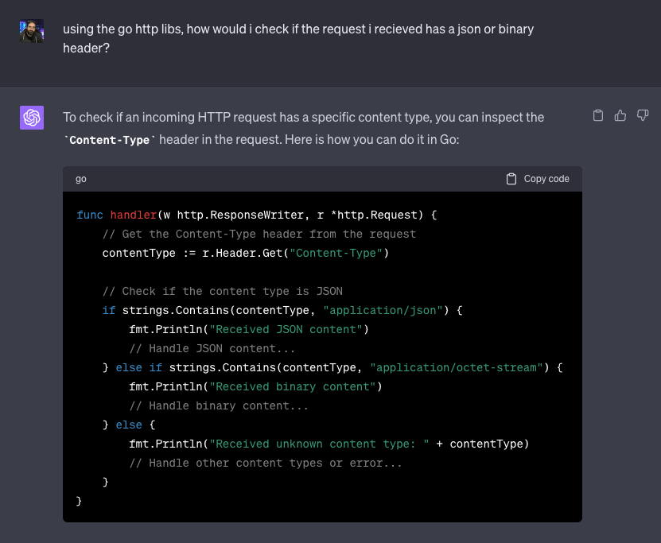
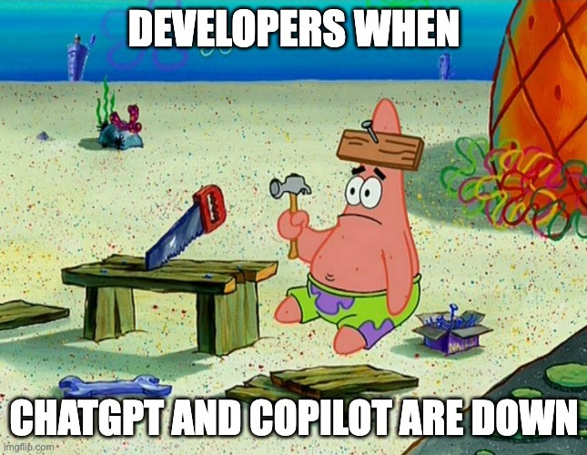
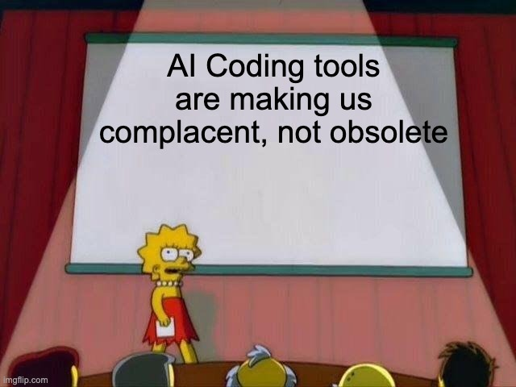

Right, so it's been a minute since I last posted something.

Like many other companies this last year, we weren't spared layoffs. While I still have my job, my team has been greatly reduced, both from people leaving when they saw the signs and from people being let go. So while fighting survivors guilt and an increased workload, posting hasn't been my first priority.

But while doing my day to day and trying to keep my head down and deliver as much as possible as quickly as possible, I noticed something. And I'm not sure how I feel about it, other than we need to talk about it.

I felt this post needed to happen. So here it is:

# ChatGPT has made me lazy.

😳

Yeah.

## Okay, but... you said AI tools are awesome?

Yes, I have been saying that, and I still think the improvements to GPT and other LLMs and the new features with Copilot are fantastic tools and will make many jobs more productive.

But in much the same way I imagine people using horses felt when they first started getting cars, or people who walked everywhere when they got bicycles, or carpenters with their first power tools, this increase in productivity comes at a cost.

## Surely you're overacting?

Maybe. Maybe not. And don't call me Shirley.

I think we need to start with a story. Something I caught myself doing earlier this week.

For local testing we have this little stub service which acts as the client/partner endpoint. Up until now all our data has always been JSON, but for a new partner we are sharing binary data as well, so I wanted to update the stub to handle both. All this needs is a simple if statement to look at the request headers.

I've been doing Go for about 6 years and have built many, many microservices with REST APIs. I should be able to code this logic in my sleep, since I know the APIs of the `"net/http"` package. But what was the first thing I did?

## So you asked ChatGPT to write some boilerplate, big deal

I know, I know, it probably doesn't seem like a big deal... yet. But here's the thing; that's not where it ended. A large part of the rest of my code was just me starting to type, looking at the Copilot suggestion in my IDE, and then pressing Tab.

Then writing a line of custom code unique to my service, before just autocompleting boilerplate from Copilot again.

And yeah, this is awesome. It reduces coding time, hopefully reduces mistakes, it make my life so much easier, right? _Right!?!_

Except when it doesn't.

Something wasn't working, and usually this is where I add some debug logging, and if that doesn't work, I pull out the debugger and start stepping through code, investigating every single line and memory allocation like a detective trying to solve the perfect murder.

Only I didn't. Instead, I did this.

As expected, it told me the obvious things; add logging on the request and receive side and print out the headers and status codes and body. Which I obviously did even before it told me to, because I'm not some n00b and this isn't my first rodeo.

So I told it I already confirmed the problem is on the receive side. And it gave me some good ideas back, and to be fair to the tool, it did help me solve the problem... One of the suggestions was

> 3. Is the request being read correctly? - Ensure that the request body is being read correctly. For instance, it could be that the body is being read somewhere else before your `io.ReadAll(req.Body)` line and it's not being reset.

Which was the issue. When doing some copy-pasta refactoring to add the `if-else`, I moved the reading of the body to outside the `if` statement since I only need to do that once, but then I didn't delete it from the `else` part, which caused some variable shadowing I didn't notice, and because an `io.ReadCloser` such as `req.Body` is a stream and not a buffer, the data I already read is gone from the stream. It worked fine for the `if` because it didn't try and read twice.

And I kinda feel like I should have just picked this up by reading my code properly, instead of jumping onto ChatGPT.

## Ouch. Tough break.

Indeed. And this has made me think a lot about these tools and the impact they've had on me. While I do feel more productive, and there are certain tasks these tools make much easier than before, I wonder at what cost it comes.

It's all too easy to draw parallels between our increasing reliance on AI tools and the introduction of power tools to carpenters or automobiles to those used to horses. The idea of 'progress' often lures us into believing that newer, faster, and more efficient is invariably better. But like power tools, which introduced an increased risk of injury, or automobiles which brought along pollution, AI coding assistants also have their drawbacks.

While power tools enable us to build bigger, faster, and more intricate things than we could with our bare hands, they also run the risk of creating a generation of workers who wouldn't know how to hammer a nail if the power was out. In the same way, tools like ChatGPT and Copilot can help us become more productive coders but also threaten to leave us helpless if we forget how to do even the most simple of tasks.

Of course, I'm not arguing against progress. Without the willingness to adopt new tools and adapt to changing circumstances, we'd still be etching symbols onto cave walls. But as we embrace these AI tools that promise to make our coding lives easier, we must remain vigilant about the risks of over-reliance.

**We must be careful not to trade our skill and expertise for convenience.**

## Conclusion

I'm sure I'm not the only one who's become a little complacent, a bit lazy, in the face of these new tools. But recognizing the problem is the first step towards solving it. 

So yeah, the next time you're reaching for that shiny AI tool to solve your coding problem, pause for a moment. Is this a shortcut you genuinely need, or is it a crutch you're leaning on? Are you using the tool, or is the tool using you?

Remember, the best tool any coder has is their brain. And unlike AI tools, it's 100% unique to you and perfectly tailored to solve your coding problems. So before you let AI take the wheel, make sure you're still in the driver's seat.

---
*This post was originally published on [dev.to](https://dev.to/wynandpieters/my-love-hate-relationship-with-chatgpt-the-unexpected-cost-of-productivity-76m)* 