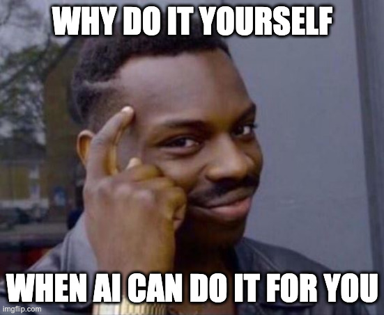
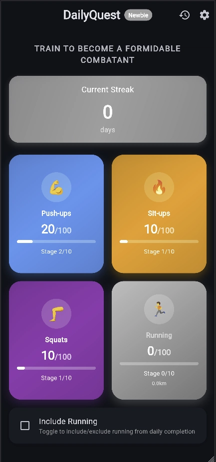
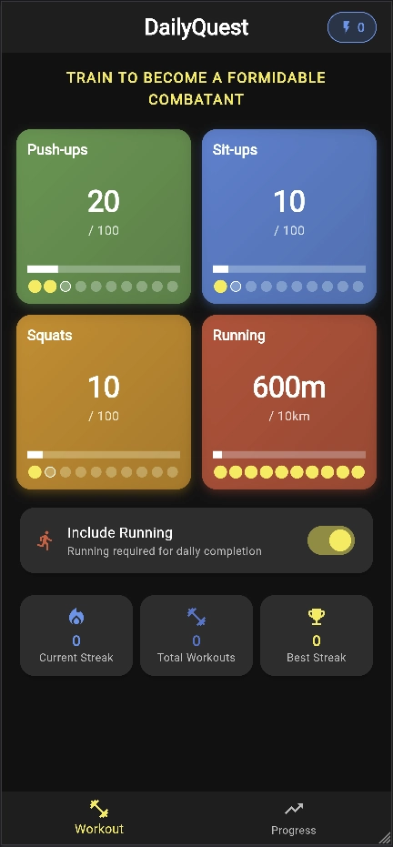
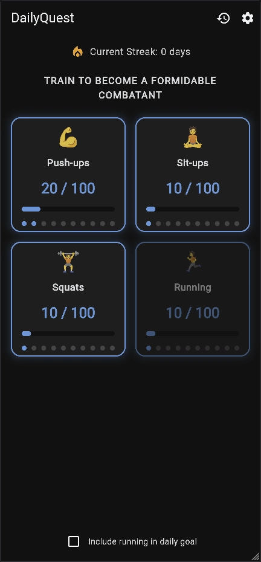

## Intro

I posted over on LinkedIn about an interesting comparison between Lovable and Bolt.new which I did. I had this idea for my next Flutter project, but after being hit by the 5th LinkedIn post about Lovable in as many minutes, I had this thought.

😂😂😂 No, actually, the thought was more along the lines of

Okay, fine, I kid, I kid. If you've read any of my previous posts on AI, you'll know I'm excited for where it's going but tired of the overinflated exaggerations of the "media" and tech bro CEOs.

The thing that was actually interesting to me was how much these tools have improved since I last looked at them, and what about Lovable has made it [$100m in ARR](https://techcrunch.com/2025/07/23/eight-months-in-swedish-unicorn-lovable-crosses-the-100m-arr-milestone/). 

(I'll chill with the memes and GIFs in a bit, let me get it out of my system).

You can go read the original LinkedIn post [here](https://www.linkedin.com/posts/wynand-pieters_aitools-nocode-lowcode-activity-7358426185355120641-Tjza), but the TL;DR was I got something out very quick on both platforms, even on the free tier, but Lovable was the clear winner, but neither app I would call "production ready".

And while it was an interesting _experience_ building the same app with two tools, it wasn't a great **experiment**.

So I wanted to take it further.

## Down the rabbit hole

In my [previous post](posts/ai-tech-stack-2025) I talked about Windsurf and Warp becoming my AI tools of choice. But I also mentioned I still wanted to give Junie a fair shake. I'm a big fan of Jetbrains products and they've been taking my money for a good many years, only fair that I actually give it the old college try.

But alongside that, people keep telling me I need to try Claude Code. I've been hesitant, mainly because I don't see the benefit over the combo of Warp and Windsurf which I'm already using. But being the curious sort, I figured, yeah, this is it. This is the showdown.

## The Challenge

I'll link to the Github, because I don't want this post becoming 500 pages, but it boils down to the same [spec.md](https://raw.githubusercontent.com/wpieters/daily-quest-workout-app-flutter/refs/heads/main/spec.md) file, the same [project rules](https://raw.githubusercontent.com/wpieters/daily-quest-workout-app-flutter/refs/heads/main/.windsurfrules) files, followed by the same [prompt](https://raw.githubusercontent.com/wpieters/daily-quest-workout-app-flutter/refs/heads/main/promp.md). 

These where also exactly as I used for Lovable and Bolt. I left some things vague; I wanted to test if the tools make some assumptions I assume every human developer would (i.e. toggling this checkbox active should disable the related button), and then also see how they respond to changing specs (i.e. oh, can we also just quickly add this thing).

## Some Background: The App

In an effort to get back into more consistent workouts, I decided to start with the One Punch Man workout.

Now, the thing is, I needed to ease myself into it, so I decided I'll do 10 reps and 1km every hour for 10 hours in the day; when I get up, every hour at work, and then before I go home.

But I wanted a way to track it. And since I didn't quickly (i.e. within 5 seconds of Google'ing) find something, I decided to build it myself.

Then decided to let AI build it.

5 times apparently.

So the app is simple. Track the reps for Pushups, Situps and Squats, and track running in 100m increments. Simple.

I quickly realized, being at the tail end of the very wet and cold South African winter, that I'm not doing 10km a day. I'm not that kind of crazy, so I decided that running should be optional.

And lastly I decided that a nice way to show progress is to have a different Goku Saiyan transformation animations play as you progress. Every single AI tool misunderstood my requirement here 🤦 At least some of them remembered the animation bit, others completely dropped that... But no Goku's were harmed in these experiments.

## Overall Impressions

Initial thoughts vs the Lovable/Bolt combo.

- They actually built Flutter apps: this may be a small detail, but I asked for Flutter, they gave me Flutter. Unlike Lovable/Bolt which only do React, these tools are already superior just because they can do more.
- Context access is crucial: the terminal based tools (Claude Code and Warp) that can see errors and project state in the same place I'm working provide massive workflow advantages.
- None of the tools got (what I consider to be) basic UX patterns right initially: All tools missed obvious interaction design (disabling running button when toggled off), so clearly there are still some human traits useful in building visual apps.
- Time investment varied significantly: 30-60 minute range with very different friction levels, but all in all, still impressive for effort in vs output.
- Manual deployment required: Unlike Bolt/Lovable's built-in deployment, all three of these needed separate CI/CD setup. I could probably have used MCP to fix this problem, but that is more setup and more time, and I want a "native" experience.
- I specifically wanted to test with post-hoc changes to see responsiveness to evolving requirements, and they all performed fine. No tool broke the app further, but some struggled to get the requirements right (like using 100m increments for running).

Overall, as you'll see below, I was most impressed with Claude Code. I can see why everyone said I should check it out.

## Impression: Claude Code

Demo URL: https://vibe-claude-code.d14wa6u34905q.amplifyapp.com/

- Most natural development experience: Conversational, collaborative approach felt intuitive
- Best context retention: Remembered previous discussions and decisions effectively
- Fastest to working result: ~30 minutes with least "poking and prodding" required
- Closest to actual requirements: Most complete feature implementation matching original spec
- Best visual polish: Professional, cohesive design language with proper stage progression
- Currently in active use: The version I'm using for actual workouts in the interim
- Least amount of work required: Minimal intervention needed throughout development
- Also had one of my now favorite features: when asked if it should execute something... "No, but tell Claude what you want instead". Brilliant. So much better than clicking cancel or no, then trying to reset the context with a prompt and having the AI get confused.

## Impression: Warp.dev

Demo URL: https://vibe-warp-dev.d14wa6u34905q.amplifyapp.com/

- Surprise standout performer: Exceeded expectations given how new their agentic features are. Will keep on eye on where this goes.
- Excellent "brave mode" experience: Worked well while multitasking on other projects. The only one I actually ran this way, and only because I was also baking a sourdough at the same time...
- Strong context access: Terminal integration allowed AI to see errors and project state, just like Claude Code.
- Took most creative liberties: Added features not in spec (Total Workouts, Best Streak, navigation tabs), not sure why it went rogue.
- Scope creep issues: Worse than taking creative liberties, it added these extra features while basic functionality (running checkbox) remained broken.
- Screenshot sharing limitations: Harder to share visual issues compared to IDE integration, Claude also had this issue, but made fewer mistakes in the design, so didn't run into it.
- Circular reference bugs: State management issues with the running toggle functionality. Biggest bug introduced I'd seen from the tools. The others had mostly linting and compile issues.
- Reasonable timeframe: ~40 minutes development time, despite fundamental bugs, so still impressive (but had the benefit of no oversight)

## Impression: Jetbrains Junie

Demo URL: https://vibe-jetbrains-junie.d14wa6u34905q.amplifyapp.com/

- Most disappointing experience: Despite high expectations from JetBrains and their IDEs, it was much slower (they'd say methodical) and seemed to get stuck in loops now and then.
- Basic project setup issues: Created project in subfolder, breaking CI/CD pipeline I created for the Claude Code and Warp projects, and despite causing issues in the IDE. Expected more from the tight integration.
- Required most manual intervention: Needed more terminal fixes than terminal-focused Warp, also harder to maintain context as it would create new Junie Terminals for different tasks.
- Longest development time: ~60 minutes for inferior result
- Multiple code mistakes: Frequent errors requiring manual prompting of fixes.
- Cleanest final UI: Minimal, iOS-like design despite poor development experience. Not quite the "anime-inspired" look I asked for, but pretty.
- Failed to meet expectations: IDE integration didn't provide expected advantages, although I didn't get to a point of debugging in the IDE, which might change my opinion

## Final Thoughts

Ultimately, I was very impressed with the outputs. While I wouldn't sell any one of these five versions, some of these could actually serve as really good templates to start from. But ultimately, I just decided that I'm going to do it myself anyway.

A friend I spoke to phrased it nicely; these tools give you a nice MVP to sell to an investor, but that first round of cash is gonna have to go to a good dev team to build it proper.

Make it work. Make it right. Make it scale.

These AI tools are for sure getting pretty good at "making it work", but I'm not sold on that they are "making it right".

Yet.

## What's next?

So first of all, I'm still sticking to Warp and Windsurf as my main tools for the time being. I'm not completely sold yet on moving redoing my stack again.

Secondly, I really wanna develop this app, because I think it could be useful to people. I definitely want it to be more Solo Leveling inspired, based on **The Preparation To Become Powerful** daily quest given to Jinwoo to complete by the System. I want the interface to be more System like, and I want to bring in the whole penalty bit somehow.

> CAUTION! - IF THE DAILY QUEST REMAINS INCOMPLETE, PENALTIES
WILL BE GIVEN ACCORDINGLY.

The idea my wife had was to maybe have some kind of an in-app avatar that gets more buff and powerful with XP earned, and you can use in-app currency to kit them out, but then failure to complete the daily quest has XP and currency penalties or whatever.

We actually discussed making this subscription based, but instead of charging a monthly fee, the penalty for for not completing your goals is $1 a day 🤣 So as long as you keep working out (or at least pretend to, I won't know) the app stays free 😉

She also wanted to take the avatar idea a step further and let people then battle their avatars, so losing XP and gear and whatever has a more tangible impact, but sheesh, that's thinking way ahead... I just wanna track my workouts 😐

Alongside that, having app notifications for when the quest starts and ends, and any penalties given, and then reminders through the day about progress, maybe eventually adding Widgets for the phone and so on...

Oh, and maybe supporting logins and online syncing, because right now everything is stored locally, which is a crap user experience, especially if you use more than one device (and who doesn't these days).

And you know what, maybe I'll have Claude Code keep working on its version while I do mine, as a longer term experiment. That could be really interesting 🤔

---
*This post was originally published on [dev.to](https://dev.to/wynandpieters/claude-code-vs-warpdev-vs-jetbrains-junie-5484)* 
