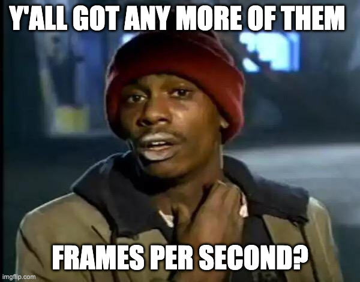
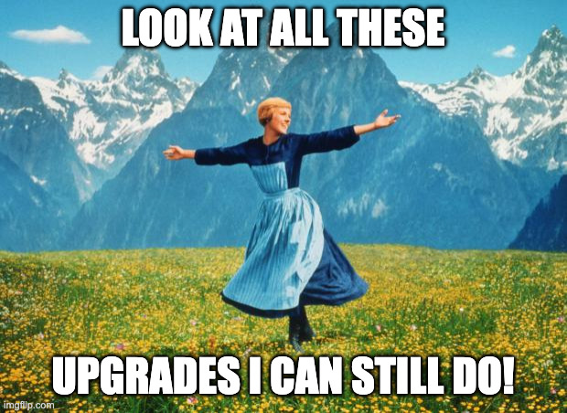
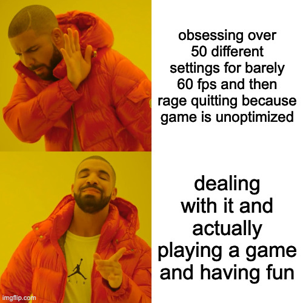
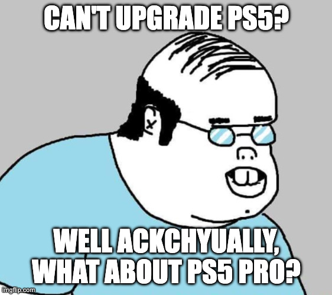
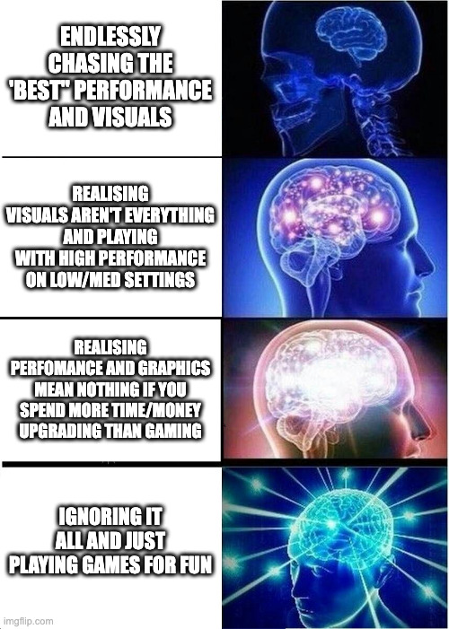
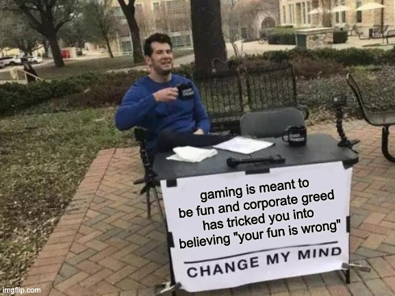

## PC Master Race?

I've always been a multi-platform gamer. I've always loved collecting consoles, and have had a varied gaming experience
over many generations. But I considered myself a PC gamer first.

I'd always go back to PC whenever I could. And I LOVED upgrading my PC, and modding my PC,
and overclocking my PC. It may not sound like much now, but I remember the first time I had a stable 5Ghz on i7-2600K
on air cooling. It. Was. Awesome.

There are also just some things that have always been objectively better on PC. Whether it's performance, or the cost of
games being much lower, or, probably best of all, mods. FPS and RTS are also just objectively better on PC.

But there are also some objectively bad things. Like driver issues. Windows 11. Windows Vista. Wide spectrum of GPUs
meaning inconsistent experience between players. And my personal favourite, the endless and constant upgrade cycle.

Because as AMD just taught us by sunsetting their **3 year old GPUs**, you gotta keep buying and parting with that sweet,
sweet cash if you want them frames.

## So what prompted this post?

Well, I caught myself window shopping. Again. For upgrades I don't need. Because it's been 4 years since my last GPU upgrade,
and 5 years since my last CPU, so I'm behind, and given that [UE5 is kinda rubbish](https://www.reddit.com/r/pcgaming/comments/1gz20su/its_time_to_admit_it_unreal_engine_5_has_been/),
where games like Borderlands 4 (which I was extremely excited for) can't hit 120 FPS on max even with DLSS4 (which is another rant I won't go into now), how the hell
can my PC play it...

And yet still I yearn. Every time my Diablo 4 dips below 100 FPS, I'm immediately on Wootware or Evetech checking if the prices
have come down on the GPUs in my wishlist. Every time I miss a kill in Overwatch 2 or Marvel Rivals (or watch a YT vid on the best
lightweight gaming mice), I think it's time to upgrade my Roccat Kone XTD from 2012. Whenever there is the tiniest bit of artefacting
in my game, I think maybe it's worth shelling out for one of those VRR 480Hz gaming monitors.

And that's the first trap right there.

Owning a gaming PC means your never done. Always one more upgrade or tweak.

And I haven't even gotten into the visual aspect. People spends so much time and money
or getting the right PC case, in the right colors, with the right RGB and the prettiest watercooler with the most appealing piping
and their gold fittings, and their wireless everything for their "clean" look...

It never ends.

And for what?

So I developed a test: whenever I feel the upgrade itch, I turn off my desktop. If I don't turn it back on for a few days,
I clearly don't need better hardware. I need to actually want to play games.

Because the second trap is what psychologist Barry Schwartz called the "paradox of choice" in n his 2004 book `The Paradox of Choice: Why More Is Less`.

## More is ... less?

Having too many options makes us less happy, not more. We spend more time deliberating than enjoying. More time optimizing than playing.

PC gaming is drowning in choices. Hundreds of GPUs at different price points. Dozens of settings per game. Reviews telling you that
you need this specific combination of hardware and settings for the optimal experience. Meanwhile, your Steam backlog grows because
you're spending more time curating it than actually launching anything.

We see this with "Netflix browsing" as well, people spending 20 minutes scrolling, then giving up without watching anything. The same
with Xbox Game Pass. And with Steam sales being so frequent, we just keep adding choices because "I'll play it one day", but then never actually gaming.

## My Solution: Hardware I Can't Upgrade

I still game on PC, just not so much on a desktop. I have a ROG Ally X for PC exclusives and anything I want to play portably. But for everything else?

PS5.

This isn't about console vs. PC tribalism. It's about choosing devices where upgrading isn't an option. On my PS5, I get two choices:
fidelity mode or performance mode. That's it. No settings menu with 50 options. No wondering if my frame pacing issues are because of
my hardware or just bad optimization. It either runs acceptably, or I don't play it.

And while the experience isn't as plug and play as it used to be in the past, it's still more so than on PC. Less fiddling , less struggling , more playing.

Same with the Ally X. It's got the performance it's got. I can play Guild Wars 2 or some indie game at medium settings and 40fps, or
I can not play it. There's no "maybe if I upgraded my GPU" because I can't. The decision tree is simple.

And honestly? There's freedom in that.

And okay, so before people yell at me with "ackchyually"

Yes, _technically_ you can upgrade your PS5 to a PS5 Pro, and yes, it's probably worth it for some people, but now you are nitpicking.

This is still two options compared to hundreds. I'm not saying upgrades or options are bad, I'm saying an abundance of options shouldn't
limit your ability to have fun.

And that's what I feel like I achieve with my consoles. I'm limiting my choices to "deal with it" or "don't play".

## Handheld Gaming got me here

I've always loved my handhelds. My DS, 3DS, PSP, Vita and now my Switch. The OG first generation, mind you. And this is where my whole journey really began.

Because people online these days love bashing the Switch. Poor hardware, bad screen, terrible performance. And yeah, this is true for some games,
but Nintendo does something with that which many other AAA companies miss. The games are fun. And once you are playing, you stop caring.

The thing about amazing realistic graphics is that you only enjoy them while looking at them. Once the gameplay starts,
you're in the thick of it, and action is happening, you're not noticing the bullet reflecting in the enemy's eyes.

Also, what I found was fascinating with the Ally X, on that small screen, playing on lower resolutions with decreased graphics: you don't notice.
Unless you are actually looking for it, you barely realise it. Because you're too busy focusing on actually playing. And everything about PC gaming as it
exists today is telling you this is wrong.

So yeah, with handhelds especially, and then to a large extent consoles, they cut through all of that optimisation crap.

Here's the hardware. Here are your options. Pick one and play.

And have fun.

## The trade-offs

I'm not pretending consoles are perfect. Games cost more, no frequent Steam sales, PlayStation Plus is an ongoing subscription and you
need it for cloud saves and online play (in most games). Some games are locked to 30fps and no amount of Digital Foundry analysis will change that.
Mods are basically nonexistent. And yes, there are still some PC exclusives that need keyboard and mouse (although some games,
like Battlefield 6 support this on console too).

But here's the thing: a mid-range PC or handheld handles those fine. Unless you're a pro esports player making money from gaming,
or a content creator who needs high fidelity recordings for YT, you don't need a R50k+ enthusiast rig. You need something that plays
the games you want to play.

For everything else, I've chosen the path of least resistance. The path where I can't endlessly second-guess my hardware decisions because
there are no hardware decisions left to make.

## What I've Gained

I don't browse component sites anymore. I don't watch GPU benchmark videos at 2am. I don't wonder if my gaming experience would be better with slightly faster RAM.

I just... play games. Or I don't, because I'm actually busy with other things, which is fine too.

The desktop test proved I wasn't gaming less because of my hardware; I was gaming less because I'd turned gaming into a hardware hobby.
Removing the hardware question removed the anxiety. Gaming feels like a hobby again instead of an optimization problem.

I'm happier gaming on hardware I can't upgrade than I ever was chasing the perfect PC build. I've put 100s of hours in Diablo 4 on my Ally X
and over 50 hours each into Fantasy Life i and Pokemon Legends Z-A on the Switch, and I'm finally playing Monster Hunter Wilds on PS5,
after refusing to get it on PC for months because of the poor performance from the Betas and then based on the reviews post launch.

But here I am, playing on the hardware because it just is what it is. Deal with it.

Does this mean I'm always happy with the console versions? No, of course not, but I'm limited in what I can do about it, and there's that freedom again.

Sure, maybe the FPS dips sometimes. And yeah, maybe those textures look a bit crap at times. But the game runs, and I'm having fun. If it gets too bad, I can always just stop playing.

As a little bonus, streaming the PS5 to the Ally X using Chiaki-NG is amazing, and actually means I can play my PS5 anywhere in the house. I still prefer the form factor and weight of the Switch overall though, but it is what it is.

## Final Thoughts

Okay. So yeah, I've decided to focus on the fun instead, and I do this by removing friction.

- If a game is on PS5 and PC, I prefer the PS5 version
- If the Switch version runs well, and it isn't double the price, I'll get that
- If neither of those makes sense, and it runs on the Ally X, then I get it on PC
- If none of the above, I consider how badly I really want to play it

I will mention the biggest exception; multiplayer. I might play on the desktop if that makes more sense for playeing with friends, but luckily crossplay is becoming more prevelant. But also, consoles do couch co-op much better than PC. Just sayin'.

And so I'd like to challenge you reading this. If you find yourself constantly browsing for upgrades more than actually playing, try the test: turn off your gaming PC for a week.
If you don't miss it, you don't need better hardware.

You need to remember why you started gaming in the first place.

Having fun.

