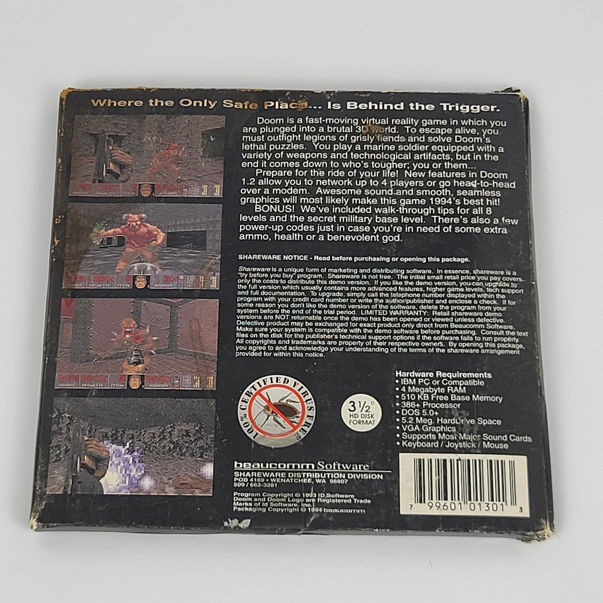
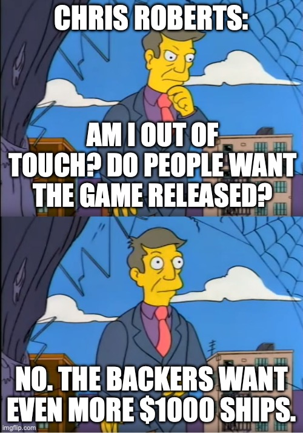
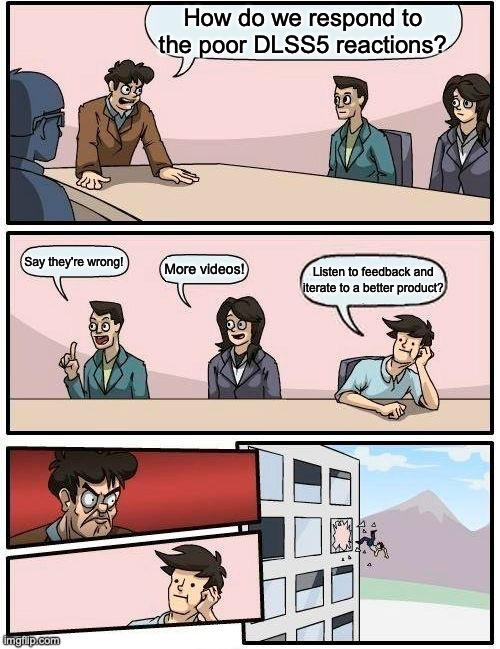
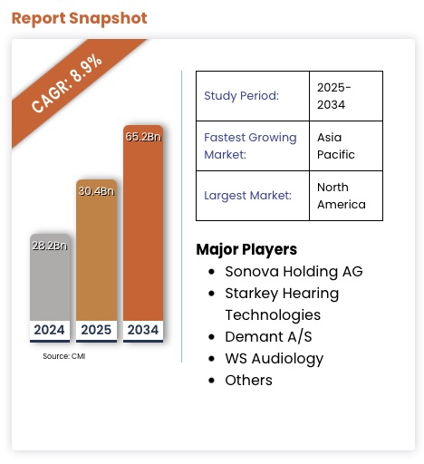
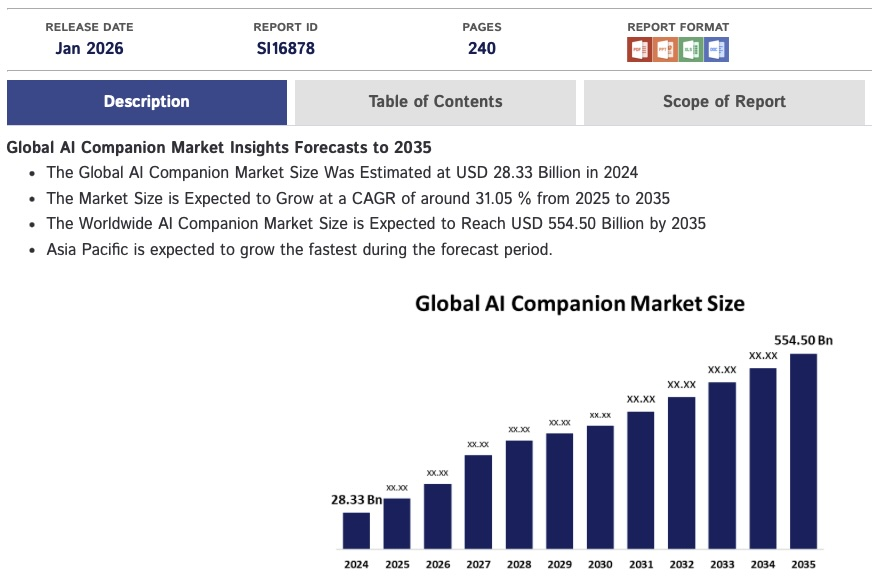
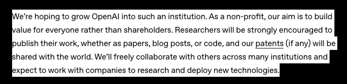
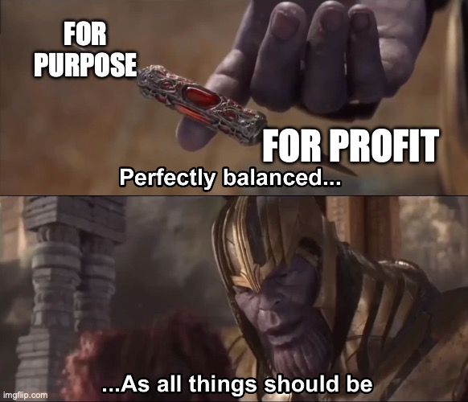

I finished *Masters of Doom* a few weeks ago and I'm nearly done with *Hackers: Heroes of the Computer Revolution*. Both books hit harder than they should, given I already knew most of the stories. But reading them back-to-back crystallized something that's been nagging at me for months.

There's a line in *Hackers* about the MIT Tech Model Railroad Club in the 1960s:

> "Access to computers should be unlimited and total. All information should be free."

These weren't idealists detached from reality — they were building the foundations of modern computing while living that philosophy.

But that doesn't sound anything like what we are experiencing at the moment.

Fifty years later, we're in an era where 87% of Activision Blizzard's revenue comes from in-game purchases. Where Star Citizen has raised $928 million over 13 years and still ships in alpha. Where "AI companions" designed for emotional manipulation get more funding than accessibility tools. Where social media products are "free" because in reality, you are the product, sold to advertisers and corporations. Google isn't a search company; they are the biggest advertising company in the world.

The shift wasn't about technology getting worse. It was about **who technology started serving**. Not everyone. But those who can afford it. Or worse; those who can't, but can be manipulated into doing so anyway.

I've [written before](https://wynandpieters.dev/posts/weve-seen-this-movie-before/) about how AI's current trajectory mirrors gaming's descent into shovelware — the quality collapse, the security disasters, the velocity fetish. 

That post was about the *execution* of the shift.

This one's about the *mindset* behind it.

Gaming is the clearest example of this shift, with streaming and social media being a close second, but the pattern applies across all software.

---

## id Software: When the Point Was Building Cool Things

John Carmack didn't open-source Doom's engine because he was bad at business. He did it because **building cool things mattered more than hoarding them**.

> "Programming is not a zero-sum game. Teaching something to a fellow programmer doesn't take it away from you. I'm happy to share what I can, because I'm in it for the love of programming."

The shareware model wasn't charity either — it was brilliant business. Give away Episode 1, let players become your marketers, keep 85 cents on every dollar. No publisher taking 70%. **The relationship was simple: we made this cool thing, want to play?**

When id told retailers "take Doom shareware for nothing, keep the profit," they weren't being generous. They understood that distribution at scale with zero marketing spend beat traditional publishing. The model worked *because* player experience was the priority, not an afterthought.

But here's what's easy to miss: this wasn't just a business model. It was a **philosophical position about who the technology served**. Players weren't revenue targets to be optimized. They were the reason you were building in the first place.

That philosophy is what died.

---

## The Transformation: From Community to Resource Extraction

The inflection points are well-documented. Horse Armor in 2006. Chinese free-to-play loot boxes arriving in 2007. By 2022, microtransactions weren't an additional revenue stream — they *were* the business.

But the numbers only tell you what happened. They don't explain the *how* or the *why*.

### The Economic Reality That Enabled It

Here's the uncomfortable bit: this shift wasn't random. There were structural incentives that made extraction more profitable than empowerment.

Between 1973 and 1989, something fundamental broke in how wealth was created in America. Productivity kept growing, but wages flatlined. The top marginal tax rate dropped from 70% to 28%. Union density collapsed from 24% to 16%. The path to real wealth shifted from wages to equity ownership.

The 1995 Netscape IPO — a 16-month-old company with $17 million in revenue hitting a $2.9 billion valuation on day one — made equity-based wealth culturally aspirational. Marc Andreessen on Time Magazine's cover, barefoot on a throne. Before Netscape, nobody thought starting a business could turn you into a rockstar.

After Netscape, that was the *only* story that mattered.

Venture capital exploded. The "growth at all costs" mindset replaced sustainability. "Move fast and break things" stopped being a mantra about velocity and became permission to break user trust if it increased engagement metrics.

For gaming, this meant shifting from "make something people love" to "optimize lifetime value per user." The player experience became secondary to the revenue model. The transformation was structural, not accidental.

### Elite Dangerous: The Template for Betrayal

David Braben's Elite Dangerous Kickstarter (2012-2013) raised £1.7 million from 25,681 believers. The promises were substantial: offline mode, ship interiors you could explore, free expansions for high-tier backers.

The betrayals came systematically.

**One month before the December 2014 release**, Frontier [cancelled offline mode](https://www.eurogamer.net/frontier-outlines-elite-dangerous-refund-policy-following-no-offline-mode-backlash) entirely — burying the announcement in a newsletter hoping no one would notice. Ship interiors, promised in the pitch video, never materialized. A decade later: "there are no plans."

The Horizons expansion (2015) charged existing owners $45-60 for planetary landings that should have been included. When Odyssey launched in 2021, it was so broken that Frontier cancelled all console development entirely, abandoning PlayStation and Xbox players who'd waited years.

But here's the key part: **Frontier used that £1.7 million in community trust to secure traditional investment** — raising £4 million through a stock exchange listing. Then they treated those same backers as customers who could be charged repeatedly for originally-promised features.

The relationship inverted completely. From "help us build this together" to "you're a revenue target now."

### Star Citizen: Perpetual Development as a Business Model

If Elite Dangerous established the template, Star Citizen perfected the exploitation.

Chris Roberts' October 2012 Kickstarter promised a $2 million space simulation delivered November 2014. Roberts himself warned: "Another two years puts us at 3 total which is ideal. Any more and things would begin to get stale."

**Thirteen years later:** Still in alpha. $928 million raised. One partially implemented star system instead of the promised 100. Squadron 42 — marketed with "Answer the Call 2016" — remains [unreleased in 2026](https://gamingbolt.com/star-citizen-creator-aiming-for-release-in-2027-or-2028).

Individual ships cost $15 to $3,000. The Legatus 2954 Pack — available only to "Chairman's Club" members who've already spent $1,000+ — costs **$48,000** for 180+ ships that might never fly in a game that might never ship.

The Terms of Service tell the real story. Originally, backers were entitled to refunds if the game wasn't delivered within 18 months. In June 2016, CIG removed this clause entirely. Now refunds require proving the project is "abandoned" — virtually unprovable when token updates continue.

Forbes summarized it perfectly: "This is not fraud — Roberts really is working on a game — but it is **incompetence and mismanagement on a galactic scale.** The heedless waste is fueled by easy money raised through crowdfunding."

**The inversion is complete.** Star Citizen's product *is* the funding mechanism. Perpetual development became the business model. The promise matters more than delivery because delivery would end the revenue stream.

### Nvidia: We know what you want better than you, and you'll pay our premium for it

In March of 2026, NVIDIA's Jensen Huang provided the perfect encapsulation of this shift. 

When gamers and developers universally rejected DLSS 5's AI-generated facial alterations — 84% YouTube dislikes, developers calling it 'dystopian slop' — Huang's [response to the criticism](https://www.reddit.com/r/pcgaming/comments/1rwkxw6/jensen_huang_says_gamers_are_completely_wrong/) that gamers and developers felt the technology "makes games appear worse, homogenous, or show only NVIDIA's view of how games should look" was simple: 

> "Well, first of all, they're completely wrong."

Not 'we'll listen to feedback' or 'let's adjust this.' Just flat dismissal. Just an out of touch CEO who has decided what the market should want and is willing to tell millions of consumers and developers they're mistaken for disagreeing.

Cullen Dwyer, a gameplay design lead at Doinksoft, captured the structural critique when speaking to [Kotaku](https://kotaku.com/we-spoke-to-game-devs-and-all-of-them-hate-dlss-5-what-the-f-nvidia-2000680059): "The average gamer is unable to afford the hardware that will make DLSS 5 a reasonable offering. In pursuing 'photorealism' or whatever they think this slop abomination is, they have created an ecosystem where the most economically viable game is one that can run on low-end hardware." 

[The Escapist](https://www.escapistmagazine.com/news-dlss-4-5-feels-like-nvidia-is-astroturfing-the-real-problems-it-made/) went further, calling DLSS part of "the grandiose plan to rent a GPU out to you over the cloud, because at some point — tin foil hat and all — they're coming to take your PC." 

The company that Jensen Huang claims "created the modern videogame industry" is now building an industry where most gamers can't afford to participate — and telling them it's their problem for not understanding the vision.

You would think the technology doesn't matter if consumers don't want it. But NVIDIA decided what consumers should want, and somehow proved **it's not about what the consumer wants or needs** - it's about what NVIDIA can sell. Where they can extract revenue. And fake frames and AI yassification is how they sell more AI, which is where the money is.

---

## AI Is Speedrunning the Exact Same Script

We're not in Act 1 anymore. We're already deep into Act 2.

### The Promises (Already Fading)

OpenAI founded as a nonprofit "for the benefit of humanity." AI would augment developers, democratize creativity, make everyone more productive. The early messaging was all empowerment.

That lasted about three years.

### The Pivot (Happening Right Now)

OpenAI attempted a for-profit conversion (reversed after backlash, but killed the profit cap anyway). Sam Altman now speaks of requiring "trillions of dollars." In 2025, **53-65% of all VC deployment went to AI companies** — half of all VC dollars to just 0.05% of deals. Nothing like this concentration has ever existed in venture capital.

The parallels to Star Citizen aren't subtle. Selling promises, not products. "It'll be ready soon" becomes perpetual development. Meanwhile the actual useful applications — accessibility tools, healthcare, education — get less funding than AI companions designed to exploit loneliness.

Around a year ago I [wrote](/posts/ai-tools-replacing-or-enhancing-skills/):

> I'm concerned about the industry's direction with these improvements. Instead of creating better developers, we're often replacing them. Rather than building amazing accessibility tools, we're creating deep fakes and virtual companions. Instead of developing better MVPs for real problems faster, we're seeing low-quality products marketed as revolutionary simply because they were built without coding experience, for no purpose other than a quick cash-grab.

A year later, that aged perfectly. Which is worse than aging badly.

### The Extraction Mechanics Are Already Visible

At time of writing, 16 of the top 100 AI apps by traffic are companions, with [128 being released in 2025](https://techcrunch.com/2025/08/12/ai-companion-apps-on-track-to-pull-in-120m-in-2025/). They use the same psychological manipulation tactics as free-to-play games: emotional language, memory, mirroring, open-ended statements to drive engagement. Character.AI was linked to a 14-year-old's suicide after he developed what investigators called an "emotionally and sexually abusive relationship" with a chatbot.

Meanwhile: 2.5 billion people need assistive technology, 85% of autistic individuals remain unemployed despite AI's potential, and the WHO reports that nearly a billion people are denied access to assistive tech entirely.

VS

AI is speedrunning the exact same script that gaming followed. And the speed isn't the tragedy, **the fact that we already know how it ends is.**

---

## The Choice We're Making (Whether We Realize It Or Not)

This isn't inevitability. It's precedent.

The shift from "for purpose" to "for profit" wasn't natural law — it was a series of choices enabled by structural incentives. Bill Gates' 1976 "Open Letter to Hobbyists" arguing software was property, not community knowledge. The 1995 Netscape IPO making equity wealth aspirational. The venture capital model prioritizing growth over sustainability. Each step normalized the previous one before pushing further toward extraction.

We've seen the same shift in media: from owning to streaming, from buying what you want to subscribing to bundles stuffed with things you don't. Same pattern, same beneficiaries — not users, but extractors.

Gaming already showed us the endpoint. Complete commercial extraction. Broken promises. Players as resources. But gaming also showed us the alternative.

31% of Steam revenue now comes from indie games. Balatro was made by one person and won three Game Awards. Palworld cost $6.75 million and sold 25+ million copies. These developers inherited Carmack's DNA — small teams, player-first design, creative freedom.

The philosophical difference is everything. Indies still operate on the original relationship: **we made this cool thing, want to play?** AAA operates on resource extraction.

**The alternative works. It just doesn't scale the way VCs want.**

---

## So Where Does That Leave AI?

I don't know. And I'm suspicious of anyone who claims they do.

But here's what I know from watching gaming's transformation: the tools don't determine the outcome. The relationship does.

Carmack didn't build differently because he had different tools. He built differently because he had a different philosophy about who the technology served. That philosophy — technology as empowerment, users as the reason you're building, sharing as strength not weakness — still works. It's just not the path most venture-backed companies take.

AI can follow gaming's path to Star Citizen-style extraction: perpetual promises, psychological manipulation, wealth concentration in the hands of foundation model companies while utility gets sacrificed for engagement metrics.

Or it can return to the philosophy those MIT engineers lived by — that access should be unlimited, that the point is what you build, not what you extract.

The pattern is visible. Gaming already showed us where the extraction path leads. Whether AI follows depends on whether anyone learned anything from watching it happen before.

The balance exists. We just need to choose it.

---

*The research for this came from way too many rabbit holes. I've covered the vibe coding quality disaster in a [previous post](/posts/weve-seen-this-movie-before/). This one's about the mindset shift underneath it all. I actually started writing this one first, but the other one felt more complete and was published first.*