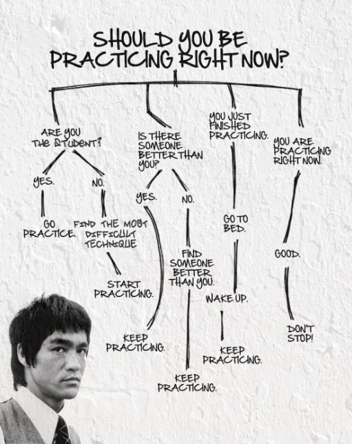

A while back I posted [my first blog post](/posts/biggest-impacts-on-my-career/), and the key take-away it seems people had from that was that "intentional learning" is key growing in your career and profession.

The discussions I had following this made me think of another conversation I had with a new developer I recently hired. He noticed on my LinkedIn that I have a LOT of completed courses, and asked how I go about learning this much and if what I learn sticks. I gave him a brief overview, but thinking about things over the last week, I figured I could probably share more.

So here are some of the tips and lessons I've learned over the years. And I'll start with what I consider to be the two most important ones.

## Tip 1: Make It Easy To Consume Content

This for me is probably the biggest one. If I have to schedule time to learn, I might not get to it. Life happens. But if you can learn anywhere, it becomes easy. 

I actually stole this concept from fitness, where trainers recommend everyday tiny habits you can do to improve your health and wellbeing; taking the stairs instead of the elevator, and parking further away to walk more, carrying groceries with your non-dominant hand to balance out arm strength, 5 pushups before going to the bathroom. This made me think about "how do I make learning an easy and everyday habit".

For starters, go install the Udemy/Coursera/Pluralsight/Skillsoft/[your preferred learning platform] app on you smartphone, on your tablet, your laptop or Chromebook... hell, if your smart fridge supports it, get it there. Easy access, no excuse, right?

I used to have 3 books I would be reading at a time; one on my Kindle, one on an e-book reader on my phone, and another on my tablet (and sometimes a physical book at home). Whenever I had 5-10 minutes to spare, I would read. Same with courses now, if I find a gap, watch one lesson/chapter/video. Waiting for a Zoom meeting to start? Perfect chance right there to improve yourself rather than vent and complain about co-workers being late.

Then, start listening to podcasts on your commute instead of the radio, or get audiobooks to listen (but please just don't watch videos while driving). You're not doing much else at this point, so why not learn?

Lastly, the most unpopular personal change I made; stop doom-scrolling or spinning the hamster wheel on social media. Rather than passively consuming random content, why not actively consume relevant learning resources? Don't just mindlessly click that next cat video! (Okay, maybe just _one_ more...)

## Tip 2: Focus. And Don't Let FOMO Control You.

This for me is the second biggest thing. Don't worry about stopping a bad course or book in the middle. Don't waste your time if you aren't getting value from it.

Time is a precious resources, and you've already invested well in yourself by using that resource to improve and grow. Don't plant seeds in bad soil. Move on.

You also don't need to learn everything all the time. I mentioned this in the previous post too; don't learn for the sake of learning or because you fear missing out on some cool new tech. Ask yourself "why" you are learning this. Do it five times. Make sure you are learning what is useful and important.

And don't worry about not learning about [insert language or framework flavour of the month] if you don't actually need it. Tech changes so fast, you should focus on what you use and need. It's a full time job learning every single thing out there, and nobody is gonna pay you to do that. At least not in my experience. You don't need to fear not knowing something, you can always fill gaps as and when needed. Rather fear stagnating and not growing at all.

## Bonus Tip 2.5: Active Listening

Actually listen. Don't just put Courses, Audiobooks and Podcasts on in the background. In an old blog post which I still find relevant and insightful, [Kids can't use computers... and this is why it should worry you](http://www.coding2learn.org/blog/2013/07/29/kids-cant-use-computers/), the writer put it very eloquently:

> The parents seem to have some vague concept that [their kids] spending hours each evening on Facebook and YouTube will impart, by some sort of cybernetic osmosis, a knowledge of PHP, HTML, JavaScript and Haskell.

We all intrinsically know this isn't how learning works. So please, just actually *listen* (or if reading, *focus*)

## Tip 3: Double Up.

No, I don't mean two courses at once. I mean listen at double speed. That little 2x button people seem to be afraid of.

And wow, do I get weird looks when I tell people I do this. Everyone seems to think I like listening to speed talking chipmunks. But here's the thing; most online learning content (and audiobooks), the 1x playback is slower than "regular" human speech.

I have never in my life met anyone who speaks the way an audio book reader does. I'm sure they do it for various reasons; pacing, enunciation, clarity. But it is painfully boring sometimes.

I recommend starting at 1.5x, which I find is closer to the speed most people I know speak, which I can still clearly follow (as evidenced by the fact that I've been communicating with humans for well over 35 years). If you don't catch something or don't grok it immediately, rewind. That's something you can't always politely do IRL, but you can on courses and audiobooks and podcasts.

If you really struggle, go back and slow down, then double down on active listening. And pause to think and take notes. Write on actual paper. It helps the brain form connections better than typing notes (at least I've been told so by people smarter than me).

Also, tools these days do very well to adjust for faster playback speeds, and not everyone sounds like Simon the Chipmunk giving you a lesson.

## Tip 4: Practice, Practice, Practice

Deliberate Practice. Many of us have heard the term, supposedly we need 10 000 hours of it to become an expert or master. But you don't become the next Mark Knopfler by listening to guitar solos on Spotify for 10 000 hours, you do it by actually playing a guitar and learning to get better and fix your mistakes. Deliberate practice is where you exclude _mindless repetitions_ and instead have _focused attention_ and a _specific goal of improving_. 

In tech, I take that to mean not just doing "Hello World" tutorials and stopping, saying you understand. It means taking time to learn what makes the new language different and special. My favourite option is to rewrite something I've done at work or in my spare time in the new language. This makes it a bit easier, since you already understand the problem or domain and can focus on the new language or framework, and get something specific out.

Bruce Lee once said

> I fear not the man who has practiced 10,000 kicks once, but I fear the man who has practiced one kick 10,000 times.

Part of what he was getting at here is that you can either learn to do one thing in many different half-hearted ways, or you can become a master in something specific. The reason I bring this up here is tie in with Tip 2. Don't try to focus on too many things at once. Learn the thing you are learning. Finish what you started.

If you've been doing Java and want to learn Scala, don't also try and learn F# and Haskell and Elixir all at the same time. Practice the one you want until you feel comfortable and really truly understand it. Then keep practicing, because the Dreyfus model of skill acquisition tells us you probably hit a stage where you think you know more than you actually do (and you don't realise what you don't know), and that's a dangerous place to live.

Also, if the course tells you to "pause and try for yourself", then **pause the video, and try for yourself**. Don't Google the answer to the quiz if there is one, no one is judging your results but you. Don't skip exercise sections just because they will be giving you the answers later. That's not how life works, why would you think learning works this way?

## Tip 5: Don't Give Up. But Don't Force It.

Some people just don't enjoy the process of learning. And that's okay, books and courses might not be your thing, just go find other ways to grow and improve. Maybe that means finding a mentor, or for some that means learning by teaching, and for others they just like getting thrown in the deep end; sink or swim. Growth happens outside our comfort zone, and maybe that's just where you like to live. 

Find something, _anything_, that works for you.

By doing nothing, entropy ensures that you are actually getting worse, so any improvement, no matter how small, is good for you.

As Warren Buffet reportedly said:

> Investing in yourself is the best thing you can do. **Anything** that improves your own talents.

So don't give up, keep working, and just

> Go to bed a little smarter each day.

It clearly worked for Buffet, why not see if it works for you?

---
*This post was originally published on [dev.to](https://dev.to/wynandpieters/how-i-approach-intentional-learning-1g9o)* 