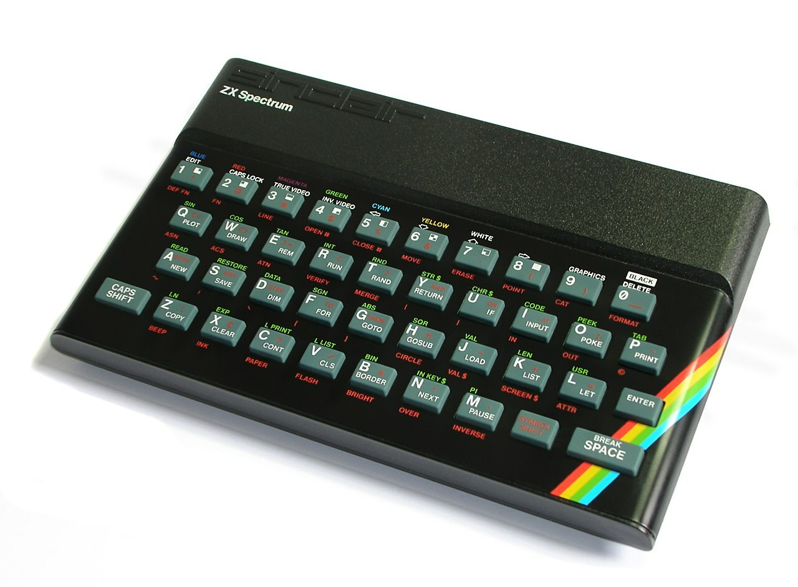

Ah, another "trend" I've seen online in the last year. I wonder which AI recommendation tool suggested this one to the thousands of small YT channels and influencers who needed a topic...


Okay, saltiness aside, I actually found this one quite interesting. And not because I agree with most of the approaches I've seen people recommend (it is shocking how many just want to punt their own products or their sponsors), but mainly it was interesting because I was thinking that...

---
_**I wouldn't do it any differently...**_

---

Yeah, you heard me. Even with all the amazing tech and tools and platforms available today, I stand by how I learned and wouldn't want it any other way.


Let me explain...

## Baby's First Hello World

Okay, so here's the thing. My very first experience with coding was on a Sinclair ZX Spectrum. One of these bad boys.



You plugged it directly into your CRT television, and you stored you data on cassette tape.

If you were born after 1990, you probably don't even understand half the words I'm saying.

The language was BASIC, and hello world was something like

```basic
10 CLS
20 PRINT "Hello World!"
30 END
```

The Spectrum had this really interesting keyboard where each of the keywords in the language had it's own key combo, so you didn't actually type everything. The interface had different modes, staring in `L` mode (for Letters) you would type the line number, and then magically the interface would expect a command, so it would switch to `K` mode (for Keyword), and then pressing *V* on the keyboard would actually input the keyword `CLS` 🤯

Anyway, it also came with this book:


Which had coding examples of a two-player Hangman game, and for drawing the Union Jack on screen. And as a kid, I was fascinated by how typing these commands into a TV would do these amazing things.

Later, when my dad came home with an Intel 286 which his work was getting rid of, we where introduced to MS DOS and Windows 3, but importantly QBASIC, which came with [Nibbles](https://en.wikipedia.org/wiki/Nibbles_(video_game)) and [Gorillas](https://en.wikipedia.org/wiki/Gorillas_(video_game)).

Which led to...

## Modding FTW

Nibbles and Gorillas where interesting, in that he way you played the game was loading up the source code, and then hitting the button for Build and Run. Even said that in the comments at the top of the [source file](https://github.com/tangentstorm/tangentlabs/blob/master/qbasic/NIBBLES.BAS):

```basic
'
'                         Q B a s i c   N i b b l e s
'
'                   Copyright (C) Microsoft Corporation 1990
'
' Nibbles is a game for one or two players.  Navigate your snakes
' around the game board trying to eat up numbers while avoiding
' running into walls or other snakes.  The more numbers you eat up,
' the more points you gain and the longer your snake becomes.
'
' To run this game, press Shift+F5.
'
' To exit QBasic, press Alt, F, X.
'
' To get help on a BASIC keyword, move the cursor to the keyword and press
' F1 or click the right mouse button.
'
```
This was amazing, because suddenly, you could mod the base game! Change the speed, the colours, the levels... as long as you learned this BASIC language, it would do whatever you tell it.

And this was how I started; in the deep end, barely knowing how to read English (my first language is Afrikaans, FWIW), but playing around, getting my hands dirty so to speak, and trying things and breaking things and fixing things.

I recently found this blog post, and I think it is well worth a read.

[30 years later, QBasic is still the best (by Nicolas Bize)](http://www.nicolasbize.com/blog/30-years-later-qbasic-is-still-the-best/)

I loved this story, and I agree, I think this is a really good way for kids to learn coding. I'm glad this is how I was introduced as well.

## So?

I could go on through my whole entire journey of becoming a professional in the software industry, but I don't think that makes sense here (or that anyone really cares).

What I can say is, I think there is a lot of value in the way people learned these skills in the olden times. Being just shy of 40, the tech I had access to and the way I learned was already "easier" than those before me, and already I feel like I missed out on some great learnings.

I think we've lost a lot of the "hacker mentality" from the days before, where nerds and geeks were basically forced to learn through a) manuals, books and documentation, and b) trial and error. And I suppose also c) community of other hackers. Which is a shame. So I'm always happy and excited when I see people like [jdh](https://www.youtube.com/@jdh) on YouTube, doing the things that hackers did.

But yeah, there it is. I like how I learned, and I still think just reading and hacking away with a community of like-minded individuals is a great way to learn to code.

And while I generally don't use this approach anymore to learning new tech, frameworks and languages, writing this post has made me rethink whether my current approach to learning really is better...

## DISCUSS!

How did you get started coding? Why did you turn it into a career? What would you do differently?

Let me know. I am but one person with one opinion. 