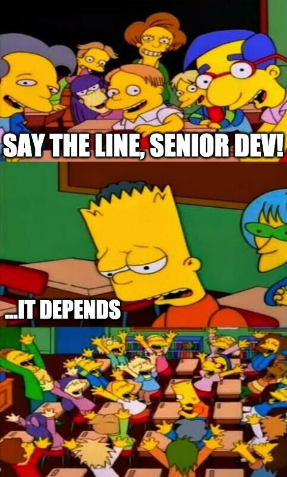

## LOLWUT. Random.

Yes. Kinda.

So here's the thing; I recently watched a reaction video by [ThePrimeTime](https://www.youtube.com/@ThePrimeTimeagen) for a [clip about the "Best Programming Setup"](https://www.youtube.com/watch?v=tzr7hRXcwkw&t=0s) from the Lex Fridman interview with John Carmack, and for some reason it sparked an urge to write about something.

The specific bit was [here](https://youtu.be/qFnHWMxlOBc?t=1185) (from around 19:45 to 21:12), where John talked about making the move from 2 to 3 monitors, and Prime commented on being a 1 monitor person.

## Erm... okay?

Stay with me.

I really liked his comment here about the argument for multiple monitors being about your ability to navigate your OS, because I agree, this is a very big part of it.

But it's not **all** of it.

As I've moved through different phases of my career, and focusing on different types of applications and types of development, I've found my monitor usage requirements changing.

Earlier in the clip when they talked about debuggers and logging, I think he hit the nail on the head when he said 

> I know we'll probably disagree on the debugger thing. Or really, I don't even think we disagree, **we're just in different environments**.

And there for me is the crux of all this. The single- vs multi-monitor debate. The Vim vs Emacs debate. The text editor vs IDE debate. The OOP vs FP debate.

If I am only ever remembered for one thing, let it be:

## Get to the point old man...

In a minute!

So here's the thing, I started my professional career in QA Automation, and one screen was fine. The scope of what I worked on was small, and it was easy to keep in my head. Doing the Alt-Tab thing was easy, and not disruptive at all.

When I moved over to frontend development, I found having two monitors really helped. I could keep designs and specs open on the one monitor, while keeping my IDE open in the other. Having the additional context in my vision was super useful.

When I moved to backend dev, I found the use case similar. Being able to keep the IDE and Terminal connected to the server on one screen, while keeping the UI and specs open on the other meant I had all the context I needed right in front of me. The system was a micro-monolith ([bunch of separate WARs packaged in a single EAR](https://www.baeldung.com/war-vs-ear-files)) in a single language (Java), so I could keep all the code in one IDE instance no problem, and debugging was still easy to do.

But when I moved to startup where we did "proper" microservices, including services in different languages (Scala, Python, Go), this became much harder to manage. In extreme cases I would need the source of two or three services open at once, along with a Confluence page or DrawIO diagram to understand the flow, with multiple windows open in iTerm all connected to different containers or servers... Suddenly I felt 2 wasn't enough. Hell, after using 3 (laptop plus two externals), I often found that wasn't even enough.

## Just git gud, scrub

HOW!?! I never could figure out how just being better at navigating or using better window managers would solve this problem. I have too many windows, because I need the context. I'm not getting any younger, and my brain space is too full of random crap to keep the work stuff in there too. 

Upgrading to a 1440p monitor made a huge difference for a while, since I could physically fit more onto the monitor, and allowed me to go back to 2 for a while, but I eventually just went back to 3 because of the complexity of the system we worked on.

Maybe that should be a different discussion... Should a system ever be _this_ complex? Another time maybe.

Anyway. When my one monitor fell of desk and stopped working for some strange reason, and my other monitor developed a massive block of dead pixels completely unrelated to knocking it with a vacuum cleaner, I figured it's time to shift gears, and move to a new trend I've been seeing. Huge-ass single monitors.

Enter the ULTRA-WIIIIIIIIIIIIIIDE monitors.

## 3440 x 1440 ... Chef's Kiss.

Only, holy crap are these expensive. I have some friends and colleagues that swear by their Ultrawides, but when I started looking at my needs, I figured I needed 5120x1440 which got even bigger and more expensive, and I just noped out.

Until I saw a sale on the 43" Samsung QN90B 4K QLED TV, which got a whopping [9.0 score for use as PC Monitor](https://www.rtings.com/tv/reviews/samsung/qn90b-qled) over on RTINGS.com.

At that size and that resolution, that would be like having four 21.3" Full HD monitors in a 2x2 configuration with NO BEZELS AT ALL.

I was sold. And now after using it for 6 months, I can never go back to anything else.

Using a decent tool like [Magnet](https://apps.apple.com/us/app/magnet/id441258766?mt=12), I now have full control over my setup. 3x1 portrait? Done. 2x2 landscape? Sure. Top full length + bottom left + bottom right? You got it. Center to just focus one thing? Hell yeah.

## Conclusion and your thoughts

Okay, very long post for something I tagged #discuss. There is a question here, I swear. But first to summarise.

I am a single monitor developer. When some of my friends saw my office setup, I got literal eye rolls. But I don't care. They don't understand.

The fact is, I am now sold on large format displays of at least 4K resolution. Together with a window organiser like Magnet, I now have full control over my workflow, from simple to complex projects, and everything in between.

And I love it.

So let me know in the comments; what is your setup? How many screens do you use? How many do you need? Not always the same answer, those two 😏 And why do you prefer the setup you have?

Curious to know. Thanks.

---
*This post was originally published on [dev.to](https://dev.to/wynandpieters/i-am-a-single-monitor-developer-but-i-am-very-particular-about-that-monitor-1ggg)* 