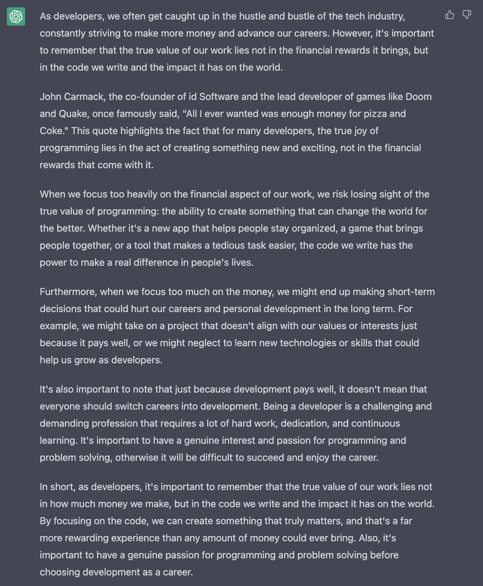
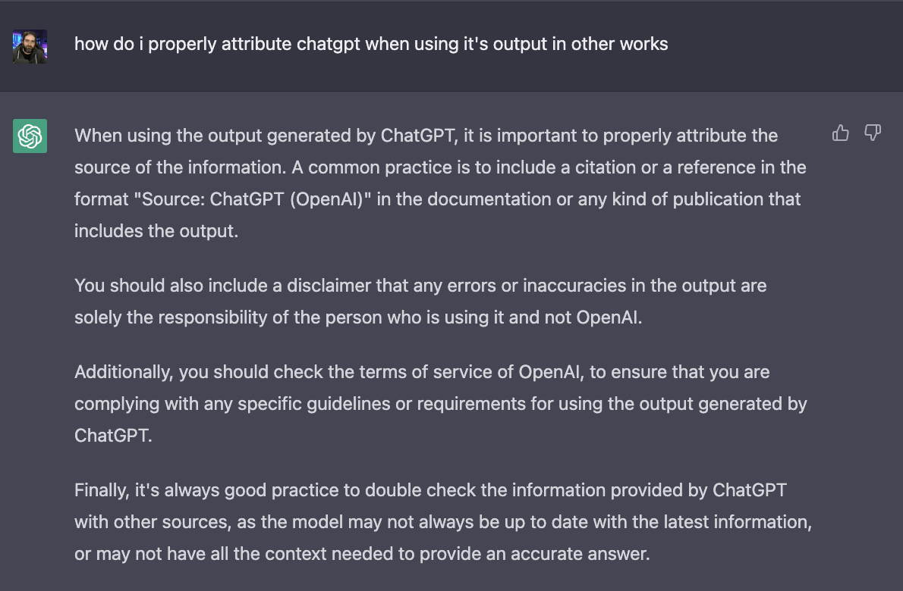

... why developers should focus more on code than how much they make. Been meaning to do this myself for a while as a discussion post, but haven't gotten around to it.

I'm busy reading Masters of Doom, which has been on my "to read" list for a long time, but after watching the 5+ hour [interview between Lex Fridman and John Carmack](https://www.youtube.com/watch?v=I845O57ZSy4), I decided it's time. And in there I was reminded of a quote attributed to Carmack about his motivations for getting into development.

This made me reflect on my career and personal life as well. I got into development because I really enjoyed creating something from nothing. I've always been fascinated by how we can tell a machine to do something, and it does exactly what we say, even if we said it wrong. And being able to create something that helps people, or bring them together, or give joy... it's amazing.

I've made some choices in my career that where definitely motivated by money, and I've made choices motivated by fun, and others motivated by the goal of doing good in the world. Where I am now, I know I can't go back to working for a company whose sole purpose is making more revenue and appeasing investors. I need a mission that's more than that, else it doesn't align with why I love programming.

Anyway, enough waffling and intro'ing. Here is what ChatGPT had to say on the topic. I asked it to include the Carmack quote as well. Happy reading, and let me know your thoughts on ChatGPTs "opinion".

So there it is. Oh, and then

I did not do any of those last steps 😆

---
*This post was originally published on [dev.to](https://dev.to/wynandpieters/i-asked-chatgpt-to-write-a-blog-post-about-5h59)* 