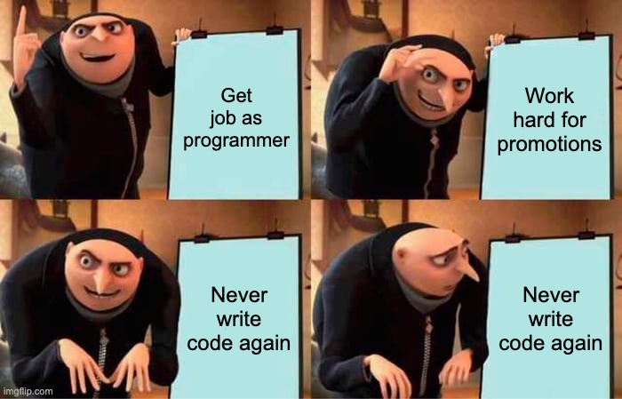
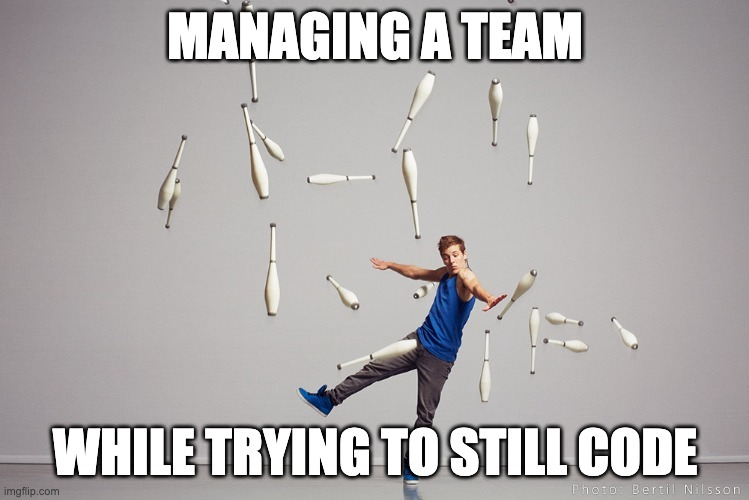
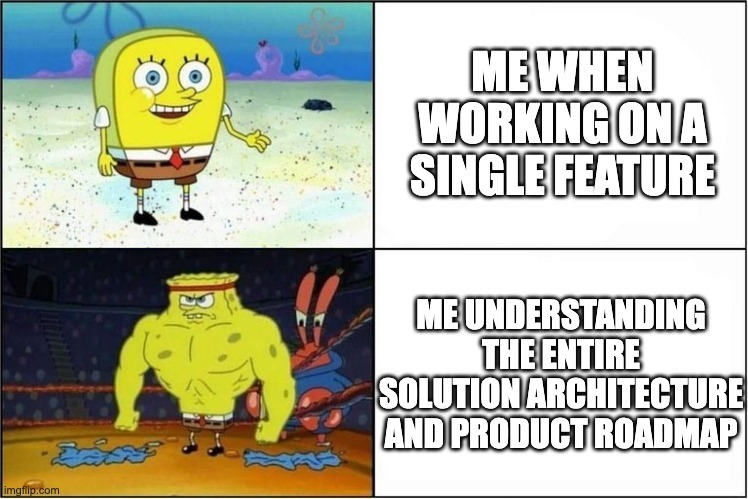
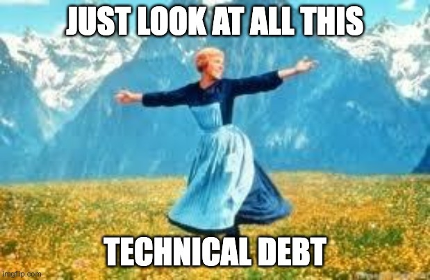
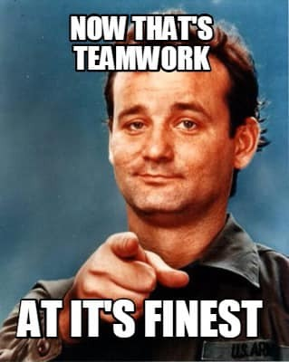
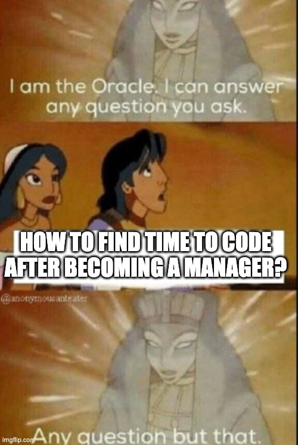

Clarity for the purpose of this post 😏

---

> code monkey, n. a computer programmer who is not involved in any aspect of conceptual or design work, but simply writes code to specifications given

---

> programmer, n. an organism that can turn caffeine into code.

---

## Introduction

Once upon a time, (many, *many* moons ago) at the very start of my career, I was just a "code monkey"; an individual contributor to the grand scheme of the digital jungle being fed instructions from primates higher on the food chain and was expected to simply do what I'm told. 

All that mattered was that if I was given a spec, I churned out something that did what was expected of it. As long as I wrote working code I was happy, my team was happy, and the company prospered. Hopefully.

But then eventually, something happened, and everything changed; the promotion came - I was to be 

[pause for effect]

---

**_A Team Lead_**

---

The transition from coder to leader has its unique set of challenges. A transition that I, like many others, navigated with equal parts trepidation and excitement (read: I was absolutely terrified and convinced I would fail horribly 😬). 

Suddenly, my performance hinged on the collective output of the team. My daily routine switched from churning out elegant lines of code to dealing with documentation, processes, mentoring, and doing the PR reviews. A fundamental shift occurred; a change in perspective from "me" to "we." 

Not "my code", but "our deliverables".

## Some Days I Just Want to Code

I became developer because of how much I enjoyed the challenge of solving a problem by telling a computer what to do, and because the range of challenges and problems are so vast. My focus and joy came from doing the work, finding a solution, and levelling up my skills.

As a lead/manager, that focus became delegating the fun stuff so others can do the work, looking at the big picture, facilitating the conversation for others to find solutions, and ensuring that they all level up.

And I learned that I love doing those things. I've been told I'm good at doing those things, although I still have my doubts. Haven't been fired yet 😅

But it took me years to shift my mindset, because I felt "unproductive" when it wasn't me doing the work. 

And even now, many long years after flipping the switch, I still miss it. Some days I just want to be given instructions and then execute on them.

So with this longing in mind, one of the most potent challenges I faced was the dilemma - How do I maintain technical competency and excellence while ensuring my team's performance? How can I still have those code monkey experiences while doing what needs to be done in my new role?

## Leverage the Tools at Your Disposal 

To stay technically competent, I started working side projects; they became my go-to for keeping my coding skills sharp. In a few instances, I tried working on Open Source projects, specifically trying to give back to projects we use at the companies I worked. The results were mixed. YMMV.

I found that Podcasts, tech talks, and conferences became a regular part of my routine, adding new perspectives and insights into my tech repertoire. I've discussed these in an [older blog post](/posts/biggest-impacts-on-my-career) as well, and I think there is a lot of value in staying technically strong even if this isn't your day to day anymore.

It can be hard to juggle all the various responsibilities while trying to hold on to the past, and while I wouldn't say you should let go of the good ol' coding days, at least loosen your grip a little.

## Lead with a Wider Perspective

In the early stages of my career, my view was often narrowed to a single feature or bug. As a team lead, my gaze had to expand, encompassing not just the details, but also the broader picture. This wider perspective allowed me to learn more from others, gaining a more in-depth understanding of our projects and objectives. 

This meant that skills like solution design, high level architecture and communication is a lot more important. It can be easy to neglect these as a code monkey, while just focusing on writing code, but a lot of times these are really valuable skills as you progress in you career, and even just through life.

What was interesting here is that I found that by learning these new skills, I gained insights and ideas that I could apply to any new project I tackle. So even when working on coding tasks and projects, the broadened horizons and more holistic view improved how I approach even small features. Who would've guessed.

## Prioritize Time Management

Time management became a crucial skill as I juggled between coding, leading, and managing. Along with realising that what I consider "productive" time changes from me sitting for hours bashing out code, to ensuring my team can do it uninterrupted for as long as possible. Context switching is costly, you know.

I implemented regular 1-on-1 meetings with my team to check in with them on a human level, and introduced a "mid-week technical sync" - a dedicated hour per developer to address specific technical challenges. 

Easily around 50% of my role involves removing blockers from the team's path and ensuring they have the resources they need. Probably another 30% is dedicated to managing their time, which includes deciding which meetings are crucial for me and them and facilitating the right discussions and design sessions. The remaining twenty percent? Well, that's for general admin, HR management tasks and sneaking in some coding whenever I can.

You see, there's this dirty little secret; if you want to code as a lead, there are plenty of opportunities in the form of technical debt. We all have it, we are constantly creating more of it, and no-one will ever prioritize it. So why can't you do it?

## Embrace Your Role

The role of a team lead is different, often vastly so. And that's perfectly alright. It's essential to realize that being a strong individual contributor doesn't necessitate being pushed into management. Similarly, if you're a strong leader, don't let your love for coding hinder your potential. 

Find a place that nurtures your strengths, where you can lean into what you're best at. Collaborate with a team that complements your weaknesses, whether you're a lead or an individual contributor. 

Ultimately, keep nurturing your skills, keep learning, keep growing. 

I've found over the years that focusing on what you are good at, and helping others excel, is a pretty good way to go about life.

## Conclusion

Every leader's journey is unique, each with its own set of challenges and rewards. My story is but one in a myriad of tales in the vast world of tech leadership. The strategies I've shared have served me well, but I'm continually learning and adapting. 

As we reach the end of this (pretty long) blog post, I'd like to turn the spotlight towards you. I invite you to share your stories and experiences. How did you navigate the transition from individual contributor to leader? What strategies do you employ to maintain your technical skills while leading a team? 

There's no 'one size fits all' in leadership. Each of us brings something unique to the table, and by sharing our experiences, we can all learn from each other and grow together. 

I look forward to hearing your stories, your victories, and your challenges.

---
*This post was originally published on [dev.to](https://dev.to/wynandpieters/i-miss-being-a-code-monkey-but-guiding-the-troop-has-its-own-charm-226k)* 