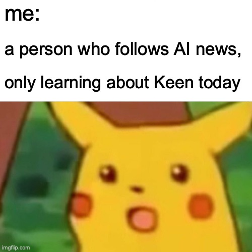
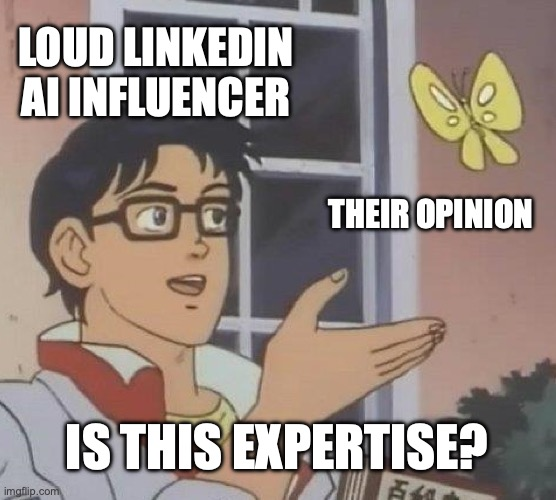
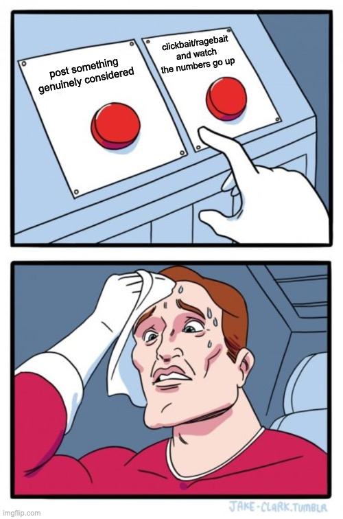
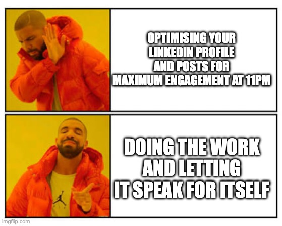
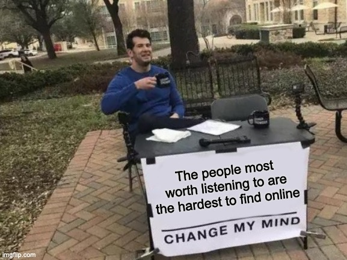

**Trigger warning:** This post contains opinions. Specifically mine. It also contains a confession or two, which I'm not thrilled about, but here we are.

---

I don't have many people in tech I actively look up to. The industry is drowning in loud, obnoxious voices who are very good at having opinions and very bad at having done anything. But Carmack is one of the rare exceptions. He's always been the quiet, thoughtful one. The hacker in the original sense; someone who understands systems deeply enough to bend them, who ships because building is the point, not the clout. I've written before about my own [struggle with that identity vs. the need to actually make money](/posts/standards), that tension between doing the craft and doing the business. Carmack, for most of his career, has never had to compromise on that. He gets to just build.

I follow AI pretty closely. I listen to the podcasts. I read the newsletters. I follow the social media platforms. I have opinions about LLMs and context windows and whether agents are actually useful yet or just vibes with an API key.

So when I realised I hadn't heard from him in a while, especially in the AI space, I went looking. And what I found mildly embarrassed me.

It turns out John Carmack (the guy who wrote Doom, co-invented consumer VR, and resigned from Meta with one of the most [brutally honest internal memos](https://www.facebook.com/100006735798590/posts/i-resigned-from-my-position-as-an-executive-consultant-for-vr-with-meta-my-inter/3467566940144465/) ever leaked to the press, in case you didn't know) has been running an AGI research lab for **three years**.

Not a side project. Not a blog. A funded company, Keen Technologies, with $20M from Sequoia, Nat Friedman, Patrick Collison, Tobi Lütke, and Jim Keller. Six researchers. A stated mission of AGI or bust. And I had absolutely no idea.

---

## So What Has Carmack Actually Been Doing

After leaving Meta in December 2022 with a resignation memo that called the company out for operating at roughly half the effectiveness it should, he went heads down on what he's calling the fourth major phase of his career.

The lab is tiny by design. Six people, working out of Dallas. Their flagship project is something Carmack calls "Physical Atari": a camera pointed at a real TV screen, servo motors manipulating a real joystick, and a reinforcement learning agent learning to play Atari games entirely from raw camera input, in real time, on a consumer ASUS ROG laptop with a 16GB GPU.

The deliberate messiness is the point. Unlike DeepMind's original Atari work, which lived entirely in clean simulation, Keen's system has to deal with the actual physical world; camera drift, servo latency, lighting changes, analog noise. Carmack's finding that even transferring a trained agent between two physically identical controllers causes performance drops. But with continuous online learning, they recover.

His thesis, in plain English: **LLMs can know everything without learning anything.** They process human-curated data in a static, turn-based way. Real intelligence, he argues, needs to be earned through continuous real-world experience. He thinks the entire industry might be stuck in a local minima by over-investing in transformer architecture.

He might be wrong. He knows he might be wrong — he puts his odds of demonstrating "signs of AGI" by 2030 at about 55%. But this is a man who shipped Doom at 22, taught himself AI from a reading list Ilya Sutskever gave him (roughly 40 foundational papers to which he stated "this covers 90% of what matters"), and is partnered with Richard Sutton, the godfather of reinforcement learning.

His wrong is worth tracking.

---

## So Why Hadn't I Heard About This

Because he's not optimizing for visibility. No hot takes. No "AGI is 6 months away 🚀" posts. No conference panels where he validates whatever the current consensus is. No newsletter with a paid tier.

Just 60-hour weeks in Highland Park, Dallas, building the thing quietly.

And this is where something clicked for me. I'd recently listened to Mitchell Hashimoto on [The Pragmatic Engineer](https://newsletter.pragmaticengineer.com/p/mitchell-hashimoto), Hashimoto being the founder of HashiCorp, one of the most successful developer tools companies ever built. Observation #8 from that episode hit me harder than anything else in it. Talking about the best engineers he's worked with:

> "They don't have social media profiles... they're honestly nine-to-five engineers. They go back and they don't code at night."

No GitHub contributions. No public profiles. Companies you've never heard of. His reasoning:

> "Every moment you spend on social media is taking away from something else... the best engineers are the ones that context-switch the least."

Two very different people — one a legendary programmer, one a successful founder — arriving at the same uncomfortable observation from completely different directions.

The people doing the most interesting work aren't competing for your attention. Which is exactly why your feed won't surface them.

---

## Yeah, Okay, This Is Me Talking About Myself

Here's the confession part I mentioned.

The best engineers I've ever worked with, hired, or still work alongside? Not known. No profiles. Or old out of date ones maybe. You'd struggle to Google them. They work for companies you haven't heard of, or quietly inside large ones you have. And they're the people I'd call first if something was genuinely on fire.

I knew this. I've always known this. I've hired for it deliberately.

And then I started a consultancy, and I started feeding the algorithm.

Because that's the tax of running a consultancy. You need clients, clients find you online, so you post. You engage. You share hot takes that are spicy enough to travel but not so spicy they burn bridges. You learn the rhythm of it.

The corrosive part isn't the time (though it does steal time). It's that viral is random, and your brain starts learning the wrong lessons. You put out something you actually thought about, it gets 12 likes. You dash off something slightly spicy at 11pm, it gets 400. The algorithm doesn't care about quality and it will train you not to either, if you let it.

And the ragebait stuff, the content that actually travels, breaks my soul a little every time. Not because I'm above it. Because I'm not, and I know I'm not, and I post it anyway sometimes because the consultancy needs the visibility and I've made my peace with that, sort of.

Except I haven't really.

---

## The Uncomfortable Meta Bit

You're reading this on a Hugo site. No SEO strategy. No tracking pixels. No email capture. No newsletter with a paid tier. Just a link sitting quietly in my profiles for anyone who cares enough to go find it. Maybe I shared this somewhere, on X or Slack or even LinkedIn, who knows.

But I'm literally enacting the thesis while writing about it, which is either very coherent or extremely on the nose. Probably both.

I did draft a LinkedIn version of this. A few versions actually; punchy, numbered, ends with a question to drive comments. They were fine. But the format would have sanded off all the interesting edges. The ambivalence. The personal confession. The part where I admit social media kind of breaks my soul. LinkedIn wants the clean lesson. Not the messy truth underneath it.

So here it is instead, on a quiet corner of the internet, unoptimised and untracked.

---

## Final Thoughts (Nobody Asked But Here We Are)

I'm not telling you to delete LinkedIn. I'm not telling you to quit posting. I do it too, and I'll keep doing it, because pragmatism. And some roles benefit from it more than others.

But if you feel like you have a solid handle on something fast-moving, whether it's AI, engineering, or anything else, it might be worth genuinely asking: **who aren't you hearing from?**

The feed surfaces the loudest. The algorithm rewards the most consistent. But the best thinking often happens in the quiet, from people who are too busy doing the thing to post about doing the thing.

Carmack is in Dallas, 60 hours a week, teaching a robot to play Atari with servo motors.

The best engineers are at home, not on GitHub.

And this post is on a Hugo site no algorithm promoted.

That's kind of the point.

---

*If you want to go find Carmack's work: [Keen Technologies](https://keentechnologies.com), and his [Upper Bound 2025 talk slides](https://www.slideshare.net/slideshow/john-carmack-s-slides-from-his-upper-bound-2025-talk/279574649) are on Slideshare. The Hashimoto quotes are from [The Pragmatic Engineer, February 2026](https://newsletter.pragmaticengineer.com/p/mitchell-hashimoto) — observation #8 in the episode summary, worth reading the full thing.*
