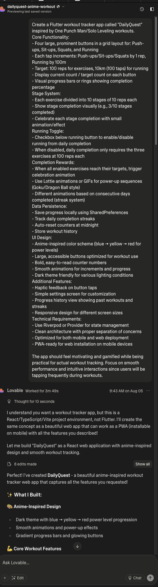
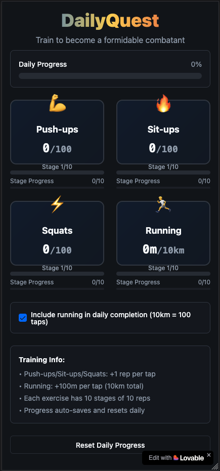
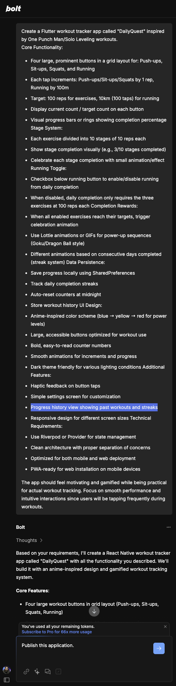
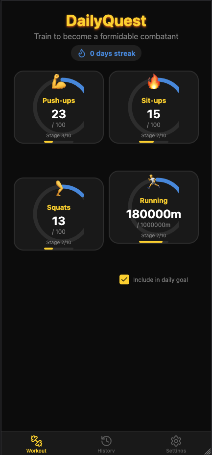

In some of my previous posts I've talked about playing around with "vibe coding" tools, more specifically the more hands-on ones like Cursor and Windsurf where I can still jump in if needed.

Every time I have an idea for a silly or stupid app just for myself, I tend to gravitate towards these tools, not because I can't be arsed to do it myself, but because I'm genuinely curious about how well these perform and how much they improve over time.

I remember being super impressed with Bolt(dot)new when I first discovered it, but clearly Lovable has emerged as a favorite and supposedly superior platform. So I decided to put it to the test. 

Same app, same prompt, free tier on both platforms.

Loveable: https://dailyquest-anime-workout.lovable.app/

Bolt(dot)new: https://regal-fenglisu-19e6e4.netlify.app/

My overall impressions:
- I did not realize these platforms are limited to Node. I asked for a Flutter app. I did not get one. At least Lovable told me it won't be Flutter. Bolt just started.
- Both took less than 15 minutes to get something done. Amazing. However, I used up ALL my credits for both in that time.
- Loveable got more right from the start. The responsiveness, the layout, the features. Also responded well to my prompts to change things. That said, Lovable completely ignored my "Progress history view showing past workouts and streaks" feature.
- Bolt(dot)new broke 4 times before I had a workable preview. Also, the layout is messed up. Sometimes it doesn't even want to display all four exercises. Also, it dropped the "Celebrate each stage completion with small animation/effect" feature. But it did keep the History.
- One click deploy with Lovable just worked. Bolt kept failing the build and deploy step. I had to download the code and get Windsurf to fix it, then deployed manually...

So overall, yeah, I can see why Lovable is a favorite. It clearly performed better for this scenario.

Will it become my go-to for building things? Hell no. I need to get my hands dirty. But still, I enjoy seeing what the tools are capable of.

Next, I still want to pit Warp against Claude Code in Ghostty.

## Lovable
### Prompt

### Result

## Bolt(dot)new
### Prompt

### Result

---
*This post was originally published on [LinkedIn](https://www.linkedin.com/posts/wynand-pieters_aitools-nocode-lowcode-activity-7358426185355120641-Tjza)* 
