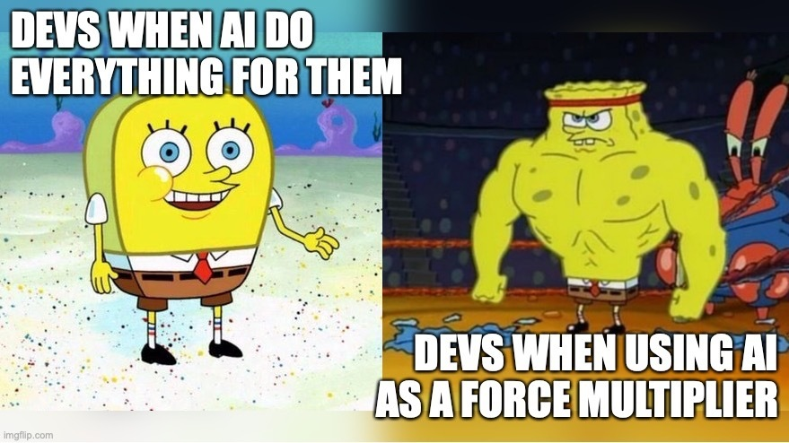
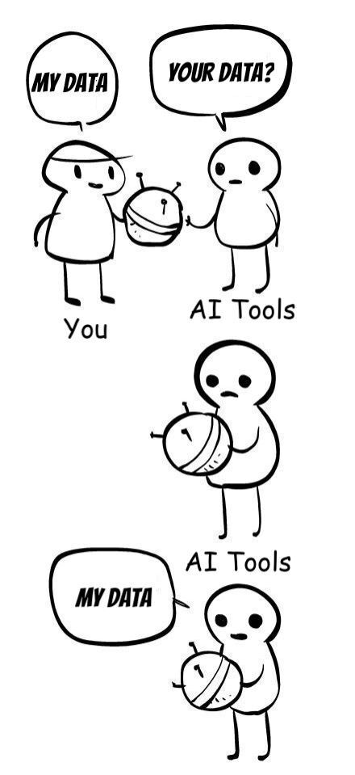
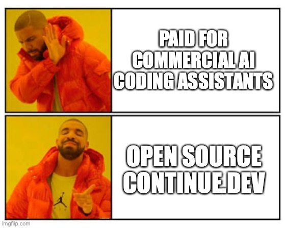

Over a year ago a [wrote a post](https://dev.to/wynandpieters/my-love-hate-relationship-with-chatgpt-the-unexpected-cost-of-productivity-76m) about how I felt that, even though ChatGPT was making me more productive, I also felt it was making me lazier and dumber.

Since then, I've been a lot more intentional about how I use AI tools, in particular generative AI tools and coding assistants. It should be a multiplier, not a replacement or crutch, which is something I see juniors and non-developers struggle with the most, but clearly we can all fall prey too.

Over the last month or so, I've been seeing more blog and LinkedIn posts where it seems others are now having the same experience I do. The one that stuck with me [was a LinkedIn post](https://www.linkedin.com/feed/update/urn:li:activity:7250173023981371393/) by someone who said they've uninstalled Copilot because 

> The reason is very simple: it dumbs me down. I'm forgetting how to write basic things, and using it at scale in a large codebase also introduces so many subtle bugs which even I can't usually spot directly. 

Now, their conclusion was, as with most things on social media designed to get a reaction out of people, that there is NO benefit to AI and you MUST NOT use it because blah blah blah... 

I don't care, I stopped reading, it's not this binary. But sure, doesn't mean there isn't a good point there, despite the overkill conclusion.

I also realise that many of the reporting on AI pros and cons are both over inflated and sensationalist, and that people need to figure things out for themselves, and I am well aware that my opinion is a statistically insignificant sample size n=20-ish people I often interact with professionally, but personally I feel like there is plenty of benefit to be had if used correctly.

So I figured I'd talk about two tools that I've been using a lot. And for some reason I don't see other people suggesting these often enough.

## Fabric

You can find Fabric [here](https://github.com/danielmiessler/fabric), and they have some good links to Youtube coverage which shows some great examples of how this works. What I liked about this tool is that there philosophy is that

> AI isn't a thing; it's a magnifier of a thing. And that thing is human creativity.

From the Github page as of the date of this post, they say that One of `fabric`'s primary features is helping people collect and integrate prompts, which they call Patterns, into various parts of their lives.

Fabric has Patterns for all sorts of life and work activities, including:

- Extracting the most interesting parts of YouTube videos and podcasts
- Writing an essay in your own voice with just an idea as an input
- Summarizing opaque academic papers
- Creating perfectly matched AI art prompts for a piece of writing
- Rating the quality of content to see if you want to read/watch the whole thing
- Getting summaries of long, boring content
- Explaining code to you
- Turning bad documentation into usable documentation
- Creating social media posts from any content input

What I like about these Patterns are that most of them are incredibly well thought out, and the first useful thing I learned from them is writing better prompts for other AI tools. Not only is Fabric a useful command line tool that I can use easily, by looking at existing patterns and learning to write my own, I've learned to prompt better.

I highly recommend watching the [NetworkChuck video on Fabric](https://www.youtube.com/watch?v=UbDyjIIGaxQ) as well as the others they suggest on the Github page, and then playing around yourself.

Some of my favourite and most used Patterns are:

- [analyze_logs](https://github.com/danielmiessler/fabric/blob/main/patterns/analyze_logs/system.md)
- [create_mermaid_visualization](https://github.com/danielmiessler/fabric/blob/main/patterns/create_mermaid_visualization/system.md) (with mixed results, but often good starting point)
- [explain_code](https://github.com/danielmiessler/fabric/blob/main/patterns/explain_code/system.md)
- [extract_wisdom](https://github.com/danielmiessler/fabric/blob/main/patterns/extract_wisdom/system.md) (especially when using YT transcripts or other summaries or posts)

What I also love about this is that Fabric doesn't feel like it wants to replace you or other humans, it feels like it wants to help, and because it's a CLI, I don't need to leave my terminal or IDE.

## Continue

[Continue.dev](https://www.continue.dev/) is a plugin for VSCode and Jetbrains IDEs which, at first glance looks like CoPilot or Jetbrains AI or Codeium or so many others, but the reason I like it is for a few simple reasons.

What is special about this for me is, as they state on the main page:

> You can connect any models and any context to create custom autocomplete and chat experiences inside the IDE

This includes locally hosted models using something like [Ollama](https://ollama.com). Which for me is great, since sometimes clients don't want their sensitive data going into the cloud models where T's & C's are sometimes iffy. 

The second reason is Context. Specifically built-in and extensible [Context Selection](https://docs.continue.dev/chat/context-selection). As part of the built-in chat windows, you can tell it to look at specific files, folders or your entire codebase, you can reference different conversations, and you can flip between models in a single conversations. You can even create your own contexts, but some of my favourites are:

- including the contents of the terminal in your IDE as context by typing `@Terminal`.
- including a documentation site as context by typing `@Docs` and selecting the documentation site.
- including a folder in your current workspace as context by typing `@Folder` and selecting the directory. It works like ` but only includes the files in the selected folder (useful in VSCode if you have multiple projects open at once)

My personal experience has just been that, despite being early days and having some bugs, Continue has been giving me better results thanks to these additional contexts that Jetbrains AI and Copilot just couldn't. 

You need to of course still pay for API access to different models, but there are free options, and I generally just buy $5 credit at a time and then it lasts me 2-3 months (but again, I don't use it _all the time_, since I don't want to be dependant on the tools).

## Bonus: Ollama and Open WebUI

Just a quick special mention before I finish up. I mentioned Ollama earlier, but just wanted to expand. I've been playing with Ollama and [OpenWebUI](https://openwebui.com), which gives you a ChatGPT-like interface on top of your local models, and I love it. 

My desktop has an 8GB RTX 3070, so I'm limited in what models I can run, but being able to play around with different custom models and setting up special Chat AIs for different use cases is great. It also helps in learning about these tools and models, which aids in utilising them much more effectively.

Highly recommend playing with them.

## That's it

I hope you check out these tools and give them a try, they've been game changers for me.

I'm also really curious what tools people are using and what you've discovered that has been instrumental to you, and you just don't understand why everyone isn't using it.

Let me know in the comments what tools you think I should look at, and if you have used Fabric and Continue and what your thoughts are on them.

With that, I'm done. Happy coding everyone.

---
*This post was originally published on [dev.to](https://dev.to/wynandpieters/my-two-favorite-ai-tools-that-i-dont-see-enough-people-talking-about-4j9o)* 