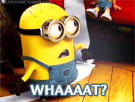
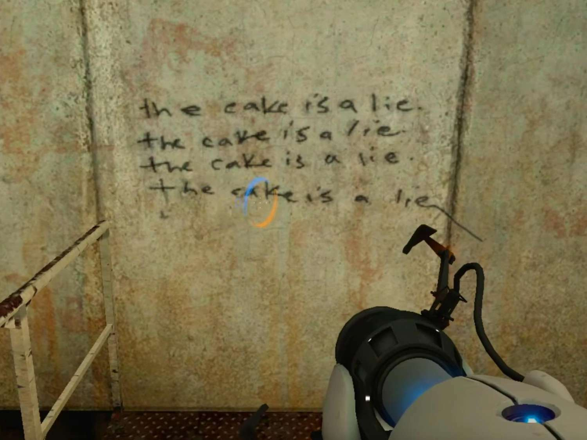
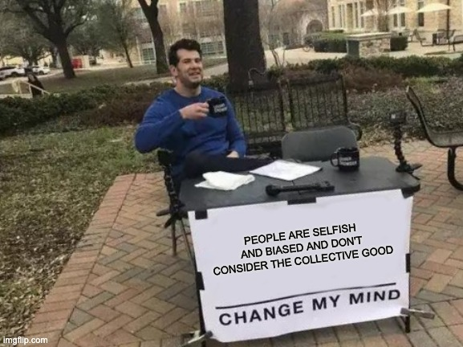

Today again, I was triggered. So here is a hastily written post about my thoughts.

## _sigh_ 😔

I feel like every week there is new thing which my inbox spams me with. If it's not AI taking our jobs, it's some [insert new and shiny framework] which will render [insert current "industry standard"] useless, or it's about how everyone will get let go because of the market correction and recession, or whatever, so many stupid things.

The latest one I'm being spammed about it is "remote work is over" and "return to the office in full force".

I hate these articles. And I'm annoyed by most of the authors. Like most news today, it's sensationalist and click-bait and full of lies and half truths and ignoring the facts.

Worse though, it's polarising, because that's what sells.

## Not all black and white

There is an entire spectrum of colors between those two. Very few things are truly binary. Remote work was never the "new norm", and back to office isn't "returning to the norm".

No my friends, it's way more complicated than that. And it's a very disturbing trend in the world today that everything seems to be all or nothing. There is no middle ground. You either support something 110%, or you are against it.

The worst example I've seen of this which I think many people can relate to is in politics, not software. In Simon Sinek's book _Leaders Eat Last_, he argues that the US Congress worked better in the past because democrats and republicans mingled with each other and spoke to each other once the business was settled. You could keep your work things at work, and your home things at home. You could have more than one opinion, and you could [*gasp*] change your mind if you turned out to be wrong!

I know right!?! Changing your mind!?! What madness is this!

"Strong opinions, loosely held" is a concept attributed to Jeff Bezos of Amazon - even though their principle is "Have Backbone; Disagree and Commit" - and is the idea that you should be able to present things you believe to be right but willing to accept that you might be wrong.

Anyway, that's a side track. I mention this because people look at the influencers (yes, that is what they are) and are swayed to their way of thinking. Like sheep following the shepard. Without questioning and thinking for themselves.

Which is what I want you to do.

## The "norm" is a lie

Just like the cake in Portal. There is no "old normal" and there is no "new normal". At least not in the sense the world wants to sell it you.

Very few concepts can be globally applied to all the 8 billion people on earth and still count as true. That would be crazy. Not only are people unique, situations are, economic status, location, etc etc etc. Just logically, it doesn't make sense.

So why would anyone assume that it applies to business?

Not all businesses are the same. They are different sizes, different locations, different stages of growth, with different motivations and different requirements solving different problems.

Even "similar" companies that are "in competition" with each other aren't the same.

There is no global norm. There is a norm in your mind. In your bosses mind. In your coworkers mind.

Work from home won't work for every company. So it can't be the new normal. But neither is back to office.

## Why are we here then?

Okay, so the 2020 pandemic forced a lot of companies who are traditionally office based to become remote. And herein lies the problem. All those CEOs and CFOs pushing their "totally objective" reports about how remote is worse than in office, probably comes from one of two places:

1. Micromanagers miss being able to look over their employees shoulders, or
2. a company that was not geared for fully remote failed to adapt properly.

The truth is, before the pandemic, there are many successful fully remote companies. Atlassian, GitLab, Shopify, Zapier. These companies prove that fully remote is viable.

When done correctly. When done with a remote-first mindset.

Most large corporations are not geared for this, and many companies that never considered it before and had to suddenly adapt, couldn't hack it. This is not proof that the concept won't work, and it's not proof that it will either.

And anyone telling you different is outright lying to you.

Every company will need to assess what works best for them, and then ensure that they hire people who agree with that way of work.

Every individual needs to decide what works for them, and find the companies that best align with their motivations and values.

## What was my point again?

 
I worry about the state of the software industry, and for none of the reasons I see other people talk about. I worry that on a societal level we have become so independent and self-serving that we have lost track of the fact that we are all on this ride called life together.

A side effect of this is how we communicate news and happenings in the world, and the way we force our views on people. Hell, even just me telling you all this can be construed the same way!

I learned a long time ago that the thing about "common sense" is that it really is not that common at all. We are all coloured by our own experiences, our prejudices, our knowledge. There are so many [Cognitive Biases](https://thedecisionlab.com/biases-index) that we fall pray to every single day.

I try very hard to always take a step back and look properly and see what I'm missing and what isn't being said, and question everything. Trust but verify.

**So no, I don't think remote work is finished just because some companies who couldn't transition are forcing a return to office.**

And no, I don't think remote work is the future and everyone must adapt or die. Some work is just better in person, and some people just really need and love an office. And even when working fully remote, don't neglect the people part of equation.

Personally, I think the future is a flexible hybrid policy, where companies allow teams who work better remotely to do that, but they have offices available for those who prefer or need that. And where we can encourage people to get together and just be human with each other.

But of course, this is just an opinion. Change my mind.

---
*This post was originally published on [dev.to](https://dev.to/wynandpieters/no-remote-work-is-not-done-yet-59d0)* 