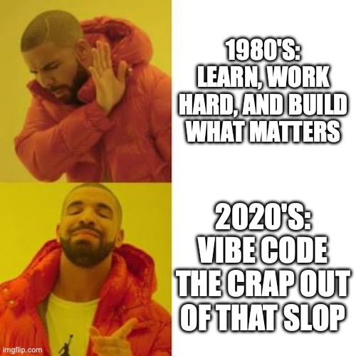
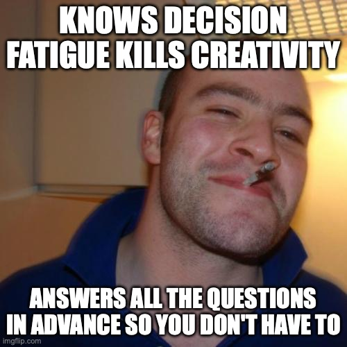
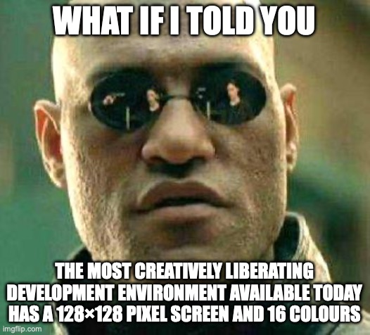
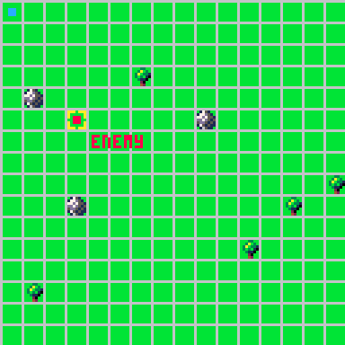

 
I never posted why I paused development on *So This Is How I Die*.
 
If you've been following the devlog, you'll know the story up to a point. The slow progress, the balancing act with client work, the occasional "I'm having a hard time" entry that I posted because solo dev accountability sometimes means confessing that nothing is on fire, you're just tired. What you won't find is a post that says *this is where I stopped, and here's why*.
 
Partly because it happened gradually. Partly because I didn't have the words yet.
 
The short version is: I got frustrated with Unity. Not catastrophically. Not dramatically. Just the slow accumulation of it — fighting with the VFX asset that suddenly broke because of the HDR pipeline, not understanding why the on-track camera was working fine yesterday and refused to run today, spending hours fighting with that one weird Heisenbug in the state machine because the debugger sucks and adding a `Debug.log()` magically fixes it. One afternoon I opened the project after looking at the list of things I wanted to still do, and immediately got an error when trying to run the game, despite things running fine the last time, and just thought: this isn't fun anymore.
 
I wasn't burned out on making games. I was burned out on the *apparatus* of making games.

 
---

I watch a lot of game dev content creators. One in particular, [@JuniperDev](https://www.youtube.com/@JuniperDev), has been really fun to watch and has some great content. She had this one video that caught my attention.

[Make Tiny Games.](https://www.youtube.com/watch?v=YtylfQq2JII)

And after watching it, I thought; this looks really fun and simple. So I downloaded PICO-8 and started messing around. A few days in, I understood the appeal. 
 
Around the time I started writing this post, I had a conversation with my brother and best friend. Just a chat, the kind of exchange that isn't meant to be a philosophical statement, but just admitting where I was at:
 
> *on a completely different topic, I've decided to pause dev on So This Is How I DIE, just because I'm getting frustrated with Unity and my time for it is already limited, so I'm doing something else now, I'm playing around with pico-8 now and it's super fun.*
>
> *what's nice for me at the moment is that it forces limitations, but everything is included. you make your own 8x8 sprites, there's a music and sound editor built in, you have an 8192 token limit for the code... you make tiny games, so you're forced to focus on the stuff that makes the game fun*
>
> *the pico-8 stuff is also interesting just from a technical perspective, because it's very retro, it's old school procedural. there's no physics engines and collision detection and lighting and sdr vs hdr and whatever other nonsense. you draw sprites and edit pixels and everything else is up to you.*
>
> *it's kinda nice. i get to think for myself a bit.*
 
That last line. Man.

Mind. Blown.

That's the whole thing, right there, said so casually.
 
*I get to think for myself a bit.*

 
I've been trying to unpack why that sentence hit so hard ever since.
 
---
 
## This Feeling Is About Thirty Years Old
 
If you started coding on a home computer in the eighties or early nineties, you'll recognise this feeling. Not the frustration specifically — the *relief* on the other side of it.
 
I grew up on a ZX Spectrum. The thing about the Spectrum, and the BBC Micro, and the Commodore 64, and every other machine from that era, is that you turned it on and it was waiting for you. Not a desktop. Not an application. Just a cursor and a prompt and the implicit suggestion that you were expected to do something. BASIC was right there. The manual was the tutorial. The machine was the IDE.
 
And crucially: the games came with their source code. Two core memories for me, in the QBasic days, [Nibbles](https://en.wikipedia.org/wiki/Nibbles_(video_game)) and [Gorillas](https://en.wikipedia.org/wiki/Gorillas_(video_game)). You loaded the game by opening the code and running the interpreter. The code was just *there*. You could read it. You could change it. You could make the snake faster or the gorillas throw nuclear bananas or add extra lives because you were ten years old and you wanted to win.
 
Nobody called this "open source." It was just how things worked. The idea that code would be opaque, that the insides of a program would be hidden from you, would have seemed strange. Of course you could see how it was done. How else would you learn?
 
That era produced a generation of developers who learned by reading other people's code, modifying it, breaking it, fixing it, and gradually understanding that they could build things too. The machine was transparent. The craft was visible. The path in was obvious.
 
At some point, that changed.

 
---
 
## What Fantasy Consoles Actually Are
 
If you haven't come across [PICO-8](https://www.lexaloffle.com/pico-8.php) or [TIC-80](https://tic80.com), the short version is this: they're fantasy consoles. Not emulators of real hardware. Entirely imaginary machines that never existed, designed with deliberate, almost aggressive constraints.
 
PICO-8: 128×128 pixel display. 16 fixed colours. 8,192 token limit for your code. 8×8 sprites. Four audio channels. Everything — the code editor, the sprite editor, the map editor, the sound tracker — lives inside a single application that looks like it was designed in 1987 by someone who had very strong opinions about what you actually needed.
 
TIC-80 is broadly similar, slightly more generous, and free. Same philosophy: here is a tiny closed world, now make something.
 
The constraints aren't incidental. They're the entire point. Zep, the creator of PICO-8, [described it in a talk at NYU's Game Center](https://www.gamedeveloper.com/design/exploring-pico-8-and-what-makes-a-design-space-cozy-): he wanted to eliminate decision fatigue. The questions that kill creative momentum — what will this look like, how big should it be, which renderer, which pipeline, where will I distribute it — he wanted to just answer all of them in advance. *Don't worry about it. I'll take care of that. Just make a cart.*

 
And here's what happens when you do: the problem space collapses into something you can actually hold in your head. You're not configuring anything. You're making something. Those are different activities, and modern engines have quietly convinced us they're the same thing.
 
---
 
## The Community Has Been Saying This For Years
 
I went digging through dev blogs and itch.io devlogs and forum threads after my PICO-8 conversion, partly to see if I was imagining things, and partly because I wanted to write about it. What I found was that this experience — the relief, the rediscovery, the slightly embarrassing joy of it — is almost universal among developers who find their way to fantasy consoles.
 
[Manuel Odendahl](https://wesen.github.io/games/blog/002-picoman-go-postmortem/), a systems programmer writing his first game, put it plainly in his PICO-8 post-mortem: he'd tried Unity and found a full-featured engine "intimidating" and "stifling" to his creativity. Too many decisions before the first line of code. PICO-8 gave him a moving sprite with collision detection in about ten minutes.
 
[Sourencho](https://sourencho.itch.io/mimic/devlog/333199/reflections-on-puzzle-gamedev), reflecting on building their puzzle game *Mimic*, described what the constraints actually do to your decision-making: *"Drawing sprites was simple: there aren't many ways to draw a tree or bird with 8x8 pixels."* The palette decisions, the scope decisions, even the feature-cutting decisions — all of it gets simplified. And when they hit the token limit, they had to cut features. Which turned out to be a feature.
 
[Gate](https://gate.itch.io/heat-death/devlog/121708/pico-8-motivation-and-value), the developer of *Heat Death*, described a three-phase arc that I think most people who stick with PICO-8 will recognise: the constraints start as a fun puzzle, become an annoying limitation, and then finally teach you the actual lesson: your time has a cost, and every feature you add is a choice you're making with that time. They wrote: *"PICO-8 taught me that there was a personal time cost to every feature I implement."*
 
[William Brawner](https://wbrawner.com/2023/11/11/pico-8-game-development/), who'd tried LibGDX and Godot before landing on PICO-8, identified the psychological mechanism precisely. He talked about the gap between what you can make and what you'd buy on Steam — and how, in a full engine with no constraints, that gap feels crushing. In PICO-8, the gap closes. The platform defines the ceiling. Suddenly your small thing isn't a failure to make a big thing. It's just a PICO-8 game. That's what PICO-8 games are.
 
And then there's this, from [a developer on the Lexaloffle BBS](https://www.lexaloffle.com/bbs/?tid=39709), which I've read about four times: *"In PICO-8, I can understand what my code is doing. I know how my code draws triangles. I know how my code draws shadows. I know how my code calculates friction. I hate having a program that I don't understand acting in ways I don't understand."*
 
---
 
## The Carmack Thread
 
I've [written about Carmack before on this blog](https://wynandpieters.dev/posts/loud-is-not-the-same-as-good/). His approach to building, his attitude to sharing knowledge, the fact that he's been quietly working on AGI in Dallas for three years while everyone else is posting hot takes — he occupies a specific corner of my thinking about what it means to actually care about the craft.
 
The quote that keeps coming back to me in the context of fantasy consoles is this one:
 
> *"Programming is not a zero-sum game. Teaching something to a fellow programmer doesn't take it away from you. I'm happy to share what I can, because I'm in it for the love of programming."*
 
He also said, separately, about Doom and Quake: *"To this day, I run into people all the time that say... that openness and that ability to get into the guts of things was what got them into the industry or into technology."*
 
He's describing the exact thing I described about the ZX Spectrum. Transparent code as a path into the craft. The visible insides of a program as an invitation. id Software's decision to release source code wasn't just generosity — it was a philosophy about how knowledge moves through a community, and what happens when it does.
 
PICO-8 and TIC-80 are built on the same principle. Every cartridge's source is open by default. The BBS is a library of annotated examples. The community posts code not as an afterthought but as the primary artifact. You see a game you like, you hit the button, you're reading the source. Just like Nibbles. Just like Gorillas. Just like the Spectrum.
 
The path in is visible again.
 
---
 
## Why This Matters More Now Than It Did Five Years Ago
 
Here's where I want to say something that might be slightly uncomfortable.
 
We are in an era where code is cheap. Not worthless — but cheap. You describe a thing, an agent writes the thing, you review the thing. This is genuinely useful. I use it every day for client work. I'm not going to pretend otherwise.
 
But something happens to your relationship with the craft when the output becomes trivially easy to generate. The struggle disappears. And the struggle, it turns out, is where the learning lives. It's also where the satisfaction lives. The thing Carmack was talking about — being in it for the love of programming — requires that you are actually *in* it. Not supervising it from above while something else does the programming.
 
I see a version of this in the Zig and Rust communities. Developers who've spent years working in high-level languages or AI-assisted environments discovering lower level languages and describing it as "falling back in love with coding." The low-level thinking, the manual memory management, the feeling of understanding every byte — it reconnects them with something they'd lost. Hell, I said the same about Go when I started using it after years of Java and Scala.
 
Fantasy consoles go further than that, though. Zig gives you back the intimacy with the machine, but the possibility space is still infinite. PICO-8 collapses the possibility space entirely. You're not just thinking at a lower level — you're thinking in a world where every token, every pixel, every sound channel is a decision with a real cost. The AI can generate Lua. It can't decide, on your behalf, what to cut when you've hit 8,192 tokens and the game isn't finished. That's your problem. Which means it's your game.
 
There's a quote from a developer called Megalomanu, [writing on Hacker News](https://news.ycombinator.com/item?id=25029967), that I keep coming back to. He described the PICO-8 experience after a long day of wrestling with CloudFormation: *"Even when writing code, I didn't feel like I was doing the same thing as during the day... it was a blessing."* He also described how the sprite constraints helped him creatively: knowing he was limited helped him stop being ashamed of his art. The constraint gave him permission.
 
That's not regression. That's recovery.

 
---
 
## The Actual Answer to "Why Should I Try This"
 
Look. I'm not going to tell you to quit Unity or throw out your current project. I'm not doing that either. *So This Is How I Die* is paused, not abandoned. I'll go back to it.
 
But if any of the following is true, you should spend a weekend with PICO-8 or TIC-80:
 
- You haven't finished a game. Not once. You have a graveyard of Unity projects and Godot experiments and GameMaker prototypes that all got abandoned somewhere between "this is exciting" and "why is the physics behaving like this." Fantasy consoles fix this structurally. The scope is forced small. Small things get finished.
 
- You've lost the thread of why you started. You remember when coding felt like something. Not a job, not a deliverable, just a thing you did because the process itself was satisfying. That feeling is recoverable. I promise.
 
- You learned to code on a home computer in the eighties or nineties and you've been quietly grieving the loss of that relationship with the machine ever since. This is for you specifically.
 
- You're a developer in 2026 who uses AI tools all day and has started to feel vaguely hollow about it. Not guilty — hollow. Like something is missing from the process. It is. Go spend four hours making a tiny game where every pixel is a choice you made.
 
[PICO-8](https://www.lexaloffle.com/pico-8.php#) is $15 at lexaloffle.com. [TIC-80](https://tic80.com) is free. The community is warm, the BBS is full of open-source carts to read and learn from, and the worst case is you spend a weekend making a bad game and remember that making bad games is fun.
 
---
 
## The Thing I Said To My Brother
 
I've been thinking about why that line landed so hard. *I get to think for myself a bit.*
 
I think it's because it's not really about the console. It's about the ratio. How much of your development time is spent actually thinking about the game versus configuring the environment in which the game might eventually be made? How much of your coding time is spent understanding what you're building versus debugging something three abstraction layers removed from anything you wrote?
 
Fantasy consoles force that ratio into an uncomfortable shape. There is no infrastructure to hide in. There's no framework to blame. There's a 128×128 screen and some Lua and the question of what you're going to put on it.
 
Which is basically what a ZX Spectrum was. Which is basically what QBasic was. Which is basically what every generation of developers who fell in love with this craft fell in love with: a machine that waited for them to have an idea, and then got out of the way.
 
And there is something liberating about that. Even when it looks like this.

 
---
 
*[So This Is How I Die](https://duhblinnza.itch.io/so-this-is-how-i-die) is an in-development roguelite dice game. The [devlog lives over on itch.io](https://duhblinnza.itch.io/so-this-is-how-i-die/devlog), and yes, before you ask, it's fine, I'm going back to it. Now stop reading, and go make tiny games.*