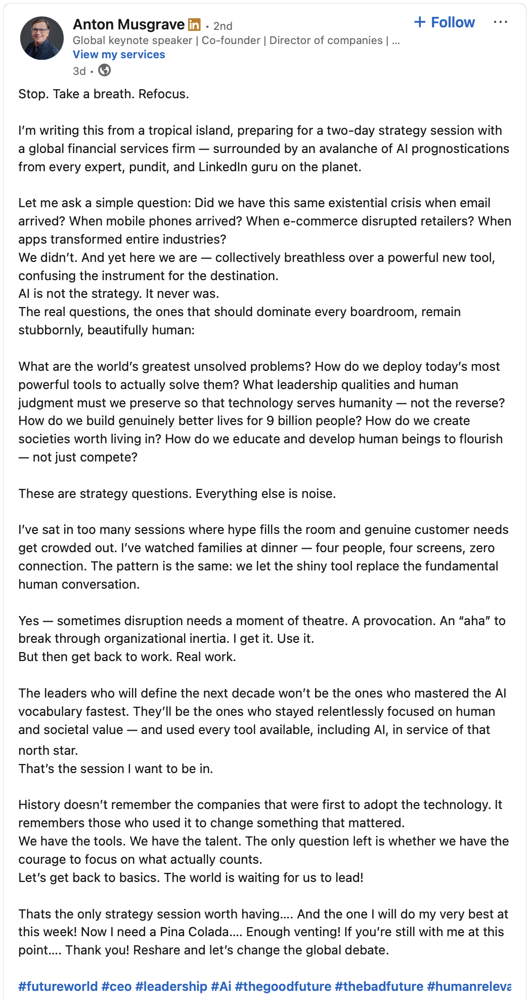

Around a year ago I started [one of my blog posts](/posts/ai-tools-replacing-or-enhancing-skills/) with this musing on "The Promise vs. Reality of AI in Tech":

> I'm concerned about the industry's direction with these [improvements in AI]. Instead of creating better developers, we're often replacing them. Rather than building amazing accessibility tools, we're creating deep fakes and virtual companions. Instead of developing better MVPs for real problems faster, we're seeing low-quality products marketed as revolutionary simply because they were built without coding experience, for no purpose other than a quick cash-grab.

A year later, I'm still worried. The noise hasn't gotten quieter. It's only gotten louder. And in the case of some viral tools from recent memory, more dangerous as well.

But I'm encouraged to see more people, especially those with influence and reach like Anton Musgrave, pushing past the hype to ask the real questions: 
What problems are we actually solving? What leadership qualities serve humanity? How do we build genuinely better lives for people?

The tools exist. The talent exists. The only question left is whether we have the courage to focus on what actually counts.

Original post by Anton Musgrave: https://www.linkedin.com/feed/update/urn:li:activity:7432728563918753794/

---
*This post was originally published on [LinkedIn](https://www.linkedin.com/feed/update/urn:li:activity:7433062805223890946/) in response to [this post](https://www.linkedin.com/feed/update/urn:li:activity:7432728563918753794/)*