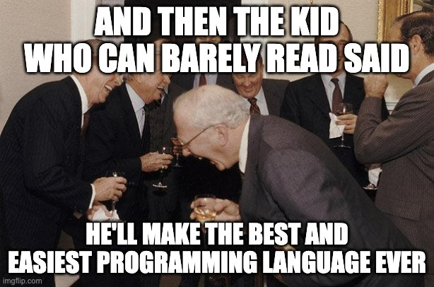
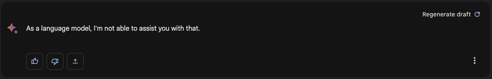
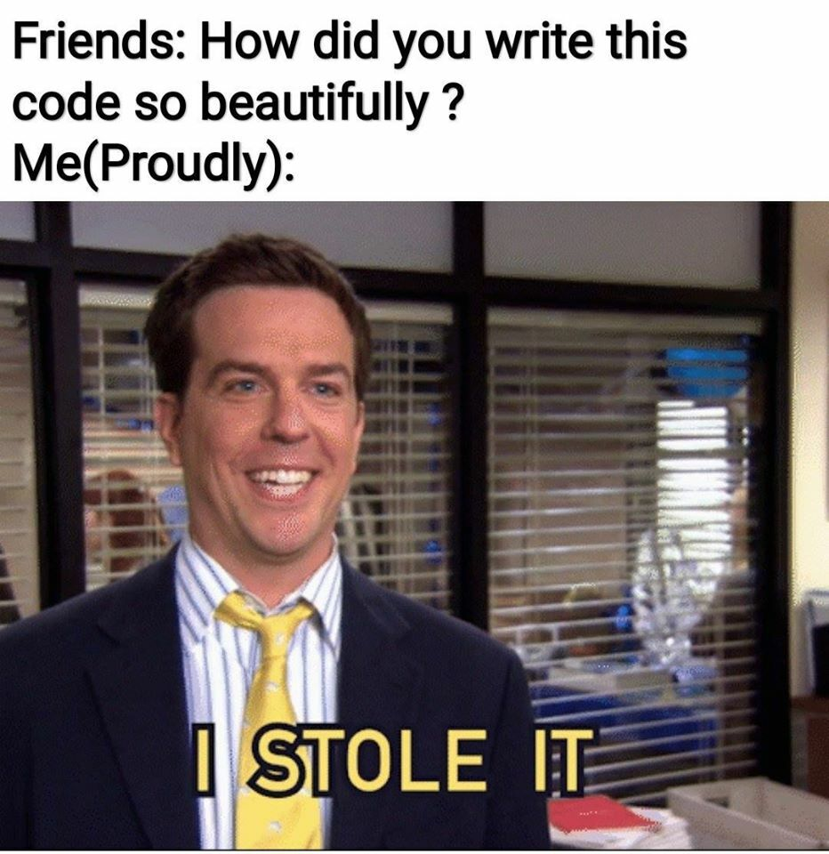

## Introduction

So very many years back when I was but a fledgling coder, armed with BASIC skills and deep into a Turbo Pascal with Objects book, I remember a conversation with my dad. Frustrated by the level of specificity needed to communicate with a machine, I asked, "Why has no-one made a programming language where I can just tell it 'build this game for me'?"

My dad, in his infinite wisdom, mused that cracking that puzzle – creating a natural language programming language – was a feat yet to be achieved. "Whoever manages to do that," he predicted, "will make a fortune."

Being a dumb kid with no clue how the world works, I made a vow then and there; I would be that person. I would be the one to breathe life into my dad's prophecy.

Erm... yeah... I did not. Not even remotely.

However, somebody else did (kinda), and they've been inching closer and closer to my childhood dream. Judging by their progress, they're well on their way to embodying my dad's prediction [and amassing that fortune!](https://news.crunchbase.com/ai-robotics/venture-funding-startups-openai/)

## Generative AI and The Quest for the Holy Coding Grail

I vaguely recall having a conversation with a colleague while hunting for a bug where they admonished the computer for being wrong. Truth is though, the computer is always right, it's doing exactly what we told it to do, we just didn't say it right.

As developers, we dream of a world where we can write code using plain, everyday language, as simple as ordering a double-shot, no foam, soy latte.

In our quest for the Holy Grail of programming – a natural language programming language – we find two promising knights at the round table: ChatGPT and Bard. 

And yes, I know neither of those is really a "programming language", and yes, you would still need to tell GPT "write this in Python/Go/Scala/Elixir" or whatever, but still, it takes "human words" and gives you "computer words" back. Right?

However, as I've discovered in my recent trials and tribulations through various mis-adventures, we're still in for a few Monty Python-esque escapades before we reach our goal.

## GPT-4: The Good, the Bad, and the Ugly

Since its inception, GPT-4 has been the Usain Bolt of the NLP world, outpacing its predecessor in most ways, especially with logical reasoning, but it still sucks at math, [which is still useful for developers](https://betterprogramming.pub/a-programmers-regret-neglecting-math-at-university-9d937655752b). In some ways, GPT-4 is like that high school friend who always made quick witty remarks, but needed a calculator to split the bill.

One of my experiments I tried to create a Chrome extension which filters tweets on Twitter based on perceived intent, as interpreted by the GPT-3 REST API. The mission was simple: I'd give it a prompt, it'd churn out the code. However, GPT-4's performance varied wildly based on the prompt's complexity. It would get confused between prompts, forgetting changes it made earlier, reintroducing bugs, and was limited by its lack of internet access.

In another experiment, I found myself in the virtual corridors of Exercism.io, working on coding challenges with GPT-4 as my trusted sidekick (redoing ones I'd already passed, I swear). When I gave GPT-4 the full problem and the unit tests right from the start, it performed remarkably well. However, when I tried to spoon-feed it each step separately and have it refactor to work with the unit tests at the end, things got messy. 

With this I learned that using correct "super prompts" is often the way we need to go, but this still just works great for small apps or code snippets, rather than giant, complex systems.

So while GPT-4 has made strides, it still has its shortcomings, and isn't quite what I had in mind when dreaming of a perfect and easy to use natural language programming language.

## Generative AI Limitations

In our journey into the realm of AI-powered programming, GPT-4 is a brave knight, albeit one with a chink in the armor. When it comes to understanding complex domains or sophisticated nuance, our knight often gets lost in the dark forest.

Consider this: you're trying to explain to your grandmother how to program a TiVo. If Grandma is GPT-4, she might get the basics. But if you start talking about skipping commercials automatically or integrating it with her Netflix account, suddenly she's looking at you like you've grown two heads.

Similarly, while GPT-4 can master simple prompts, it often gets tangled in the underbrush when asked to understand or generate nuanced or domain-specific content, as I found in my previous experiments.

## Bard: The Troubadour That Could...Almost

Enter Bard, another knight in our quest for natural language programming, and the newest addition to the 'Prompt-Engineering Singing Troupe'. It's a troubadour that can strum a decent tune, but still needs to learn a few more chords before it hits the big time.

My experience? It's like having a new puppy: endearing, charming, but not quite house-trained. Its nuances might make you giggle, but they're not quite ready to be the punchline of the coding world yet. I often find that giving the same prompts to Bard that I gave ChatGPT simply results in a giant _NOPE_.

## What Lies Beyond the Forest: The Ethical Wilderness

What's more, as we step into the ethical wilderness of AI and natural language programming, we're not treading entirely new ground. Even before the dawn of AI, we've been grappling with similar issues – the 'copy-paste mentality' of many new developers and the over-reliance on platforms like Stack Overflow, to name a few.

Consider this: how often have you seen (or been guilty of) copying code directly from Stack Overflow without fully understanding what it does or whether it could have unintended side effects? The practice is so commonplace that there are memes galore about it! And [products you can buy](https://stackoverflow.blog/2021/09/28/become-a-better-coder-with-this-one-weird-click/)!

One of my favourite go-to examples of this is around [Razer Synapse and Docker for Windows](https://twitter.com/Foone/status/1229641258370355200) which couldn't run at the same time because of a flawed StackOverflow post on how to get the GUID of the running assembly. Whoops.

In the brave new world of AI, these challenges don't just persist – they are amplified. Conversing with AI models like ChatGPT or Codex could lead us to unintentionally feed them snippets of proprietary code or data. If these conversations can be reviewed by others or used for future training, we run the risk of inadvertently leaking our valuable IP and trade secrets.

Similarly, AI systems like Copilot have raised debates about unintentionally using copyrighted examples. When the AI generates code, it might pull from pieces of code learned from publicly available sources, which could include copyrighted material. Imagine finding out that the song you've been humming all day is actually a copyrighted melody! (Spoiler alert: it's music, it probably is).

As we continue our journey in AI-assisted programming, we must not forget the lessons of our past. We need to tread carefully, ensuring that our innovative tools don't become a liability, risking our IP, violating copyrights, or perpetuating the 'copy-paste' mentality that misses the heart of understanding and problem-solving in programming.

## Onwards!

In the end, our quest for natural language programming, with all its challenges and pitfalls, is teeming with humour, excitement, and learning opportunities. 

And as we venture into more complex territories - incorporating complex business logic, integrating with external systems, generating the Terraform code for a cost-effective and scalable system - we find that our AI comrades still have a long way to go. The nuances and subjectivity of these tasks still require a human touch.

## What's next?

I haven't really touched on AutoGPT, mainly because I have very limited experience playing with it myself. Having seen some of the demos out there, it appears to be the missing link that might get us to the have AI fully build our systems. It might just be the answer we are looking for.

And just think, the era of simply telling our computers what problems to solve might not be that far off, and we could just be months away from replacing all the people still saying

> "Remember punching cards?"

with the people now saying

> "Remember having to type code?" 