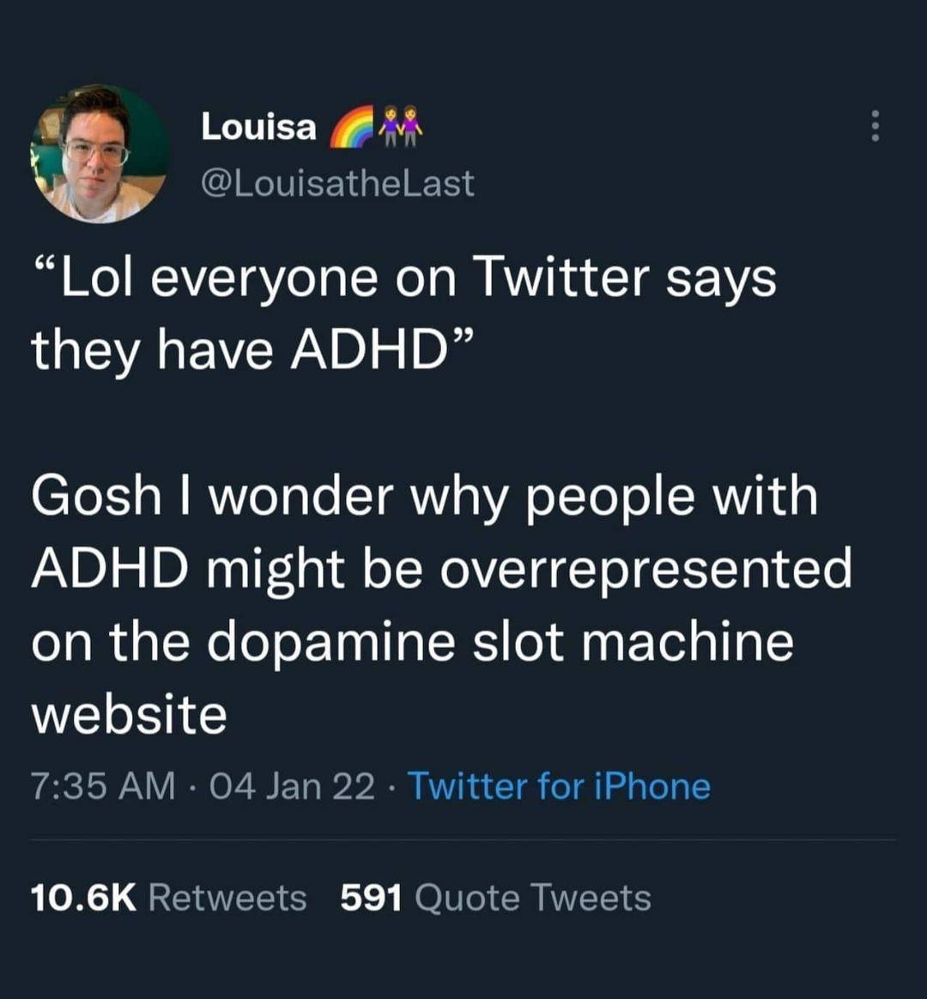
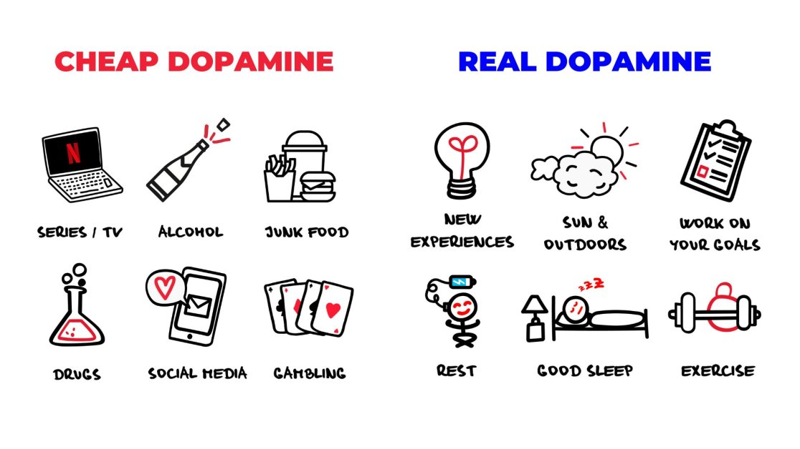
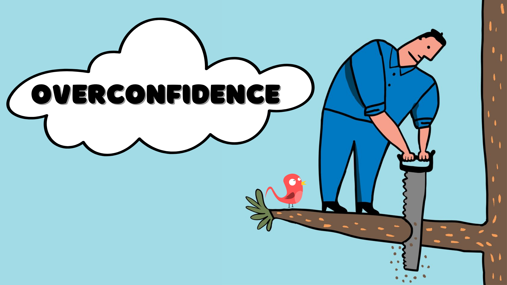

🧠 Something I've been thinking about a lot after doing these AI coding experiments...

I get why non-devs enjoy this so much. Creating something cool gives you a dopamine hit. Solving a problem does it too. Just like how YT Shorts, IG Reels, TikTok and even LinkedIn these days give you these hits through scrolling, these AI tools do it by "doing, showing, doing, showing".

💡 What I've noticed though, and this is probably because I've been coding for 30 years, is that the hit I get from the AI tools is very, very small compared to the one I get from solving a hard problem through blood, sweat and tears, and finally grokking the thing I didn't get before. It's harder, but way more satisfying.

🤔 How do we get people to that point? How do we engage them to a point where they go "this hit isn't enough, I need to go deeper", get them to a point where they actually want to learn and understand and finally build for real?

This is probably a bit left field, but let me cook a bit. The other day I saw a post in my LinkedIn feed about an X post, where a non-dev challenged an experienced dev saying "with AI, there is nothing you can ask me to build that I won't be able to". The experienced dev "had no words" and left it there.

🎯 But here's the thing, I can think of 50 examples of things an AI tool won't be able to build for you. My favorite is always: give me a new Operating System to replace Windows but is 100% backwards compatible for gaming purposes. Once the tools can do that, I'd be impressed, but until then, we still need people with deep skills and deep knowledge; Lovable ain't that.

But could it be the thing that leads more people towards that?

.
.
.

#SoftwareDevelopment #AITools #LearningToCode #TechEducation #ProblemSolving #DeepLearning #CodingJourney #TechSkills #DeveloperMindset #AIinCoding #SoftwareEngineering #TechThoughts #ProgrammingLife #SkillDevelopment #TechIndustry

--- 

*This post was originally planned for LinkedIn, but I either never shared it, or can't find it now. I'm sharing it here instead.*