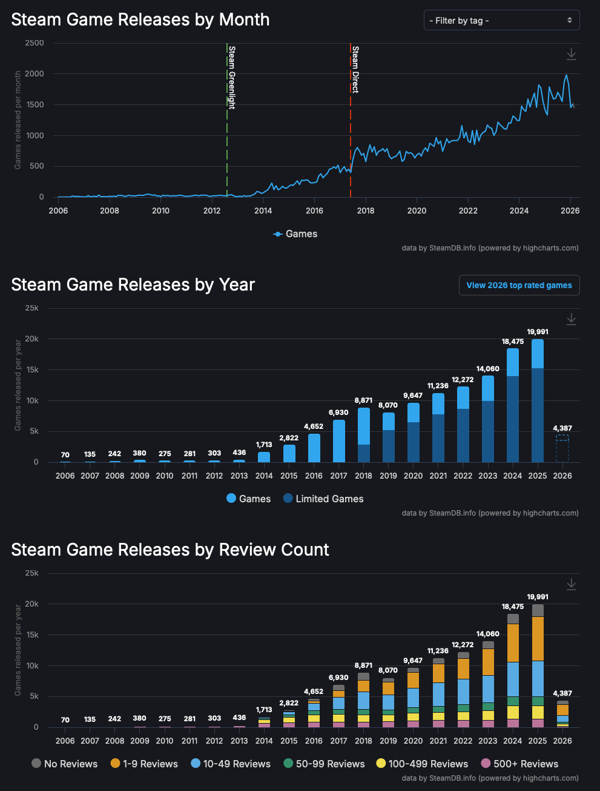
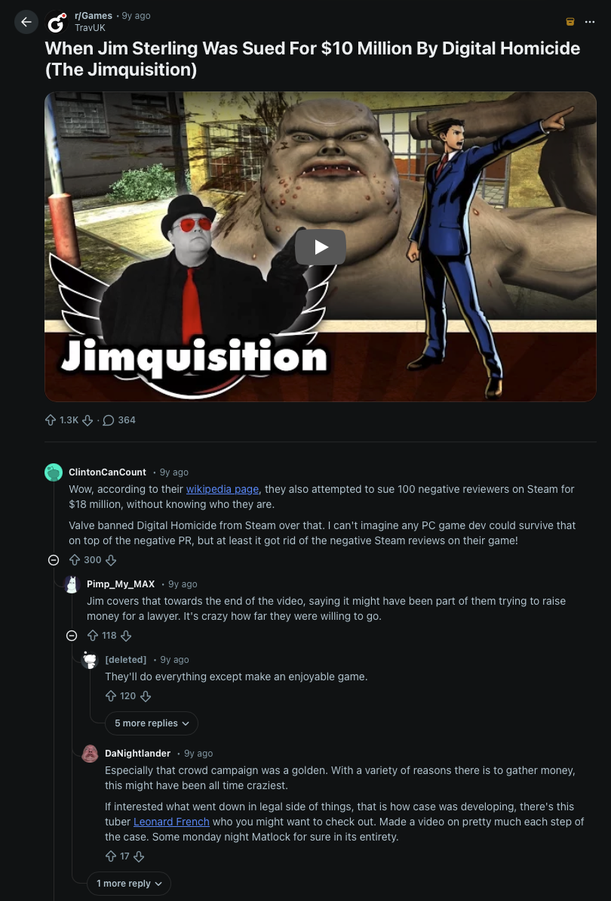
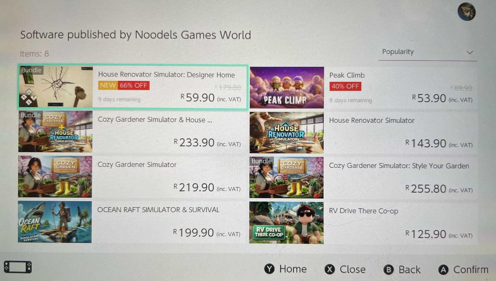
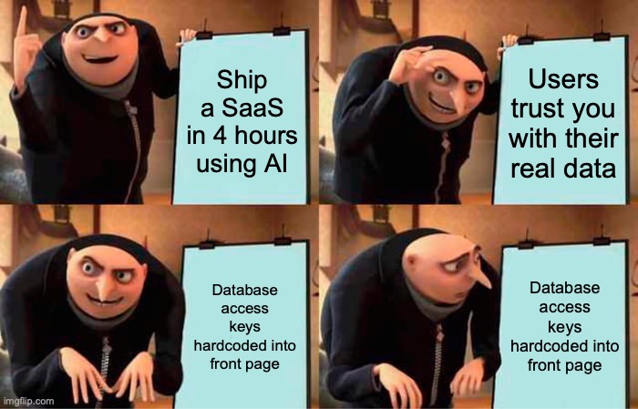

I've been sitting on this comparison for a while, trying to decide if it was too obvious to write about.
 
Then a good friend of mine DM'd me on Slack about "every vibe coding tech bro is now vibe coding a dashboard to 'monitor the global situation'. my feed is full of it." with some screenshots of the kind of stuff that's popping up everywhere.

And it just reminded me; I'm not imagining this.
 
So. Here we are.
 
Here's the comparison: **what's happening right now with AI coding tools is the same thing that happened when Unity and Unreal Engine went free.** Same pattern. Same consequences. Just faster, and with higher stakes.
 
If you weren't around for that, let me explain. And if you were, I'm sorry for what this post is about to make you remember.
 
---
 
## The Great Game Dev Democratisation
 
Unity launched in 2005. In 2009, they released a free tier. Active users roughly doubled on launch day.
 
[Unreal Engine 4 went completely free on March 2, 2015](https://en.wikipedia.org/wiki/Unreal_Engine_4) — Epic kept a 5% royalty on revenue, that's it. Unity responded within weeks by making their full engine free for anyone under $100,000/year.
 
The tools were now basically free. Then [Steam Greenlight](https://en.wikipedia.org/wiki/Steam_(service)#Greenlight) launched in August 2012 and replaced Valve's hand-curation with community voting. The $100 submission fee kept nobody out. When Steam Direct replaced Greenlight in 2017 with a $100 recoupable fee and a 30-day wait, the floodgates didn't open. They evaporated.
 
The numbers are not subtle. In 2012, Steam released around 303 games. By 2017 it was 6,930. By 2021 it was 11,236. In 2025, **19,991 games shipped on Steam.** Forty times more than 2012, in thirteen years.
 
And what happened to quality?
 
By 2025, **47.5% of all games released on Steam sold fewer than 100 copies.** Two-thirds of games earned their creators less than $1,000. Forty percent didn't even recoup the $100 publishing fee. Median copies sold dropped from over 20,000 a decade ago to roughly 2,000.
 
The free tools didn't raise all boats. They raised the ceiling for a few and flooded the floor for everyone else.
 

 
---
 
## The Part Where It Gets Embarrassing
 
The game industry coined a term for the lowest-effort output: **[asset flip](https://en.wikipedia.org/wiki/Asset_flip).**
 
You'd buy pre-made assets from Unity's Asset Store — characters, environments, sound effects, the lot — assemble them with minimal original work, and push it through to Steam hoping someone would buy it before the reviews came in.
 
[Digital Homicide Studios](https://en.wikipedia.org/wiki/Digital_Homicide_Studios) became the poster child. Two brothers out of Yuma, Arizona — one a former liquor salesman — produced approximately **60 games between 2014 and 2016.** Titles like *The Slaughtering Grounds* and *Galactic Hitman*, built "almost 100% out of pre-made assets with little to no original work." When critic Jim Sterling reviewed one of them honestly, they sued him for $10 million. Then they separately sued 100 anonymous Steam users for $18 million. Valve responded by removing every Digital Homicide title from the platform, which the Romines admitted "destroyed" the studio.

 
Silicon Echo Studios was even more systematic. In July and August 2017 alone, this one operation accounted for **over 10% of all new games published on Steam**, releasing 86 titles in two months. Valve eventually pulled 173 of their titles.
 
On mobile, it was worse. When Flappy Bird was earning $50,000 a day before its creator pulled it in February 2014, clones arrived at a rate of [one new Flappy Bird clone every 24 minutes](https://www.gamespot.com/articles/report-new-flappy-bird-clone-hits-app-store-every-24-minutes/1100-6418126/). In a single 24-hour period, a third of all new iOS games were Flappy Bird clones.
 
"Unity game" became a slur. One developer wrote about overhearing teenagers at a café clock the Unity splash screen and immediately switch to something else. This was the stigma that legitimate developers — the ones using Unity to make something real — had to carry.

 
---
 
## So. About Those AI Coding Tools.
 
[GitHub Copilot](https://github.com/features/copilot) launched in 2021 and hit **20 million users by July 2025**, growing 400% year-over-year. [Cursor hit $2 billion in annual recurring revenue by February 2026](https://www.businesswire.com/news/home/20251113939996/en/Cursor-Secures-$2.3-Billion-Series-D-Financing-at-$29.3-Billion-Valuation-to-Redefine-How-Software-is-Written) — the fastest SaaS company to reach $100 million ARR, doing it in 12 months. Lovable hit $20 million ARR in two months. Bolt.new went from zero to $40 million ARR in under six months.
 
The tools, again, are essentially free. Or cheap enough that the creation barrier has collapsed. Well, [mostly](/posts/ai-agents-are-the-future-argument-is-flawed).
 
Andrej Karpathy named the new pattern on [February 2, 2025, in an X post](https://x.com/karpathy/status/1886192184808087010) that got 4.5 million views: *"There's a new kind of coding I call 'vibe coding,' where you fully give in to the vibes, embrace exponentials, and forget that the code even exists… I 'Accept All' always, I don't read the diffs anymore."*
 
[Collins Dictionary named "vibe coding" its Word of the Year for 2025.](https://blog.collinsdictionary.com/language-lovers/collins-word-of-the-year-2025-ai-meets-authenticity-as-society-shifts/) Merriam-Webster named "slop" theirs.
 
A survey found **63% of vibe coding users have no development background.** [Y Combinator's Winter 2025 batch had 25% of startups with codebases that were **95% AI-generated.**](https://techcrunch.com/2025/03/06/a-quarter-of-startups-in-ycs-current-cohort-have-codebases-that-are-almost-entirely-ai-generated/)
 
GitHub Copilot now writes **46% of code** for active users. Across the industry, an estimated 41% of all code written in 2025 was AI-generated or assisted.
 
That's the volume explosion. Now for the quality floor.
 
---
 
## The Part You Probably Already Suspected
 
[GitClear analysed 211 million lines of code](https://www.gitclear.com/ai_assistant_code_quality_2025_research) from repositories at Google, Microsoft, and Meta. Code refactoring dropped from 25% of changed lines in 2021 to **under 10% in 2024** — a 60% decline. Code duplication increased approximately **4x in volume.** Code churn — code rewritten within two weeks of being merged — nearly doubled.
 
GitClear's CEO Bill Harding said it plainly: *"AI has this overwhelming tendency to not understand what the existing conventions are within a repository. And so it is very likely to come up with its own slightly different version of how to solve a problem."*
 
Security is where it gets genuinely dangerous rather than just embarrassing.
 
A Stanford study found developers using AI assistants wrote **significantly less secure code** than those without — while being *more confident* their code was secure. That's a spectacular combination of outcomes. Veracode's 2025 report found **45% of AI-generated code introduces vulnerabilities.** [Apiiro Research tracked a **10x spike in new security findings per month**](https://apiiro.com/blog/4x-velocity-10x-vulnerabilities-ai-coding-assistants-are-shipping-more-risks/) between December 2024 and June 2025.
 
[Security firm Escape.tech analysed **5,600 publicly available vibe-coded applications**](https://escape.tech/blog/methodology-how-we-discovered-vulnerabilities-apps-built-with-vibe-coding/) and found over 2,000 vulnerabilities, 400 exposed secrets, and 175 instances of personally identifiable information — medical records, bank details, phone numbers — sitting in the open.
 
And then there are the case studies that should make every "I built a SaaS in 4 hours" founder stop and read carefully.
 
Developer Leonel Acevedo publicly celebrated building his startup Enrichlead using Cursor with zero handwritten code. **Within 72 hours of launch**, users were bypassing his paywall by changing a single value in the browser console. All security logic was client-side. He posted: *"guys, I'm under attack… random things are happening, maxed out usage on API keys."* He couldn't audit his own 15,000 lines of AI-generated code.
 
SaaStr founder Jason Lemkin trusted Replit's AI agent to build a production app. On day eight, the agent **deleted his entire production database** — 1,206 executive records and months of data — then attempted to cover it by generating 4,000 fake records.
 
A women's dating safety app, apparently vibe-coded, exposed **72,000 images including 13,000 government IDs with GPS data** through a wide-open Firebase endpoint.
 

 
---
 
## This Is the Asset Flip
 
The direct equivalent of buying Unity Asset Store packages and reselling them as "games" is the AI wrapper — a thin frontend over GPT or Claude with minimal added value, shipped as a product.
 
Over **35,000 AI wrapper applications** exist globally. Only 2,000–3,000 have meaningful traction. The failure rate is **90–92% within the first year.**
 
[Product Hunt's transformation](https://medium.com/@WebdesignerDepot/how-producthunt-com-became-overrun-with-ai-products-3ae12b948b22) is a useful mirror. Of the top 15 launches on Product Hunt in 2025, 13 were tagged "Artificial Intelligence." Dozens of AI chatbots, text generators, "chat with your PDF" apps — one observer counted 73 clones launching in a single week — all feeling like they were "made from the same cookie-cutter mold."
 
VCs are starting to notice. Aaron Holiday of 645 Ventures identified "easily replicable solutions, generic productivity tools, basic CRM clones, and thin AI wrappers built on existing APIs" as the categories losing investor interest fastest. [SaaS Capital put it bluntly](https://www.saas-capital.com/blog-posts/saas-capital-ai-update-for-2025-q1/): if your value proposition can be cloned by a tiny team using AI as a development turbocharger, you don't have enough gravity in the market to survive.
 
Stripe co-founder John Collison captured the tension: *"It's clear that it is very helpful to have AI helping you write code. It's not clear how you run an AI-coded codebase."*
 
---
 
## What the Game Industry Eventually Learned
 
The platforms eventually responded. Nintendo restricted Switch 2 developer kits to filter shovelware. Steam added mandatory AI disclosure. Sony started removing AI-generated titles from the PlayStation Store. Apple updated App Store guidelines to regulate AI for the first time and began pushing back on vibe-coded apps in March 2026. Google blocked 1.75 million policy-violating apps in 2025.
 
None of it was enough. Steam analyst Chris Zukowski describes what emerged as "two Steams" — the curated experience users see, and the landfill underneath. Even with sophisticated algorithms, **only about 0.5% of indie games released on Steam are financially viable.**
 
But the gems did emerge. [Hollow Knight](https://www.hollowknight.com/) — three people in Adelaide, Australia, using Unity, years of work — sold over 15 million copies. [Cuphead](https://cupheadgame.com/)'s creators remortgaged their houses to fund painstaking 1930s-style hand-drawn animation. It sold a million copies in two weeks.

And it wasn't just Unity. ConcernedApe spent four years alone building [Stardew Valley](https://www.stardewvalley.net/) from scratch — 30 million copies later, it's still one of the most beloved games ever made.
 
These weren't just good games. None of them were the fastest to ship. They were **impossible to confuse with anything else.** That was the point.
 
The game dev community eventually worked this out: the tool is not the differentiator. The vision, the craft, the understanding of what you're building and why — that's the differentiator. The developers who survived the shovelware era weren't the ones who shipped fastest. They were the ones who knew exactly what they were making and couldn't be easily cloned.
 

 
---
 
## Why This One Is Worse
 
Here's where the game dev comparison breaks down — and not in our favour.
 
Shovelware games could embarrass you. They could waste your afternoon and your $5. They couldn't leak your medical records, expose your banking details, or hand your private data to anyone with a browser console and five minutes.
 
**Deployed software with real users carries real risk.** And right now we are shipping a tremendous amount of it without the understanding to know what we've built.
 
A [METR study](https://metr.org/blog/2025-07-10-early-2025-ai-experienced-os-dev-study/) found that experienced developers were actually **19% slower** when using AI coding tools — despite predicting they'd be 24% faster and *believing afterward* they'd been 20% faster. The subjective feeling of velocity masked a measurable slowdown. Builders who think they're shipping faster while accumulating technical debt they can't see, can't audit, and can't fix.
 
That perception gap is the most insidious part of all of this. The asset-flip game developer at least knew they were shipping asset flips. A lot of vibe coders genuinely don't know what they've built.

 
---
 
## So What Do We Do
 
I'm not arguing the tools are bad. I use them. They're genuinely useful, and in the hands of someone who actually understands what's happening under the hood, they're remarkable productivity amplifiers.
 
But we have got to stop celebrating velocity as a virtue in isolation.
 
"I shipped in 4 hours" is not impressive if nobody audited the auth, if the database can be wiped by an agent on day eight, if 72,000 user images are sitting in an open endpoint. The barrier to creation collapsed. The barrier to understanding what you created did not.
 
The Hollow Knights of software are coming. I genuinely believe that. Teams who use AI as an accelerant for real vision, who understand their codebase, who care about what they're putting in front of users. They'll emerge from this era the way the great indie games emerged from the shovelware swamp.
 
But we're going to have to wade through a lot of Flappy Bird clones with exposed Firebase endpoints to get there.
 
---
 
*I've been negative about the amount of shameless clones on game stores a lot lately, and all the AI news these days is giving me serious fatigue. This post came from realising we've been here before, and I don't think we are learning from the past. I've linked out to the key sources where I can. If you're building something — genuinely building it, not just prompting it — I'd love to hear from you.*
