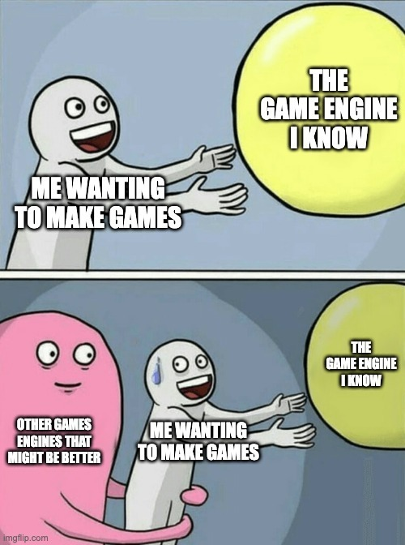
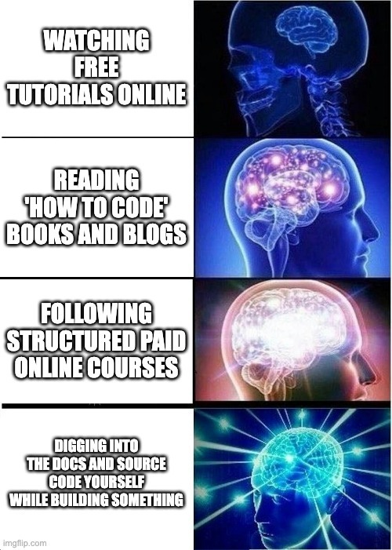
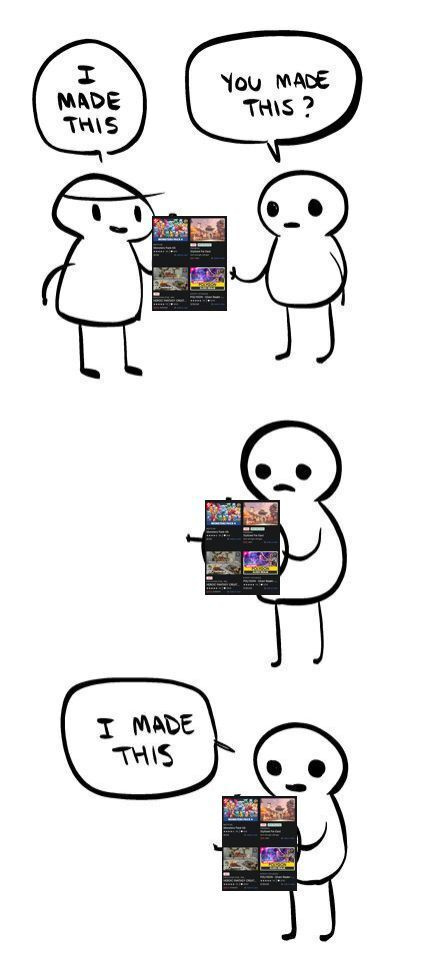

### TL;DR

That's pretty much it. Entire post summed up right there 👆

## Introduction

Early in 2023 I took on a challenge. I'd been going on about making my own game for ages, and my wife finally called me out on it; stop talking, start doing.

A buddy of mine had been doing the same thing about an app idea he had, and so our wives decided to lock us in a room for a day and force us to work on these ideas.

We decided we'd take 24 hours split over 3 days and work on our ideas just to get something out, and the experience was a good reminder that actually building something is often the best way to learn.

In case you are interested, you can check out what I built over on [Itch.io](https://duhblinnza.itch.io/what-traffic); there are some blog posts and updates as well.

FWIW, it really sucks 😂

But I learned a lot. And actually releasing something made it easier to start working on the second one. Which you can also check out [here](https://duhblinnza.itch.io/so-this-is-how-i-die), again with a more comprehensive devlog available.

But enough shameless plugs, I'm here to talk about what I learned.

For those who don't know, I've been doing professional software development since 2007, and hobbyist since I first learned BASIC in the 1990s (yes, I'm old 🧓🏻)

I've done web, frontend, mobile, backend, cloud, full stack, serverless, app server... I've been around the block, but game dev is new. And very different, it turns out.

At least in the way it's taught, or maybe just the way I learned. And I figured I might as well share my thoughts.

## Lessons Learnt

Some of these will relate to my experience building games a solo indie dev. Others will relate to my experience as a dev and how that translates (or doesn't) to game dev. And maybe this is just comment on how not to learn a new skill.

### Lesson 1: Just do it.

I touched on this on one of my first posts here about falling into the trap of "learning" but never "doing", and this is an issue I had. I remember doing a 2D Unity tutorial, I think it was a space shooter example project or something. Once finished, I took months before getting back to it, and then Unity had updated, and so had the tutorial.

So I did it again. And the next time the tutorial was replaced, so I did the new one. And then the 3D one. And then again the new 3D one when Unity updated again.

Even after completing a 2D and 3D course on Udemy, by the time I got around to my game idea, it had updated again, so of course I had to start from scratch again.

But alas, a conversation with my friend who, when I said I need to do all the tutorials again just said: 

> But why? Just use the version you know.

Mind. Blown. 🤯

Or not, it was obvious, but that conversation made it more obvious. I was scared of trying something new and failing, so I found excuses to put it off. Simple as that.

Don't find excuses. Just do it. Building something, anything, it is a billion times better than not building anything at all.

### Lesson 2: Engine doesn't matter.

Actually it does. But it also doesn't. It depends.

Maybe the more accurate statement would be it doesn't matter as much as you think. At least not if you are a solo indie dev or small group.

Sure, for large game dev companies, using the latest Unreal 5 for the latest GPU tech and the most uncanny valley graphics makes sense. But for most small projects, they can all accomplish the same goals, just in different ways.

There are plenty of unbiased engine comparisons out there, and if you haven't even started your first game yet, go do your research and figure out what works for you.

But don't be like me and spend months debating if I should stick with Unity or learn Godot or Unreal, or try to convince myself my idea is so simple and different I can just use something [Ebitengine](https://ebitengine.org/) because I know Go, or [Bevy Engine](https://bevyengine.org/) because I want to learn Rust.

I'm familiar with Unity, and it can do what I want. Games way more complex and ambitious than mine have been built in it. It's just another excuse to not start something.

Unless you have a very specific goal in mind that requires a specific engine, just pick one with a language close to what you are familiar with and get going. You can always change things for the next project if it doesn't work out.

#### Side Note

Godot 4 is awesome, and I love the effort going into the engine. I firmly believe that in a few years Godot will be the primary choice for indie devs for making games. Godot will do for game dev what Blender did for 3D modelling and animation.

### Lesson 3: Tutorials are great, but RTFM.

Learning to code has drastically changed over the last 50 or whatever years. Gone are the days of spending hours pouring over physical Language Reference Manuals. Who would do that when you can just Google your problem or get CoPilot to give you the code?

But here's the thing. Those online sources are usually very superficial. They are typically aimed at beginners after all.

Never underestimate what you can learn about tools and frameworks by the reading the docs. There is nuance and detail there you won't get from tutorials, blogs and courses.

I quickly fell into a trap of "all tutorials do this the same way, so it must be best" and "all tutorials say this is bad, so I shouldn't do it", but like I say in probably every single one of my blogs... it really all depends, there is no one right answer, and I shouldn't assume there is.

If _everyone_ online says "do it this way", yeah, maybe that is the best practice and it is the right way, but it could also be that everyone is just copying each others content because it's easier to reproduce and get a slice that very lucrative online courses pie.

So yeah. Read the freaking manual. If you are unsure of something, that should be your first port of call. If you still don't understand, check the forums. And only then Google.

There are many concepts in the Unity Engine I never new existed, because so few tutorials and lessons actually touch on them. Like how to actually use the [Debugger](https://docs.unity3d.com/Manual/ManagedCodeDebugging.html) and do [Unit Testing](https://docs.unity3d.com/Packages/com.unity.test-framework@1.4/manual/index.html), things which are common practice and often taught in pretty much any other software development field. I also learned about [Compute Shaders](https://docs.unity3d.com/Manual/class-ComputeShader.html), not something I'll need for my games yet, but since I never saw anyone talk about it, and because I didn't start with the docs, I never even new it existed!

So yeah, RTFM. Please.

#### Side Note

Another side note here, there are also really good courses and teachers out there, and some top notch YT channels where I did end up learning about these things. I'm not saying "courses bad, manual good", I'm saying that the reference guides from the creators are probably a better first resource than whatever Google is being paid to show you.

### Lesson 4: Assets are your friends.

This is a weird one for me, and I'm not sure why my mindset for this was different. And maybe this is very much a _me_ problem and not something that other people experience.

I don't think twice about using open source frameworks that are available when I'm doing backend work. And I rarely debate about paying for tools like JetBrains IDEs and CoPilot or ChatGPT, but for some reason the idea of paying for assets was weird. I always wanted to try and do everything myself, especially if was just "code". Using 3D models and audio which I can't do myself was much easier than using someones Player Input Controller or a Pathfinding asset.

Using someone else's code kinda made me feel like the wrong side of the "I made this" meme...

But at the end of the day, unless you are really talented at every facet of game dev (audio, animation, coding, designing), you either need other people, or you need other people's stuff. And they are selling these things, so it helps them out too.

And if you are just playing around, start with free stuff that's engine agnostic. [Kenny.nl](https://www.kenney.nl/) is an amazing resource with "Thousands of completely free game assets for you to use", and they have a top notch [all-in-1 bundle available over on Itch.io](https://kenney.itch.io/kenney-game-assets).

Just like you don't always need to re-invent the wheel in software, you don't need to solo every aspect of your game. Devs with more experience and who have been in the game longer than you have solved a lot of problems already. Use that to your advantage.

Oh, one more thing: you can learn a lot from these assets. Especially the ones that come with scripts. I wanted Serialized Dictionaries for handling some of my objects in the editor, and I could never quite get it working, turns out there was a really good free asset, and just going through the code helped me understand things and see where I went wrong.

## Conclusion

I don't have a specific purpose with this post other than I sharing what I thought was some interesting observations and revelations. Make with that what you will.

If you've ever been interested in making your own game, or really just want to build anything, but keep finding excuses, I really recommend watching [this video from Pirate Software over on YT](https://www.youtube.com/watch?v=aMc-GKv5olA) or [reading their post over on develop.games](https://develop.games/#nav-skills).

I think there is a lot there that translates to more than just game dev. 

And I hope it inspires you to also go out and 

**_build something_**

I look forward to one day seeing what that is, so put it here in the comments when you have something to show. Or make your own #showdev post 🙂

As for me, I'm slowly working towards having something playable, and I'm glad I decided to stop finding excuses and just start. It might not always be going the way I want or at the pace I would like, but at least it's going. Slow progress is better than no progress, after all.

---
*This post was originally published on [dev.to](https://dev.to/wynandpieters/what-i-learned-from-making-my-first-game-and-how-my-approach-changed-for-the-second-one-3dea)* 