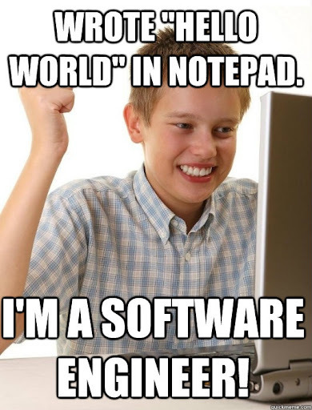

**Trigger warning:** this is a bit of a rant. Also, it contains opinions. Specifically mine. If you are allergic to other peoples opinions, or likely to experience anger or hatefulness when hearing others opinions, this post is probably not for you. 

Also, if you actually are an Engineer, have a cookie.


## Intro

I spend a large amount of time on interviews. Or I did, up until mid 2020, but whatever. Sure, it's not as much as large corporations fielding thousands of applicants, but I'd wager more than the average startup. I've conducted a couple hundred interviews myself, and I've been interviewed a couple ten times.

The discussion of roles, responsibilities and titles is a tricky one, and one that often comes up in interviews. We live in a world where titles have become... maybe not quite meaningless, but a lot more ambiguous and less likely to carry the same weight it did in the 80s, 90s and 00s.

In a world where a barely legal high school dropout can be the CTO of his own startup with 0 employees and no product to speak of, where a marketing director can be called a "Wizard of Light Bulb Moments" and everyone plus their aunt Bob can be an "Data Scientist" after doing one free Python course on YouTube, titles have become ... let's just stick with 'less important'. 


Just recently in one of my online communities there was a question:

> SRE or SysAdmin - which job title would get the most attention from interns/Juniors? (Job descriptions would be the exact same btw)

I'm not sure when Site Reliability Engineer and Systems Administrator became the same thing. I must have missed that notice. Damn spam filter.

But this just highlights my point: Roles and responsibilities are the things most people will end up caring about. And with that comes the *expectations* of what those roles entail, and what experience or background is needed for that. It's not what I'm called, but what I'll be doing.

And finally, we come to the heart of my post. Software Engineering. Or is that Software Development? 



## A rose by any other name...

I'm not getting into things like prefixes today. I don't care about App [something] vs Full-Stack [something] vs Cloud [something] vs Web [something] or whatever else. I feel these are _mostly_ clear in their focus. You are either focusing on mobile, or websites, or DevOps or Cloud etc etc etc.

What I do care about is that [something] and what the expectations are arounds those. Or maybe what *my* expectations are. This is an opinion after all.

The terms I hear most often are Coder, Programmer, Developer and Engineer. And here's the thing; I see these used interchangeably. But I don't agree with this. I think these are progressions and divergences. I think that one follows the other, or splits off, and they have different places in the world and in business, and not everyone needs to be everything. So let's start where we all do.

### Coder

Coders write code. That code could be very simple. A single line of Bash to extract data from a URL

```shellscript
➜  ~ curl -s https://www.githubstatus.com/api/v2/status.json | jq '.status.description'
"All Systems Operational"
➜  ~
```
or doing some `sed`, `grep` or `awk` commands, that's code.

Maybe you start doing something simple with Python like comparing SemVer versions

```python
✔︎ ~ python -c "from distutils.version import StrictVersion; print(StrictVersion('0.10.0') >= StrictVersion('0.6.0'))"
-c:1: DeprecationWarning: distutils Version classes are deprecated. Use packaging.version instead.
True
✔︎ ~
```

Or maybe you just did your first "Hello World" tutorial for a new language like Rust and you managed to compile and run it.

Congrats, you have the reached the level of Coder. You have a basic understanding of one or more programming languages and can *write code* to accomplish specific tasks.

### Programmer

Programmers are next step beyond coders. They are capable of writing, testing, and debugging code to build software applications. You probably know what an SPA is, and maybe even know who to make one without ChatGPT and StackOverflow. Programmers know how to *program code* into something meaningful.

### Developer

Developers (specifically software developers given the audience here) have a broader skillset that includes not only programming (which is built on coding) but also software design, project management, and collaboration with other team members. They are involved in the entire software development lifecycle, from planning and designing to testing and deployment. Developers often have a solid understanding of programming languages, frameworks, and tools, as well as the ability to solve complex problems and create high-quality software products. You know how to *program* and *develop software* that works.

### Engineer

Software engineers, sometimes referred to as software development engineers, have a more comprehensive and systematic approach to software development. They apply engineering principles and practices to the design, development, testing, and maintenance of software systems. Software engineers often possess strong analytical and critical thinking skills, as well as an in-depth understanding of computer science fundamentals, enabling them to build scalable, secure, and robust software solutions. So yeah, they also *develop software*, but rely on *engineering principles* to do so.

## I had a point, right?

Okay, so here it is. If you didn't study engineering, or work in an engineering role, please don't call yourself an engineer.

Maybe this is just me, but if you call yourself an engineer, and I interview you like one (because I have a certain expectation), and you are not an engineer, the interview will go very poorly for you.

If you call yourself a developer, and I interview you like a developer, you'll probably have a much better chance to impress me when you start pulling out the engineering principle guns.

Interviews, when done "right" (oof, loaded term right there), are meant to be conversations in which both parties get to test the waters and figure out if there can be a mutually beneficial work arrangement; I have a problem that needs solving, and you hopefully have the skills and attitude to solve it.

It is not you coming in here throwing your titles and experience around trying to convince me your bootcamp made you a 10x engineer, but then you commit your AWS credentials to Github.

## That's bleak dude

Okay, but hear me out, because there is a second part to this.

It doesn't matter.

Kinda.


As long as you are honest about what you can and cannot do, and as long as you are growing and improving, that's fine.

Also, it's not your fault as the jobseeker that most companies don't 🦆-ing know what roles they are hiring for half the time and end up with 💩 job specs with confusing "requirements".

If you really want get somewhere, focus less on what the role is called, or what your title will be, and focus more on the value-add that you know you can provide.

Anyway, let me know your thoughts. Am I being to harsh? Am I the only one who feels this way?

Ooh, better yet, what is the weirdest job title you've seen someone **actually** calling themselves?


---
*This post was originally published on [dev.to](https://dev.to/wynandpieters/why-youre-not-an-engineer-also-why-it-probably-doesnt-matter-egb)* 