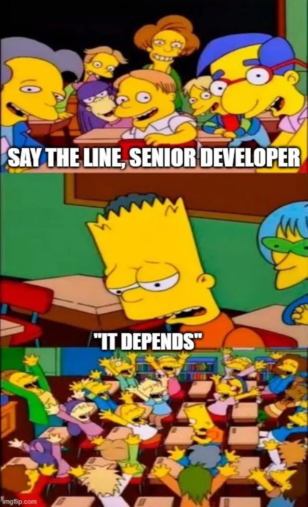
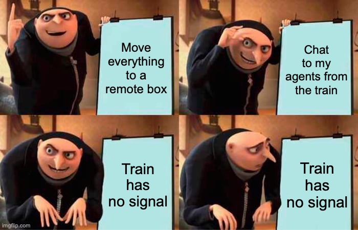
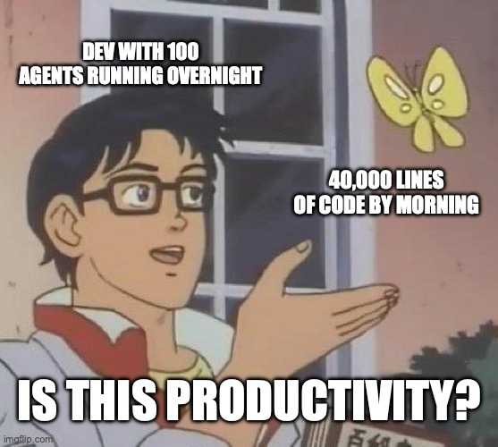
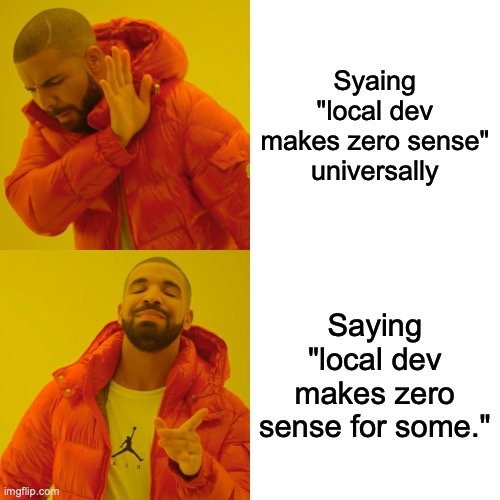

I was on LinkedIn this morning making a quick post about my experience with Omarchy, and then this showed up in my feed.

["Local dev setup makes zero sense to me now."](https://www.linkedin.com/posts/the-pragmatic-engineer_local-dev-setup-makes-zero-sense-to-me-now-activity-7507094057106485249-rptB)

It’s a comment from Matt Pocock, who we all know by now, the TypeScript educator, creator of the /grill-me skill that half the industry has been grilled by at this point (including myself), with a clip from The Pragmatic Engineer podcast. The post goes on: every dev has a hundred terminals, those terminals should be available to your whole organisation, available from everywhere. So for him that means he’s on a train chatting to his Hetzner box in Discord, and therefore an expensive laptop feels like wasted compute.

I hadn’t watched the episode yet. My first reaction was the one I always have when confronted with advice or opinions like this.

So I read the full transcript before writing this, and I’ll still listen to the full podcast later, because ranting at a clip without the context would be exactly the thing I'm about to complain about.

## What he actually said

The clip is accurate. It’s just trimmed.

A few sentences before the quoted section, Matt says that he doesn’t particularly work with a team, but understands the value of it. He’s a solo educator. He built a seven-figure business selling online course. He has a remote box that runs schedules for him, does a morning stand-up with his agent, and fixes bugs his students report while he’s commuting.

For him? It makes complete sense.

And notice the phrasing he used that quickly gets lost in the post. Zero sense to me. That “to me” is doing a lot of honest work. Matt isn’t **prescribing** anything. He’s **describing** his setup.

!(Always Has Been meme with the realisation "Wait, the right dev setup depends on context?")[images/setup-context.jpg]

The clip turns a description into a headline, because that’s just what social media is at the moment. The headline turns it into a direction. And somewhere a junior dev in Johannesburg reads it and wonders why they’re already behind.

## The box isn't the expensive part

Let me give the remote setup it’s due first, because the argument is actually pretty strong.

A Hetzner box is cheap. Genuinely cheap. A small VPS costs less per month than a takeaway, and it’s a lot cheaper than the top-spec laptop the industry has been telling us we need. A student with a hand-me-down Chromebook and a cheap remote box arguably has a better dev environment than one with a laptop they can’t afford to upgrade.

So if the argument was purely about hardware, I’d concede it.

But the hundred terminals aren’t hardware. Every one of those terminals is an agent. Every agent is spending tokens. The cost didn’t disappear when the laptop got cheaper, it moved from a one-off purchase to a monthly subscription, billed in US dollars.

Let’s do the maths in rand, since that’s what applicable to me and probably a lot people reading my content.

[OfferZen’s 2026 salary report](https://www.offerzen.com/blog/full-stack-developer-salary-south-africa) puts the average for a full stack developer with 0–2 years of experience at R22,031 a month. Before tax, mind you.

For additional context, Stats SA’s latest Quarterly Employment Survey puts [average monthly earnings at R30,611](https://businesstech.co.za/news/business/877450/this-is-what-the-average-employee-is-earning-in-south-africa-right-now/) as of May 2026. That figure only covers the formal, non-agricultural sector, people who already have a proper job, in a country where a lot of people don’t (I won’t go into the MASSIVE inequality gap today, that could be whole series of rants…).

Those average earnings grew 4.1% year-on-year while inflation sat at 4.5%. Salaries here aren’t keeping up with the cost of living. A subscription billed in dollars doesn’t care.

Now pick an agent plan. The $20 Claude Pro tier is around R330 a month, and excludes the 15% VAT, so it’s really $23 and R381 (at time of writing of course). About 1.8% of that junior’s gross salary. Fine. Manageable.

But the $200 tier, you know, the one you need if you actually want to run a fleet of agents around the clock… that’s around R3,810 a month after VAT.

Almost 18 percent. Of gross.

A $200pm subscription might be fine if you’re in London or San Francisco or running a business that pays for it. It’s a very different conversation when you earn in rand and pay out of pocket. Because isn’t that the whole “everyone is a developer” argument right now? Which [I’ve already disagreed](/posts/ai-agents-are-the-future-argument-is-flawed) with, mind you.

Later in the same episode, Matt points out that tactical programming work has gone below minimum wage in a lot of countries. He’s right, depending on the country of course. However, those are often the exact same countries where a dollar-denominated agent subscription is a meaningful slice of someone’s salary.

The work got cheaper. The tools didn’t.

## Not everyone gets to send their data to a box in Germany

Cost is an obvious “it depends” one to point out. It’s not the only one.

Part of my job for many of my clients is production investigations. Something breaks, and to understand why, I often need the actual user data involved. Sometimes that includes personal information. The moment it does, POPIA is in the room with me, and it dictates what I can do with that data, how I store and handle it, and who else is allowed to see it.

“I’ll just spin it up on my always-on box and let an agent poke at it” isn’t a workflow at that point. It’s a potential breach. And the person accountable for it isn’t the agent, or the VPS provider. It’s me.

I’ve written before about how [the plumber in your wall is more regulated than the engineer writing code for your bank](/posts/should-software-engineering-be-regulated). Data handling is the one place where that isn’t entirely true, and it’s precisely where a personal remote box gets complicated.

Then there’s connectivity. A remote-first workflow assumes the remote is reachable. Good train Wi-Fi is not a universal human experience. Good internet isn’t even. Many parts of South Africa are still on ADSL or dodgy wireless links. Towns where rolling out Fibre is just not “financially viable”. And since we can’t get Starlink (thanks ICASA), it just is what it is.

## My setup, FWIW

I‘ll show my hand, because it’d be a bit rich to write this whole post without doing it.

Almost everything I do runs locally on my Mac. Each client gets their own user account on the machine, with its own encryption. Each client also gets their own external drive, separately encrypted. When one engagement’s data needs to stay away from another’s, it’s not a policy I’m promising to follow. It’s a wall. Everything stays with me, and I control everything, because that’s where the responsibility buck stops.

And sure, I do run remote machines, usually VMs in AWS, as well as a server my company hosts, reachable from outside over Tailscale. But thsese are only for PiForge’s own projects, and only the ones that genuinely need to be running all the time.

Is it the most glamorous setup? No. Does it let me look a client in the eye and tell them exactly where their data lives and who can touch it? Yes.

That’s the trade-off I chose. Because of my constraints. Not because someone on a podcast told me to.

## The irony is the rest of the episode

This is the bit that genuinely got me about this whole LinkedIn post and the resulting trigger, because the full episode is actually one of the better arguments for it depends I've heard all year.

Matt describes strategic programming as a mixing desk with a hundred sliders. Turn one up, you get microservices. Turn it down, you get a monolith. The skill isn’t knowing the right setting; it’s knowing your setting, and you often only hear the mistake months later.

He says you shouldn’t use `/grill-me` for everything. Small change? Just build it and align afterwards. Fits in one session? Grill first. Spans many sessions? Use something bigger like `/wayfinder`. That’s a decision tree built entirely out of context.

He goes back to The Pragmatic Programmer, A Philosophy of Software Design and Domain-Driven Design and finds that the old wisdom still holds. Which is a point I’ve been [banging on about for a while](/posts/fundamentals-matter).

An hour of nuance in the podcast.

But the sentence that goes viral is the one without any context.

That’s not on Matt. And probably not on Gergely either. It’s on how we consume this stuff. We’ve built an industry [that rewards the hot take over the depth](/posts/loud-is-not-the-same-as-good), and then we act surprised when people mistake one person’s setup for best practice.

## My take on this

I don’t think he’s wrong about the direction.

Gergely mentions in the same conversation that companies with proper platform teams — Ramp, Stripe, Uber — are seeing most of their developers voluntarily move to cloud environments once the setup is good enough. Remote dev environments aren’t new either. And the collaboration point is real: a grilling session you can tag a colleague into is genuinely better than one trapped in your terminal.

So if you’re on a team with a platform budget, or you’re solo and the subscription pays for itself, the cloud probably is where you’re headed.

My objection is not “remote is bad”. My objection is that “makes zero sense” is a universal statement, and almost nothing in this profession is universal. A setup is a slider on the mixing desk. Where you put it depends on your money, your data, your team, your connection and your clients.

And here’s the slider I think almost nobody is questioning.

The whole premise of the always-on box is that your agents should be working while you sleep. The day shift plans, the night shift builds. A hundred terminals, humming away.

I don’t believe 90% of developers need agents running 24/7.

And of the 10% who do, I seriously doubt they’re shipping substantially more — or substantially better — than the people who are intentional about what they build. More code, sure. More activity, definitely. But we’ve known for decades that output and value aren’t the same thing. Lines of code was a terrible metric before AI. It didn’t become a good one because a machine is generating them overnight.

The bottleneck in most of the work I've seen was never typing speed. It was knowing what to build, why, and what not to build. An agent fleet doesn't fix that. If anything, it makes the cost of not knowing much higher, much faster.

## So where does this leave us

The thing about advice from people at the leading edge, is that it describes the leading edge. That’s useful, and we should want to hear it.

But that’s not where most of us live.

I think one of the most important skill in this profession, one that separates real impressive engineers from people who copy setups, is knowing which constraints are yours. Not “what does Matt do?” but “what do my constraints actually allow?”

Context matter. And it always depends. There is no on size fits all.

If the answer for you is a cheap remote box and a fleet of agents, great. If it’s one agent on a laptop, separate encrypted drives per client and a budget you watch carefully, that’s not falling behind.

That’s engineering.

“Zero sense to me” is a perfectly acceptable sentence.

So long as the “to me” stops getting cropped from the headline.

---
*“It Depends” will probably be written on my tombstone. It was a running joke when I worked at LifeQ. People would start conversations with me saying “I know you’re gonna say it depends, but…” 😆 But I still believe that. The why matters. The how isn’t always the same. And the what can change.*

---
*This post was originally published on [Substack](https://wynandpieters.substack.com/p/zero-sense-to-whom), which is weird, I usually do my personal blog first...*